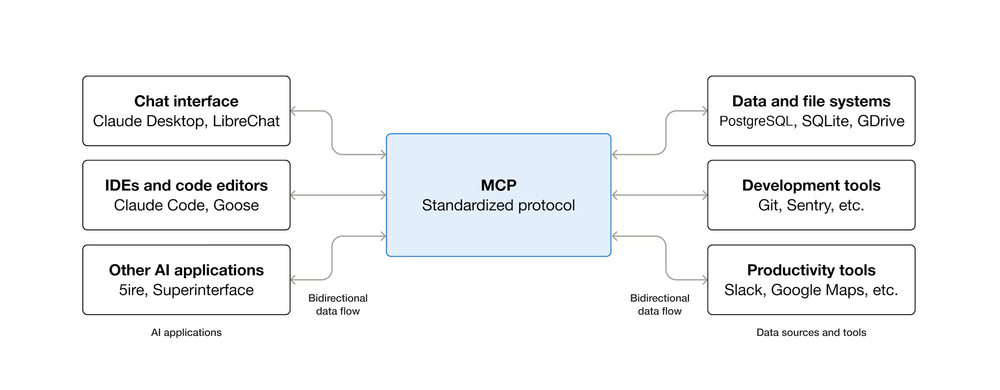
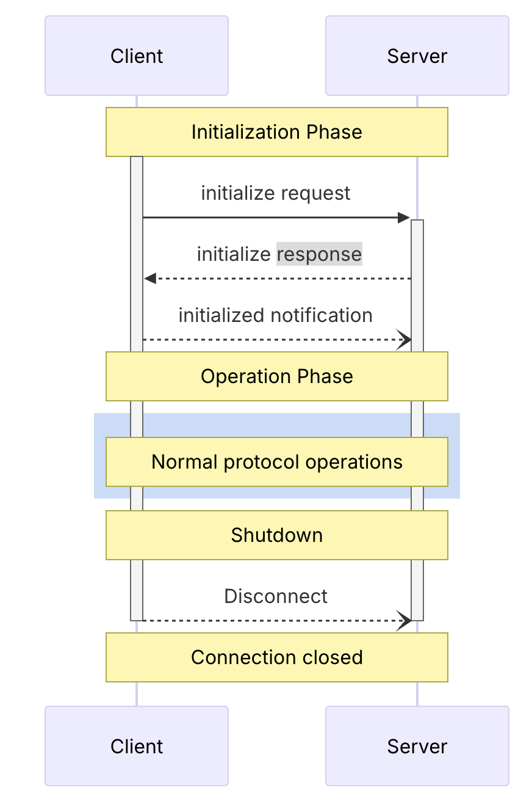
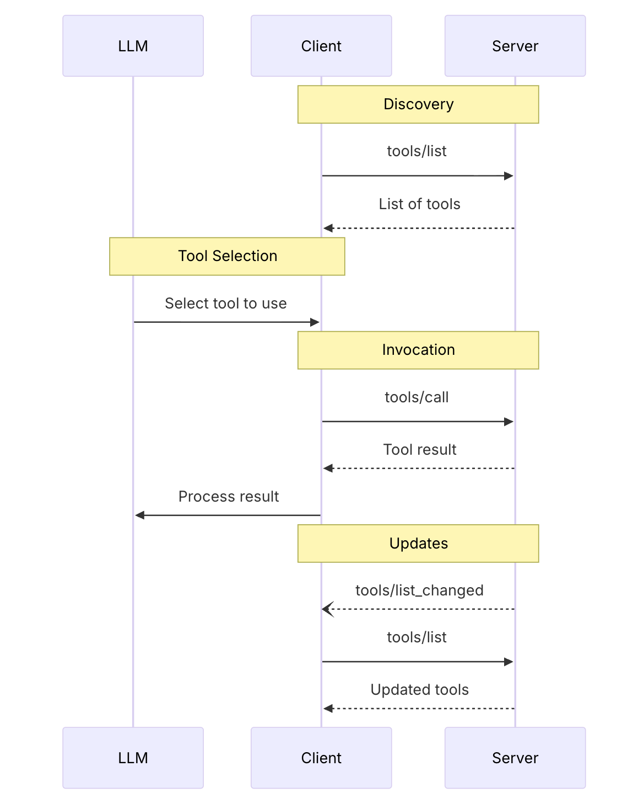

MCP（Model Context Protocol）是一套标准协议，这套标准协议规定了应用程序之间如何通信，如何按照这一套标准协议传递数据


## 流程
使用 MCP ，在客户端和服务器之间建立完整通信的流程如下

- 初始化
- 建立通信后，一些常规操作指令（比如，工具发现等）
- 连接关闭


### 初始化
客户端与服务器确认是否满足 MCP 协议，客户端发送包含 JSON-RPC 版本、ID、method（initialize）和参数（MCP 版本、客户端信息等）的请求，服务器响应版本和功能等信息

客户端发送的初始化消息
  ```json
  {
  "jsonrpc": "2.0",
  "id": 1,
  "method": "initialize",
  "params": {
    "protocolVersion": "2025-11-25",
    "capabilities": {
      "roots": {
        "listChanged": true
      },
      "sampling": {},
      "elicitation": {
        "form": {},
        "url": {}
      },
      "tasks": {
        "requests": {
          "elicitation": {
            "create": {}
          },
          "sampling": {
            "createMessage": {}
          }
        }
      }
    },
    "clientInfo": {
      "name": "ExampleClient",
      "title": "Example Client Display Name",
      "version": "1.0.0",
      "description": "An example MCP client application",
      "icons": [
        {
          "src": "https://example.com/icon.png",
          "mimeType": "image/png",
          "sizes": ["48x48"]
        }
      ],
      "websiteUrl": "https://example.com"
    }
  }
}

  ```

紧接着服务端必须回应

```json
{
  "jsonrpc": "2.0",
  "id": 1,
  "result": {
    "protocolVersion": "2025-11-25",
    "capabilities": {
      "logging": {},
      "prompts": {
        "listChanged": true
      },
      "resources": {
        "subscribe": true,
        "listChanged": true
      },
      "tools": {
        "listChanged": true
      },
      "tasks": {
        "list": {},
        "cancel": {},
        "requests": {
          "tools": {
            "call": {}
          }
        }
      }
    },
    "serverInfo": {
      "name": "ExampleServer",
      "title": "Example Server Display Name",
      "version": "1.0.0",
      "description": "An example MCP server providing tools and resources",
      "icons": [
        {
          "src": "https://example.com/server-icon.svg",
          "mimeType": "image/svg+xml",
          "sizes": ["any"]
        }
      ],
      "websiteUrl": "https://example.com/server"
    },
    "instructions": "Optional instructions for the client"
  }
}
```

成功初始化之后，客户端要发送一个 `initialized`的通知（notification）

```json
{
  "jsonrpc": "2.0",
  "method": "notifications/initialized"
}
```
  


### 工具指令
这个指令是 MCP Server 服务端的特性，可以给 Client 端提供各种指令选择，和各种对应的功能

下面是 LLM 大语言模型通过 MCP 协议的服务器和客户端交流的过程


#### 工具发现
客户端请求服务器罗列提供的服务（方法为 tools list），服务器返回工具集合数组，包含工具名称、标题、描述、参数等

客户端发送的工具发现请求
```json
{
  "jsonrpc": "2.0",
  "id": 1,
  "method": "tools/list",
  "params": {
    "cursor": "optional-cursor-value"
  }
}
```
`method`为 `tools/list`，看得到是

服务器响应
```json
{
  "jsonrpc": "2.0",
  "id": 1,
  "result": {
    "tools": [
      {
        "name": "get_weather",
        "title": "Weather Information Provider",
        "description": "Get current weather information for a location",
        "inputSchema": {
          "type": "object",
          "properties": {
            "location": {
              "type": "string",
              "description": "City name or zip code"
            }
          },
          "required": ["location"]
        },
        "execution": {
          "taskSupport": "optional"
        }
      }
    ],
    "nextCursor": "next-page-cursor"
  }
}
```

#### 工具调用
客户端请求调用服务器工具（方法为 tools code），传入工具名称和参数，服务器返回结果，结果为数组，每个元素是对象，包含类型（如文本）和内容

客户端发送
```json
{
  "jsonrpc": "2.0",
  "id": 2,
  "method": "tools/call",
  "params": {
    "name": "get_weather",
    "arguments": {
      "location": "New York"
    }
  }
}
```

服务器响应的
```json
{
  "jsonrpc": "2.0",
  "id": 2,
  "result": {
    "content": [
      {
        "type": "text",
        "text": "Current weather in New York:\nTemperature: 72°F\nConditions: Partly cloudy"
      }
    ],
    "isError": false
  }
}
```

#### 工具更新监听
如果服务端的工具发送变化，服务端会发送 `listChange`通知

```json
{
  "jsonrpc": "2.0",
  "method": "notifications/tools/list_changed"
}
```

