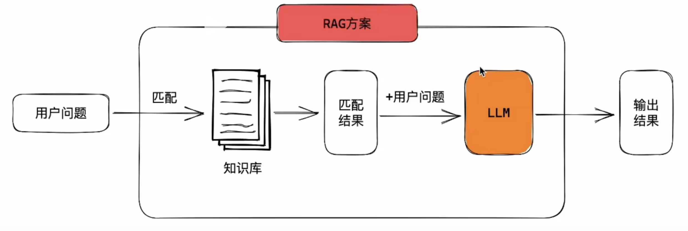
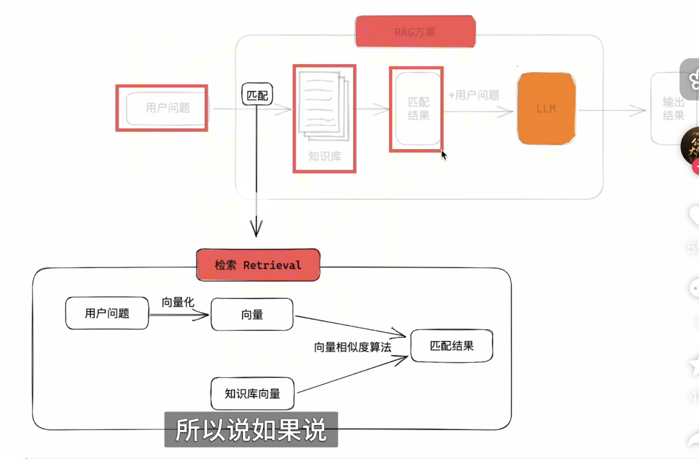

RAG（Retrieval-Augmented Generation）检索增强生成，是一种能让 LLM 大语言模型能从外部提供的数据源检索，主要应用于知识类的场景

## LLM中存在的问题
- 知识的“静态性”与“幻觉”问题
- 领域知识的专业性和深度不够
- 信息的数源可信度问题

PS.
静态性：知识无法更新，无法更新到最新的知识，只能是当时添加进数据源的最新知识，且无法获得企业内部资料
LLM 回答的问题可能在浅层面还比较符合，但深层次的问题答案无法很好的回答
模型回答的数据来源可能不是很准确，也可能从污染源拿到问题答案，导致可信度不高，且有可能会编造问题答案（医疗、法律问题等）

## RAG解决方案

### 索引 Indexing
- 分割
- 嵌入
- 存储

#### 分割
分割可以把文档按照指定的方式分割，分割的算法有多种可以选择

#### 嵌入
将分割后的文本变为一个多维向量的数学表示，方便后续检索使用。转换为向量后，方便计算分割词之间的相关性

并且向量维度越高，对语言的理解就越准确越细腻

要实现对一个完整语句的嵌入，有多种方法，比如传统统计、静态词嵌入、上下文感知嵌入等等。目前，绝对主流的嵌入方法是基于Transformer的上下文感知嵌入

核心逻辑：文本-->token化-->嵌入-->池化-->结果

#### 存储
使用向量数据库存储嵌入的向量结果

### 检索 Retrieval

PS. 计算向量相似度的公式
选择使用简单且常用的余弦相似度计算相似度:
`cos(0)= (A·B) / (||A||*||B||)`
可见，余弦相似度仅与方向有关,和向量长度无关。
它的取值范围是-1~1:
- -1: 两个向量方向完全相反，属于反义
- 0: 两个向量垂直，含义完全无关
- 1: 两个向量方向完全相同，属于同义

> 为什么余弦相似度只看方向，不看长度? 
   长度无关性:因为长度仅表示意思的程度，不会改变含义本身

#### 步骤
1. 查询预处理：补充用户提出的问题，修正问题，相当于补充问题
2. 多路检索：
3. 结果融合、重排
4. 后处理

### 生成 Generation
生成,既是把检索结果和用户问题一起「告知」大模型。生成方法有很多，最常用、最简单的就是Prompt（提示词直接喂给大模型）