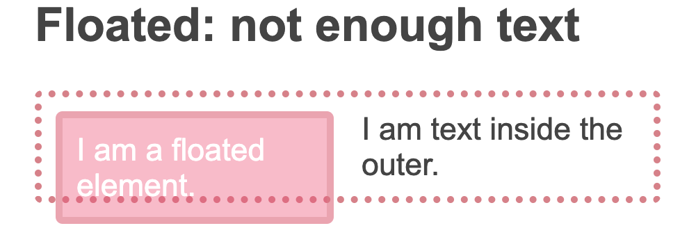
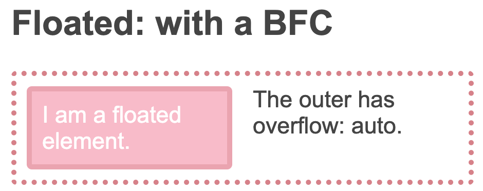
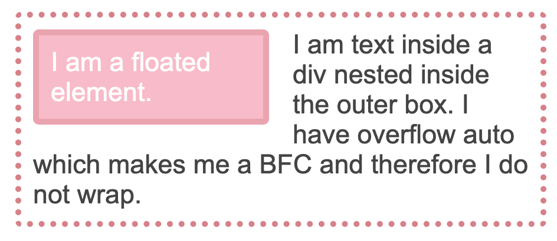
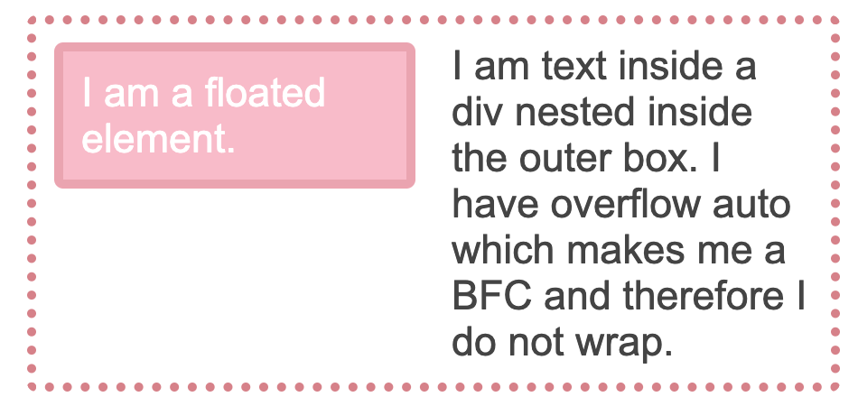

#### BFC (Block Formatting Context) 

MDN定义：Web 页面的可视 CSS 渲染的一部分，是块级盒子的布局过程发生的区域，也是浮动元素与其他元素交互的区域

概念很抽象，根据它的作用讲：就是可以让浮动元素的父级元素包括住浮动元素，不会造成高度坍塌



上面这个粉色的框就超出外面的父级虚线框了，布局有问题，粉色框是`float`浮动元素，可以给 “父级虚线框” 添加一个属性

```CSS
overflow: auto;
```

之后就变成这样



再比如可以使用`display: flow-root;`



变成



BFC：根据张鑫旭CSS世界定义，BFC为一个“结界”，外部不能对内部造成什么影响，比如上面使用了`overflow: hidden`的`p`标签（那一大段黑色文字）就形成了一个BFC，外部的那个`float`的浮动元素就对黑色文字造成不了影响

其实这个粉色框`float`元素也是BFC，不过是粉色框内部而言。同样的，按照BFC的生成规则，黑色文字的BFC也可以用`float`创建，但破坏性太大了，让元素本来的流体特性没了，变成了包裹性

### BFC的生成规则

• `float` 的值不为 `none`

• `overflow` 的值为 `auto`、`scroll` 或 `hidden`

• `display` 的值为 `table-cell`、`table-caption` 和 `inline-block` 中的任何一个

• `position` 的值不为 `relative` 和 `static`

`overflow: hidden`也不是没有缺点，比如设置了这个属性的BFC，结构是一个父元素包含一个子元素，这个子元素超出父元素的部分就会隐藏

### 应用

`margin`高度塌陷，父子元素`margin-top`的合并，可以给父元素创建一个BFC，父元素的`margin-top`和其内部隔绝，父元素和子元素各自的`margin-top`就可以生效了


