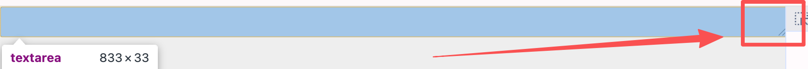

乍一看这俩概念会觉得非常的平淡，宽度和高度不就是设置对应的 `width`和 `height`属性就可以了嘛，但是 CSS 世界每一个盒子都是有独特的宽高计算规则，每一个盒子的共同作用变成了页面显示的全部


# 宽

## 宽度表现

- 块级盒子宽度
- 内联元素宽度

### 块级盒子宽度

块级盒子的宽度一般都是可以想象成水流的流动性，要铺满整个父元素的宽度，这也是默认的 `width: auto`的表现，这里的宽度是 `content`+`padding`+`border`+`margin`共同作用的结果，并且神奇的是这种流动性会自动分配前面四个属性的宽度（张鑫旭称之为“格式化宽度”）

### 内联盒子宽度
#### 替换元素
替换元素：``、`<video>`、`<ifream>` 、`<textarea>`、`<input>`、`<button>`（前面三个是 `inline`后面的是 `inline-block`）

替换元素的宽度表现有些许复杂，是通过：这些元素自己本身的尺寸（300 * 150）、通过 `width`和`height` HTML 属性设定的尺寸、还有 CSS 设定的尺寸
如果一个 ``没有设置任何的上述尺寸，且如果设置了 `src=""`(注意这个是一个空属性值)那么这个``默认会在所有浏览器解析为一个没宽度没高度的内联元素 ，如果使用 `src`引入图片，那么尺寸为 **引入图片的尺寸**，如果设置了 `width`，没有设置 `height`，那么 ``会按照图片的比例计算出 `height`。最后，如果使用 CSS 设置了 `width`、`height`那么最终的尺寸就是 CSS 设置的

##### `inline-block`盒子

这个盒子很特殊，这里说它具有的流体特性，表现为外部盒子可以设置宽高，并且有**宽度智能选择的特性**，比如如果没有超过父元素宽度，那么表现为 `inline`的收缩性盒子，宽度就是内容宽度（当然没有设置 `width`等），如果超过父元素，宽度就变成了父元素的宽度（这个就是宽度智能选择行为）

###### input、textarea
这俩盒子也是 `inline-block`盒子或者说是替换元素，替换元素有一个特点是宽度只能是它的内部盒子决定，非外部盒子决定，外部盒子决定宽度只有块级元素的流动性
```html
<textarea></textarea>

<style>
textarea{
	/* 这里设置了也是无效的，这个多行文本输入框还是默认宽度，不会 100% 宽度 */
	display: block; 
	
	/* 必须要改变替换元素内部盒子的宽度，也就是可以直接设置 width 属性，这句话可以让替换元素 100% 宽度 */
	width: 100%;
}
</style>
```
并且，`input`、`textarea`的 `box-sizing`默认就是 `border-box`，宽度是包括了 `padding`，这样做的好处在于方便宽度自适应，而不需要考虑 `padding`的影响导致宽度溢出

设置了 `content-box`、`100% width` 后，宽度已经溢出了

#### inline元素

inline元素的宽，就是内容宽度

## min-width、max-width

这俩属性的权重比 `!important`还大，而且如果设置 `max-width: 100px` < `min-width: 150px`那么会取最大的 `150px`
如果设置了 `width: 120px !important`，`min-width: 140px`那么元素的最终尺寸是 140px

# 高

高度的计算相对来宽度说比较的简单，高度 `height: auto`是默认值，但是默认的 `auto`无法和所谓的子元素的 `height: 100%`计算
所以，有时想设置子元素的高度和父元素的高度一样都为 100% 就得给父子元素还有父元素的祖先元素都得使用 100% 的高度设置

## 高度表现

### 块级元素的高度

这里的高度如何计算在上面已经提到，还有另一个方法就是使用 `position: absolute`绝对定位，绝对定位的高度计算是相对于 `padding-box`的

### 内联元素的高度

内联元素包括：`inline`、`inline-block`、`inline-table`
内联元素的计算很复杂，首先要看 `line-height`行高控制多少、`font-size`字号大小，这俩决定行间距（准确说是元素上面的半行距和下面的半行距，和起来是行间距），`vertical-align`决定内联元素中字符的对齐位置，不同的字体对齐的位置也会有些许的差异

## min-height、max-height
和上文的 `min-width`、`max-width`计算规则一致