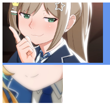

# 层叠上下文

屏幕上的元素往往都是堆叠到一起的，最上层显示文本，之后是背景色等。这些图层之间的关系可以在一个上下文中进行单独的管理——**层叠上下文**

## 层叠上下文中的比较

在层叠上下文中，每个元素得有一个标识——**层叠水平**，用来决定这个元素在当前上下文中的显示顺序

这个标识不是一个简单css属性来决定（通常都是用`z-index`来决定），也可以通过有些元素自带的层叠水平来排列顺序

### 比较规则

* 在后面的元素覆盖前面的元素显示

* 层叠水平大的元素要在层叠水平小的元素上面显示

举例：`z-index`大的比小的在上显示、最后一个`div`要在第一个`div`上显示（得是在同一个层叠上下文中）

## 层叠顺序


### CSS中的层叠水平属性

#### 布局属性`position: relative、absolute、fixed`

这些布局元素都会在应用这些属性的元素上创建层叠上下文，但要搭配`z-index`不为0

```html
<!-- 第一部分 -->
<div style="position:relative; z-index:auto;">
        <-- 横妹子 -->
</div>
<div style="position:relative; z-index:auto;">
        <-- 竖妹子 -->
</div>


<!-- 第二部分 -->
<div style="position:relative; z-index:0;">
        <-- 横妹子 -->
</div>
<div style="position:relative; z-index:0;">
        <-- 竖妹子 -->
</div>
```

第一部分：mm1图片在mm2图片上显示，`z-index: auto`的两个相对布局元素都是普通元素，他们里面的两个`img`元素才是层叠上下文，且`z-index: 2`的要大于1的


第二部分：相对布局的俩`div`创建了两个层叠上下文，但这俩的层叠水平相同，所以遵循后面的元素覆盖前面的，mm2在mm1之上显示


关键在于普通元素和层叠上下文元素的区别，而且即便层叠上下文元素中还有层叠上下文元素，但这时就只比较父级的层叠水平了

#### `display: flex`的子元素、子元素`z-index`不为0

会在子元素身上建立一个层叠上下文

```html
.box { display: flex; }
.box > div { background-color: cornflowerblue; z-index: 1; }    /* 此时该div是层叠上下文元素，同时z-index生效 */
.box > div > img { 
  position: relative; z-index: -1; right: -150px;     /* 注意这里是负值z-index *
/
}


<div class="box">
    <div>
        
    </div>
</div>
```

根据上面层叠顺序图，层叠上下文的背景是最底层，比`z-index`为负还要低。所以，最后的显示是mm1在蓝色背景上，且往右偏移了150px


#### `opacity`透明度、`transform`变换、`filter`过滤、`will-change`

这些属性都会在应用他们的元素上创建层叠上下文，但子元素是无法穿透他们的  
  


`filter`就更是了，会模糊一切


#### `isolation: isolate`和`mix-blend-mode`混合

`isolation`属性是和混合一块用的，这个属性会在应用的元素上创建一个层叠上下文，正好能和`mix-blend-mode`属性创建的层叠上下文隔离开，也是`isolate`英文的意思

```html
<style>
    .mode {
  /* 竖妹子绝对定位，同时混合模式 */
  position: absolute; mix-blend-mode: darken;
}    
.box {
  background: cornflowerblue; isolation:isolate;         
}
.box > img { 
  position: relative; z-index: -1;
}

</style>


<div class="box">
    
</div>
```

mm1图片在最上层显示，之后是层叠上下文的`background`的`div`，最后才是mm2图片。混合模式创建了一个层叠上下文，层叠水平和下面的`div`一致，遵循后面的元素覆盖前面的元素



最后，合理运用元素自己的层叠上下文，或者使用属性创造层叠上下文，来控制元素的层叠关系，都比随随便便满屏幕的`z-index`强
