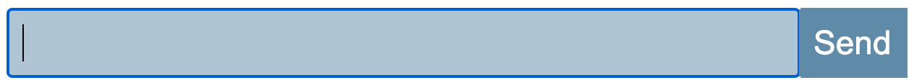
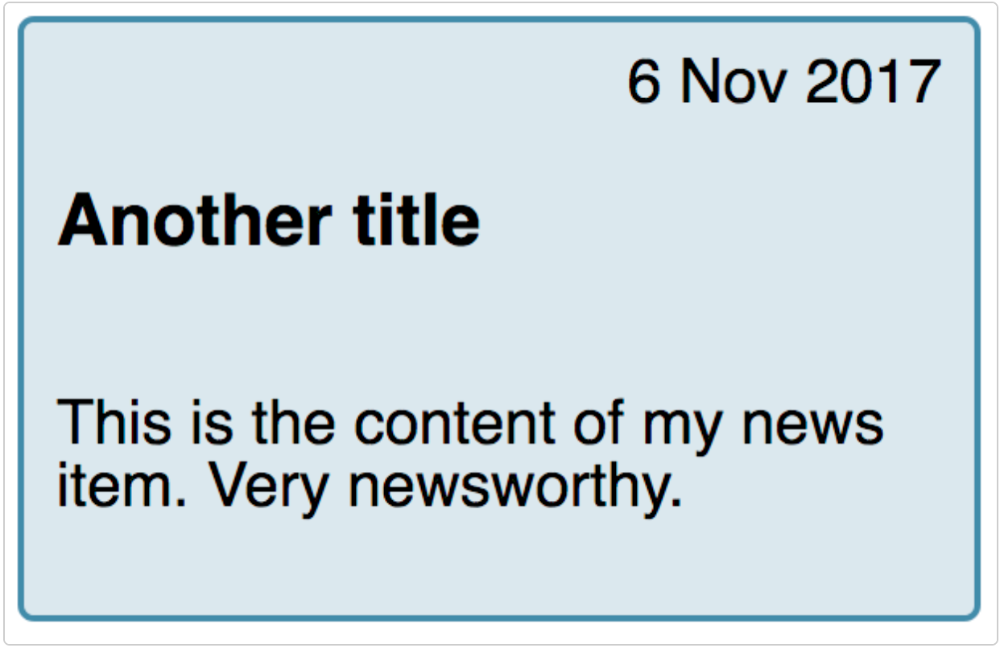
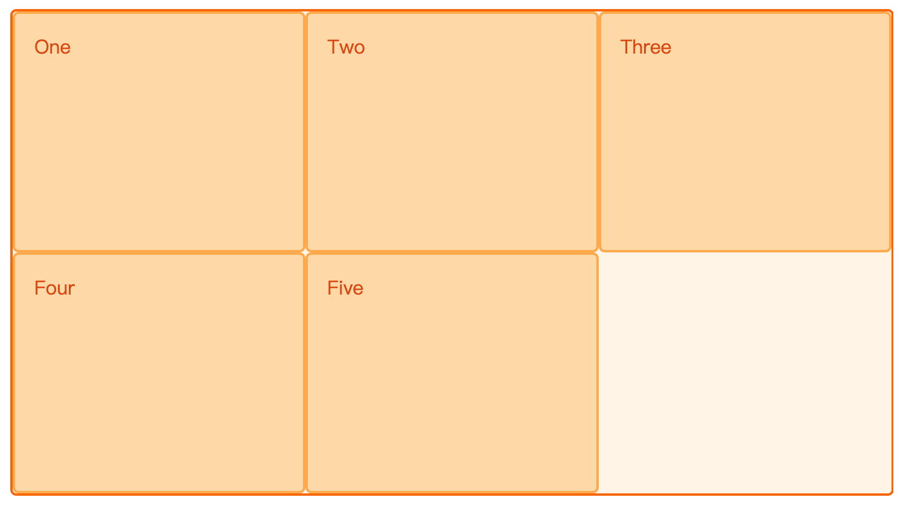
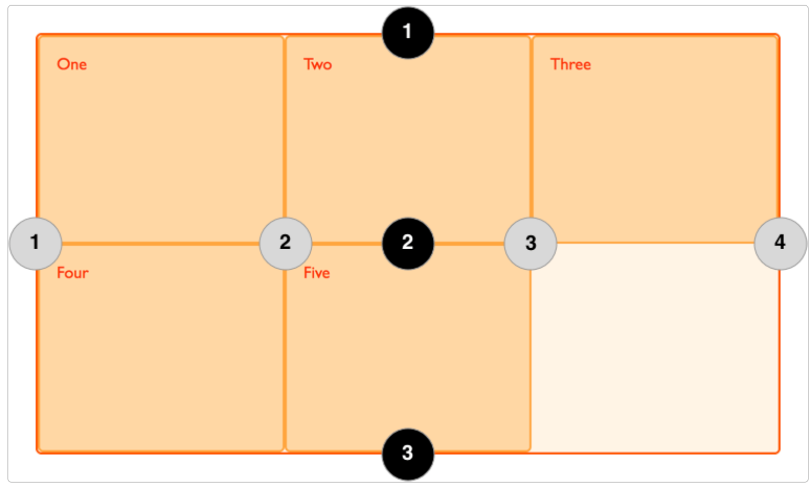
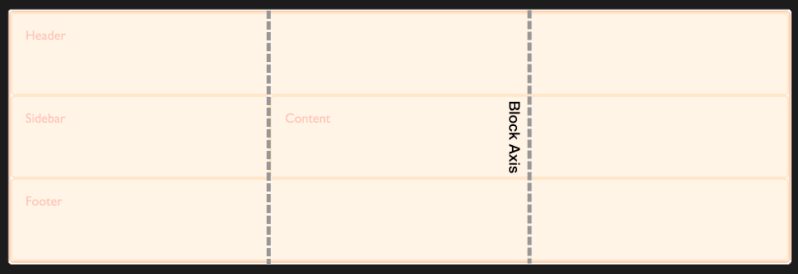
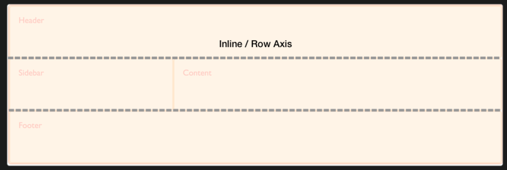
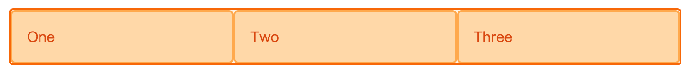
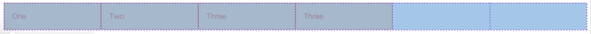
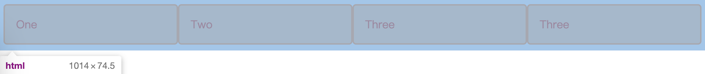

布局，CSS中必然要学会的一部分。基本上就是CSS 三分之一的内容

## Flex布局

Flex布局，原来称之为FlexBox（弹性盒子布局）面向的对象为盒子模型的元素，对于在页面上显示的一行，Flex布局会将其所有的位置填满（默认状态下）也可以通过flex开头属性指定元素的basic基础弹性盒子宽度，就像搭俄罗斯方块一样填满一行

Flex布局和Grid布局不一样，是两个概念。一个是弹性盒子的布局，一个是栅格


### 轴线

两条轴线：**横**轴 和 **交叉**轴，跟指定的方向一致的为主轴，垂直的为交叉轴。按照文档流的方式进行排布，所以也就注定了是一维方向的布局

**轴线的方向**：根据日常的书本文字排版方向来，都是从左往右的书写习惯，所以默认指定了轴线，也就指定了方向，同样可以指定反向的轴线方向

**交叉轴**：这个是相对的概念，相对于设置的主轴。如果主轴是X，交叉轴就是Y


#### 对应的属性

`flex-direction`：控制主轴的方向，水平`row`，竖直`column`也可以设置水平和竖直的反向，加后缀`row-reverse`

`flex-wrap`：控制换行，和`word-wrap`差不多

简写：

`flex-flow`：上面两个属性的合并简写，eg. `flex-flow: row nowrap`


### flex盒子中的元素

在`flex`容器中的盒子会默认的宽度，宽度就是这些盒子的内容的宽度。可以指定每一个元素的基础宽度`flex-basic`，每个元素在容器中多余的宽度（总宽度减去盒子基础宽度）中平均分配的宽度`flex-grow`，除了让盒子增加宽度，还可以让盒子缩小。盒子缩小必须是一行没有任何多余的宽度才可以触发`flex-shrink`


#### 对应的属性

`flex-basic`：容器内盒子的基本宽度，默认`auto`就是容器内容的宽度。也可以设定指定宽度

`flex-grow`：`flex-grow: 1`设置盒子增长宽度的比例

`flex-shrink`：设置盒子缩短的比例

简写：

`flex`：`flex: 1 1 auto`对应`flex: flex-grow flex-shrink flex-basic`，`flex: 1`或者`flex: 2`对应的是`flex: 1 1 0 flex: 2 2 0`，元素可增加，可减短，从0的基础上伸缩

如何理解呢，让每一个盒子都从0开始抢占flex容器的空间，这样可以使得每一个盒子分配的宽度都是一样的，即元素的大小不在空间分配计算的考虑之内

如果设置`flex-basic`为`auto`，那么虽然每一个盒子分配的宽度是一样的，但是加到盒子的原始内容宽度上就会不一致（没法保证每一个盒子的内容都是一样宽度嘛）

所以，`flex-basic`设置为0就是为了解决这个问题

合理的使用`flex`这个简写的属性很有用处，比如一个form控件。占一行，要求*`input`*框和`button`按钮一行，并且`input`框要占多的空间



可以让`input`设置`flex: 1 1 auto`

code

```CSS
.wrapper {
  display: flex;
}

.wrapper input[type="text"] {
  flex: 1 1 auto;
}
```

```HTML
<form class="example">
  <div class="wrapper">
    <input type="text" id="text">
    <input type="submit" value="Send">
  </div>
</form>
```


### 对齐

#### 主轴上的对齐

`justify-content`：`space-around`留两边和中间，`space-between`留中间

PS. flex布局主轴的对齐只有这么一个属性，不要和`Grid`布局弄混了


#### 交叉轴上的对齐

`align-items`：其实这个指的是盒子的高度，默认下盒子的高度是`flex`容器的高度，但设置了`center`等属性就不会占用全部高度了，看起来就像在交叉轴上居中了，默认控制单行

`align-self`：控制**单个**盒子的

多行

一行flex容器排不下所有的盒子，需要换行。多行的盒子需要控制它们之间的间距，就有了以下的属性

`align-content`：控制折行盒子行间距，对应的属性值和`justify-content`差不多一样，有`space-between`和`space-around`

交叉轴属性不一定要在`display: flex`下才能生效，用下面提到的`display: grid`属性同样也可以生效


#### 顺序

`order`：这个属性可以指定一个盒子显示的顺序， 可以设定负值。设定的盒子会按照每一个盒子`order`属性给定的顺序排列

eg. 一个普通的讯息卡片，会由标题，日期，简介组成



标题需要排列在日期的下面，但是，用户在使用`tab`制表符键盘按键 移动选择的元素时又想让选到卡片上的标题。如果按照常规思路，日期是第一行，`tab`选择时就会先聚焦到日期这个`DOM`上。

解决的方法就是给日期设置`order`属性，排在标题前面，但元素真正的位置不动（标题`DOM`还是在日期前）

code

```CSS
.card {
  display: flex;
  flex-direction: column;
}
.date {
  order: 0;
  text-align: right;
}
```

```HTML
    <div class="wrapper">
        <div class="card">
            <h3>News item title</h3>
            <div class="date">1 Nov 2017</div>
            <p>This is the content of my news item. Very newsworthy.</p>
        </div>
        <div class="card">
            <h3>Another title</h3>
            <div class="date">6 Nov 2017</div>
            <p>This is the content of my news item. Very newsworthy.</p>
        </div>
    </div>
```


## Grid布局

网格，二维布局的工具，顾名思义，是由多条互相垂直的线构成的，类似表格。元素盒子通过一个个“格子”进行定位


### 定位容器

网格通过一条条行、列组成，两条平行的列、行组成轨道，一个盒子默认占据一个轨道（行，列都是一样）



如上图，one盒子所占的第一个列轨道，和第一个行的隐式轨道（隐式轨道就是没有通过`grid-template-columns`或者`grid-template-rows`属性指定，上图是以“行”作为没有指定的轨道


#### 容器的声明

也是声明一个容器是“网格”的属性：`display: gird`或者`display: inline-grid`


### 轨道的相关属性

**声明**：`grid-template-columns`和`gird-template-rows`

**轨道宽度**（这是相对的，只声明了列轨道就是宽度，行轨道就是类似于高度）：`grid-template-columns: repeat(3, 1fr)`（`fr`为相对的单位，可以均分。`repeat()`为第一个参数为**重复行**或者**列**的数量，第二个参数为宽度）

**指定隐式轨道宽、高的属性**：`grid-auto-row`和`grid-auto-column`，以指定了列轨道为例子，使用`grid-auto-row`来指定隐式行轨道的高度，`gird-auto-row: minmax(100px, auto)`最小100px高度，最高不限制，以容器内容的最大高度为准

**网格线编号：**



上图中的黑色1-3是行网格线的编好，第一行、第二行这样的。列是灰色的圆圈编号

`grid-column-start`和`grid-column-end`：可以指定一个盒容器从第几列到第几列，行同理，不写了

**简写：**

以列为例：`grid-column-start`和`grid-column-end`可以简写为：`grid-column`

还有一个一步到位的属性

`grid-area`：

eg. `grid-area: 1 / 1 / 2 / 3`代表`grid-row-start: 1 grid-column-start: 1 grid-row-end: 2 grid-column-end: 3`


### 网格相关

**间距：**

`grid-column-gap`和`grid-row-gap`

后面添加了去掉前缀的属性

`column-gap`和`row-gap`、`gap`：`gap`对应`gap: row-gap column-gap;`

**嵌套：**大网格布局套一个小的网格布局

**顺序**：`order`属性


### 对齐

`Grid`布局也有两条轴线，块轴、行轴

块轴：



**块轴的对齐**

`align-items`：控制块轴上的盒子的对齐，以起始轴线，最后轴线，中间对齐，还有一个`baseline`基准线属性值

`align-self`：单独控制盒子对齐的


行轴：



**行轴的对齐**

这里不要和`flex`弄混了

`justify-items`：行轴上的元素对齐

`justify-self`：单独控制行轴盒子的


**整体的对齐**

`align-content`和`justify-content`，控制多个轴的对齐，可以理解为控制整体对齐


### Grid和Flex

让网格布局在一行/列中带有flex布局的弹性形式

太抽象，例子

```CSS
.wrapper {
  display: grid;
}
```

```CSS
<div class="wrapper">
  <div>One</div>
  <div>Two</div>
  <div>Three</div>
</div>
```

给`.wrapper`添加如下属性

`grid-template-columns: repeat(auto-fit, minmax(200px, 1fr))`



每一行中的每一个元素最小都是`200px`的宽度，但是分完`200px`的宽度发现还有剩余的宽度，于是按照`1fr`来均分了剩余的宽度，并给了这一行中的每一个盒子（`auto-fit`属性起的作用）

这像啥，这不就是`display: flex`嘛。但是，`flex`会在一行上多排尽可能多的盒子，像的点也只有均分这个剩余宽度而已

但也可以用`flex-basic`指定盒子的基准宽度，同时用`flex-grow`和`flex-shrink`控制盒子的伸缩，再用`flex-wrap`控制盒子的换行达到上面网格按列划分、自动换行、同样宽度这几个特性


换一个，给`.wrapper`添加如下属性

`grid-template-columns: repeat(auto-fill, minmax(200px, 1fr))`



每一行中的每一个元素最小同样为`200px`，但是`auto-fill`指定了**尽可能填充更多的列，但是这一行太宽了，并且没那么多元素给这一行，就会将剩余空间均分，空白填充**

但如果拉一下浏览器，让**剩余的宽度小于每一个元素的最小宽度**`200px`



PS. 每个盒子宽`208px`，4个就是`830多px`，不够一列`200px`的宽度，所以**剩余空间就被已有的盒子瓜分了**

这个行为和`flex`还是有点不同吧

## Float布局

浮动布局是一种常用的网页布局方法，它可以使元素在网页上浮动，以便在一行中显示多个元素。以下是使用CSS实现浮动布局的基本步骤：

1. 选择要浮动的元素。

2. 在CSS中添加以下代码：

```CSS
float: left | right | none;
```

`left`：元素向左浮动。

`right`：元素向右浮动。

`none`：元素不浮动。

1. 对于非浮动元素，需要清除浮动以便它们可以正确地在浮动元素下方显示。可以使用以下代码清除浮动：

```CSS
clear: left | right | both;
```

`left`：清除左侧浮动元素。

`right`：清除右侧浮动元素。

`both`：清除两侧浮动元素。

例如，以下代码将创建一个左浮动的段落：

```HTML
<p>这是一个段落。</p>
<p style="float: left;">这是一个左浮动的段落。</p>
```

在这个例子中，`<p>`元素将浮动到左侧，使其与`<p>`元素并排显示。

在清除浮动的例子中，我们将使用`clear: both;`：

```HTML
<p>这是一个段落。</p>
<p style="float: left;">这是一个左浮动的段落。</p>
<p style="clear: both;">这是一个清除浮动的段落。</p>
```

在这个例子中，`<p>`元素将浮动到左侧，但`<p>`元素将清除左侧和右侧的浮动元素，以便它可以在浮动元素下方显示。

