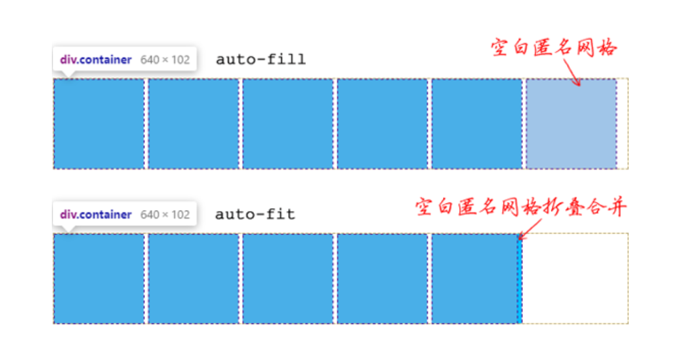

布局，决定元素在页面上的排布规则，页面布局情况很多，如不定宽度、高度的布局，定宽、高布局，自适应布局，网格布局，分栏布局

# 弹性布局

弹性布局/Flex布局，原来称之为FlexBox（弹性盒子布局）面向的对象为盒子模型的元素，对于在页面上显示的一行，Flex布局会将其所有的位置填满（默认状态下）也可以通过flex开头属性指定元素的basic基础弹性盒子宽度，就像搭俄罗斯方块一样填满一行

Flex布局和Grid布局不一样，是两个概念。一个是弹性盒子的布局，一个是栅格

### 轴线

两条轴线：**横**轴 和 **交叉**轴/**纵**轴，跟书写习惯方向一致的为**主**轴，垂直的为**交叉**轴。按照文档流的方式进行排布，所以也就注定了是一维方向的布局

**轴线的方向**：我们的书写习惯都是从左往右，所以默认指定了轴线，也就指定了方向，同样可以指定反向的轴线方向

**交叉轴**：这个是相对的概念，相对于设置的主轴。如果主轴是X，交叉轴就是Y


#### 属性

`flex-direction`：控制主轴的方向，水平`row`，竖直`column`也可以设置水平和竖直的反向，加后缀`-reverse`

`flex-wrap`：控制换行，和`word-wrap`差不多

`flex-flow`：上面两个属性的统一的简写形式

eg. ````
```css
	flex-flow: row nowrap;
	/* 下面只写<flex-direction>或者<flex-wrap>也是可以的，不一定要全部写上两个属性 */
	flex-flow: nowrap;
```


### flex属性

`flex: <'flex-grow'> <'flex-shrink'>? || <'flex-basic'>`
通过 CSS 属性值定义语法，可以知道`<flex-grow>`和`<flex-basic>`可以选其中一个，或者都写，`<flex-shrink>`可以写可以不写


#### flex 属性代表的三个属性值

在`flex`容器中的盒子默认的宽度就是这些盒子的内容宽度（`content-box`）可以指定每一个元素的基础宽度`flex-basic`，每个元素在容器中多余的宽度（总宽度减去盒子基础宽度）中平均分配的宽度`flex-grow`，除了让盒子增加宽度，还可以让盒子缩小。盒子缩小必须是一行没有任何多余的宽度才可以触发`flex-shrink`

- `flex-basic`：
  容器内盒子的基本宽度，默认`auto`就是容器内容的宽度。也可以设定指定宽度，如果容器已有 `width`属性，且 `width > flex-basic`那么容器显示的最终宽度为 `width`，但是如果开始缩放，容器可以最终被压缩到 `flex-basic`指定的宽度。同时也支持`max-content`、`min-content`等属性（但是，还没实装到浏览器）

- `flex-grow`：
  `flex-grow: <number>`可以写小数，如果`<1`则表示增长的空间大小 = 剩余总空间 * `<number>`，如果`>1`，则独享整个空间，如果`=1`，这里要设置在多个元素上才有表现，就是按照设置的比例（这里设置了 1）来给每一个盒子分配空间

- `flex-shrink`：
  `flex-shrink: <numer>`同样可以写小数，`<1`收缩不多，如果已经溢出容器则收缩后也可能会溢出容器，但如果是多个元素设置了`<1`的缩放且他们的和也`<1`那么每一个盒子的缩放计算如下：缩放`<number>` = 元素页面上真实缩放的大小 / 完全收缩后的大小。如果多个元素总和`>1`，则按照设置的`<number>`缩放到刚好合适容器大小，单个元素`>1`也是缩放到刚好合适容器大小

#### flex几种常见的缩写

- `flex: auto`对应`flex: 1 1 auto`，
- `flex: 1`或者`flex: 2`对应的是`flex: 1 1 0 flex: 2 2 0`，元素可增加，可减短，从0的基础上伸缩，这里的 0 只是说分配从 0 计算，而不是元素的宽度就是 0 了
- `flex: none`对应的是`flex: 0 0 auto`
- `flex: initial`对应`flex: 0 1 auto`，这个是初始值，很常用


如果设置`flex-basic`为`auto`，那么虽然每一个盒子分配的宽度是一样的，但是加到盒子的原始内容宽度上就会不一致（没法保证每一个盒子的内容都是一样宽度嘛）

所以，`flex-basic`设置为0就是为了解决这个问题

合理的使用`flex`这个简写的属性很有用处，比如一个form控件。占一行，要求`input`框和`button`按钮一行，并且`input`框要占多的空间


可以让`input`设置`flex: 1 1 auto`

code

```CSS
.wrapper {
  display: flex;
}

.wrapper input[type="text"] {
  flex: 1 1 auto;
}
```

```HTML
<form class="example">
  <div class="wrapper">
    <input type="text" id="text">
    <input type="submit" value="Send">
  </div>
</form>
```

#### flex元素的宽度
flex 元素的宽度是多方共同作用的结果，有 `width`、 `flex-basic`、元素的内容宽度，还有 `box-sizing`共同作用决定元素基础宽度，同时设置 `width`和 `flex-basic`时，`width`无法影响元素基础宽度，仅仅能影响元素的最小宽度

##### 元素最小宽度
当没有 `flex-basic`时，`width`和元素内容宽度，谁小选谁
当没有 `width`时，设置的 `flex-basic`宽度比最小内容宽度小，那么元素的宽度为最小内容宽度

### 对齐

#### 主轴上的对齐

`justify-content`：
- `normal`默认值
- `flex-start`表现为整体布局的左对齐（文档流的是从左向右的，如果文档流变化那么布局的方向也不一样）
- `flex-end`表现为整体布局右对齐（当然，文档流的方向也是从左到右）
- `center`这个是最常用的属性，整体布局居中对齐
- `space-around`留整体布局两边和布局内元素之间的空隙，左右两边的空隙相同，元素之间的空隙相同，但不代表两边的空隙和元素间的空隙相同
- `space-between`则不考虑整体布局两边的空隙仅仅保留整体布局内元素中间

`justify-item`：表示一次性设置容器内所有元素的样式的，比如不想一个一个给子元素添加`justify-sely`属性，就用这个属性

`justify-self`：这个属性不是设置在布局的容器上的，而是布局容器中的元素身上的，可以精细控制布局容器内的元素的单独样式


#### 交叉轴上的对齐

`align-items`：控制容器内的所有元素的，**属性设置在容器上，不是元素上**，`stretch`| `flex-start`|`flex-end`|`center`|`baseline`（这里的 baseline 就是 x 字母的下边缘，了解 line-height 和vertical-align 属性就知道这个 x 基线）

`align-self`：控制容器内的**单个**元素（盒子）的，默认值是`auto`，剩下的值和上面的`align-items`保持一致且概念相同

`align-content`：将布局容器内的盒子作为一个整体，对应的属性值和`justify-content`差不多一样，有`space-between`、`space-around`、`flex-start`、`flex-end`、`stretch`、`center`


#### 顺序

`order`：这个属性可以指定一个盒子显示的顺序， 可以设定负值。设定的盒子会按照每一个盒子`order`属性给定的顺序排列

eg. 一个普通的讯息卡片，会由标题，日期，简介组成


标题需要排列在日期的下面，但是，用户在使用`tab`制表符键盘按键 移动选择的元素时又想让选到卡片上的标题。如果按照常规思路，日期是第一行，`tab`选择时就会先聚焦到日期这个`DOM`上。

解决的方法就是给日期设置`order`属性，排在标题前面，但元素真正的位置不动（标题`DOM`还是在日期前）

code

```CSS
.card {
  display: flex;
  flex-direction: column;
}
.date {
  order: 0;
  text-align: right;
}
```

```HTML
    <div class="wrapper">
        <div class="card">
            <h3>News item title</h3>
            <div class="date">1 Nov 2017</div>
            <p>This is the content of my news item. Very newsworthy.</p>
        </div>
        <div class="card">
            <h3>Another title</h3>
            <div class="date">6 Nov 2017</div>
            <p>This is the content of my news item. Very newsworthy.</p>
        </div>
    </div>
```


# Grid布局

网格，二维布局的工具，顾名思义，是由多条互相垂直的线构成的，类似表格。元素盒子通过一个个“格子”进行定位，类似农田，街道

## 定位容器

网格通过一条条行、列组成，两条平行的列、行组成轨道，一个盒子默认占据一个轨道（行，列都是一样）


如上图，one盒子所占的第一个列轨道，和第一个行的隐式轨道（隐式轨道就是没有通过`grid-template-columns`或者`grid-template-rows`属性指定，上图是以“行”作为没有指定的轨道

#### 容器的声明

也是声明一个容器是“网格”的属性：`display: gird`或者`display: inline-grid`


### 轨道

#### 轨道的声明

`grid-template-columns`和 `gird-template-rows`

#### 需要提前了解的知识

##### fr
fr（fraction的缩写），表示的是列 `grid-template-columns` 如何按照比例划分的，fr 就是确定这个划分比例的

两种情况
- fr 的和`>1`
  `grid-template-columns: 1fr 1fr 1fr`，分配比例为 1:1:1 ，如果为 `auto 1fr 1fr 1fr`那么要先用列的总宽度减掉 `auto`的宽度
- fr 的和 `<1`
  `grid-template-columns: .2fr .2fr .2fr`，这里分配的比例就是 `总宽度 * 0.6` 最终得到的分配宽度是总宽度的 60%，所以这三列占的这一行是占不满的
  如果 `auto .2fr .2fr .2fr`，怎么计算呢，先计算出总的 fr 们占据的宽度，之后剩下的都分配给 `auto`

##### repeat()
CSS 属性值定义语法
`repeat( [ <positive-integer> | auto-fill | auto-fit ] , <tracklist> )`

简单解释下上面的语法
- `<track list>`是`grid-template-columns`后写的所有的列
- `<positive-integer>`是正整数，也就是重复后面的列定义语法的次数
- `auto-fill`：这个关键字可以在不确定列数的时候使用，可以让列合理布局在容器空间中，用空白的盒子来填充一行中列已全部分配的剩余空间
- `auto-fit`：同样在列数不确定的时候使用，但是会合并一行中列已全部分配的剩余空间，合并的包括轨道（columns 和 rows）和间隙（gap）




#### 属性

**轨道宽度**（这是相对的，只声明了列轨道就是宽度，行轨道就是类似于高度）：`grid-template-columns: repeat(3, 1fr)`

**指定隐式轨道宽、高的属性**：`grid-auto-row`和`grid-auto-column`，以指定了列轨道为例子，使用`grid-auto-row`来指定隐式行轨道的高度，`gird-auto-row: minmax(100px, auto)`最小100px高度，最高不限制，以容器内容的最大高度为准

**网格线编号：**


上图中的黑色1-3是行网格线的编好，第一行、第二行这样的。列是灰色的圆圈编号

`grid-column-start`和`grid-column-end`：可以指定一个盒容器从第几列到第几列，行同理，不写了

**简写：**

以列为例：`grid-column-start`和`grid-column-end`可以简写为：`grid-column`

**布局区域**

`grid-template`：用在容器上的，划分容器的区域

`grid-area`：这个属性是用在容器内的盒子上的，可以指定一个盒子的布局区域的名字

eg. `grid-area: 1 / 1 / 2 / 3`代表`grid-row-start: 1 grid-column-start: 1 grid-row-end: 2 grid-column-end: 3`


## 容器中的元素

### 网格相关

**间隙：**

`grid-column-gap`和`grid-row-gap`后面添加了去掉前缀的属性，这两个属性有可能会从浏览器中移除，所以需要下面的新属性

`column-gap`和`row-gap`、`gap`：`gap`对应`gap: row-gap column-gap;`


**顺序**：`order`属性


## 对齐

`Grid`布局也有两条轴线，块轴（交叉轴，纵轴，垂直的那条轴）、行轴（水平的那条轴）

### 块轴


**块轴的对齐**

`align-items`：控制块轴上的盒子的对齐，以起始轴线，最后轴线，中间对齐，还有一个`baseline`基准线属性值

`align-self`：单独控制盒子对齐的


### 行轴


**行轴的对齐**

这里不要和`flex`弄混了

`justify-items`：行轴上的元素对齐

`justify-self`：单独控制行轴盒子的


### **整体**

`align-content`和`justify-content`，控制多个轴的对齐，可以理解为控制整体对齐

`place-items`
CSS 规则语法：`place-items: <align-items> <justify-items>?`

# Grid和Flex

让网格布局在一行/列中带有flex布局的弹性形式

太抽象，例子

```CSS
.wrapper {
  display: grid;
}
```

```CSS
<div class="wrapper">
  <div>One</div>
  <div>Two</div>
  <div>Three</div>
</div>
```

给`.wrapper`添加如下属性

`grid-template-columns: repeat(auto-fit, minmax(200px, 1fr))`


每一行中的每一个元素最小都是`200px`的宽度，但是分完`200px`的宽度发现还有剩余的宽度，于是按照`1fr`来均分了剩余的宽度，并给了这一行中的每一个盒子（`auto-fit`属性起的作用）

这像啥，这不就是`display: flex`嘛。但是，`flex`会在一行上多排尽可能多的盒子，像的点也只有均分这个剩余宽度而已

但也可以用`flex-basic`指定盒子的基准宽度，同时用`flex-grow`和`flex-shrink`控制盒子的伸缩，再用`flex-wrap`控制盒子的换行达到上面网格按列划分、自动换行、同样宽度这几个特性


换一个，给`.wrapper`添加如下属性

`grid-template-columns: repeat(auto-fill, minmax(200px, 1fr))`


每一行中的每一个元素最小同样为`200px`，但是`auto-fill`指定了**尽可能填充更多的列，但是这一行太宽了，并且没那么多元素给这一行，就会将剩余空间均分，空白填充**

但如果拉一下浏览器，让**剩余的宽度小于每一个元素的最小宽度**`200px`


PS. 每个盒子宽`208px`，4个就是`830多px`，不够一列`200px`的宽度，所以**剩余空间就被已有的盒子瓜分了**

这个行为和`flex`还是有点不同吧

# Float布局

浮动布局是一种常用的网页布局方法，它可以使元素在网页上浮动，以便在一行中显示多个元素。以下是使用CSS实现浮动布局的基本步骤：

1. 选择要浮动的元素。

2. 在CSS中添加以下代码：

```CSS
float: left | right | none;
```

`left`：元素向左浮动。

`right`：元素向右浮动。

`none`：元素不浮动。

1. 对于非浮动元素，需要清除浮动以便它们可以正确地在浮动元素下方显示。可以使用以下代码清除浮动：

```CSS
clear: left | right | both;
```

`left`：清除左侧浮动元素。

`right`：清除右侧浮动元素。

`both`：清除两侧浮动元素。

例如，以下代码将创建一个左浮动的段落：

```HTML
<p>这是一个段落。</p>
<p style="float: left;">这是一个左浮动的段落。</p>
```

在这个例子中，`<p>`元素将浮动到左侧，使其与`<p>`元素并排显示。

在清除浮动的例子中，我们将使用`clear: both;`：

```HTML
<p>这是一个段落。</p>
<p style="float: left;">这是一个左浮动的段落。</p>
<p style="clear: both;">这是一个清除浮动的段落。</p>
```

在这个例子中，`<p>`元素将浮动到左侧，但`<p>`元素将清除左侧和右侧的浮动元素，以便它可以在浮动元素下方显示。

