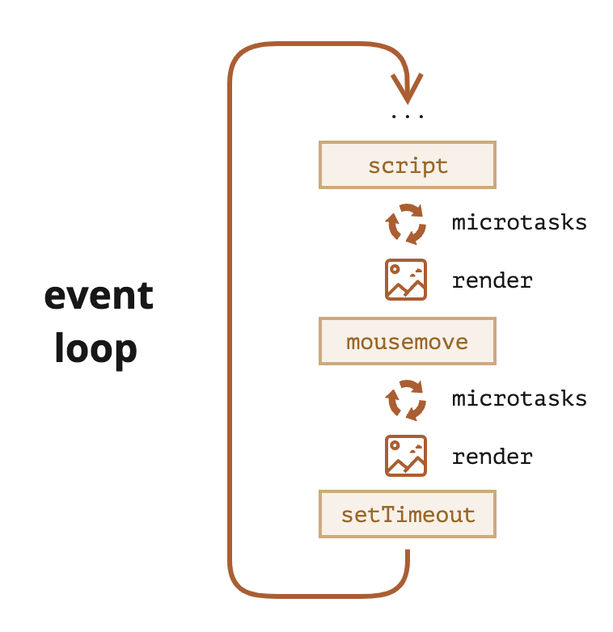
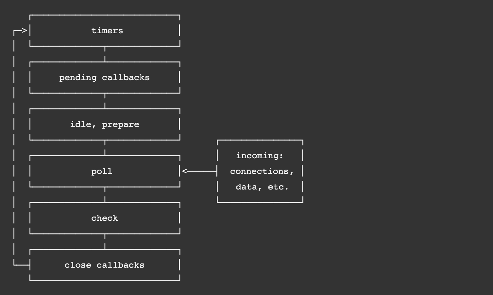

这里的其他任务、微任务仅仅说浏览器和`nodejs`的`v8`相同的地方，`nodejs`独有的一些其他任务函数暂且不提
且后面提到的`事件循环Event Loop`都以浏览器为准
`nodejs`要和系统打交道，不会涉及到渲染、鼠标移动这些界面上的操作，而浏览器的环境正是要和这些东西打交道，所以这两者不太相同


### 浏览器的其他任务、微任务

首先，其他任务、微任务在浏览器里面都是些什么任务

**其他任务**（task）：常规的 js 代码，定时器，计时器，ui交互，I/O，一些脚本script。这个不是同步任务，而是一些不应该影响主线程的，能独立执行完成的任务

**微任务**（micro task）：Promise、网络请求（本质也是Promise）、`MutationObserve`API

微任务和其他任务都是`Web APIs`，浏览器提供的

这些任务都是为了不影响主线程的执行，不阻塞主线程的代码而引入的

### 浏览器事件循环 Event Loop

浏览器一次只能执行一个任务，为了防止浏览器被一些任务阻塞造成假死，得需要程序级的机制（事件循环）来完成任务的有序执行，异步任务和同步任务交替执行

有了这个机制，上面的其他任务和微任务才有了用武之地

执行一些常规的代码（同步代码） → 执行所有微任务 → 渲染 → 其他任务 → 执行一些常规的代码..... → ....



这里有一些细节

其他任务的执行是从一个其他任务队列中取出的，执行一个其他任务队列中的一个最早的任务，就要完成一遍上面的事件循环机制（但这个队列不是数据结构的队列，按照先进先出的原则。而是取出一个可以执行的其他任务来执行）

微任务则会全部执行完毕，也就是取出当前微任务队列中的所有微任务，并执行完毕

以下代码的执行结果
```js
Promise.resolve().then(() => {
  // 微任务1
  console.log("Promise1");
  setTimeout(() => {
    // 任务2
    console.log("setTimeout2");
  }, 0);
});
setTimeout(() => {
  // 任务1
  console.log("setTimeout1");
  Promise.resolve().then(() => {
    // 微任务2
    console.log("Promise2");
  });
}, 0);

// 结果
Promise1 -> setTimeout1 -> Promise2 -> setTimeout2
```

### Node中的事件循环



+ `timers`：本阶段执行已经被 `setTimeout()` 和 `setInterval()` 的调度回调函数。
+ `pending callbacks`：执行延迟到下一个循环迭代的 I/O 回调。
+ `idle、prepare`：仅系统内部使用。
+ `poll`：检索新的 I/O 事件;执行与 I/O 相关的回调（几乎所有情况下，除了关闭的回调函数，那些由计时器和 `setImmediate()` 调度的之外），其余情况 node 将在适当的时候在此阻塞。
+ `check`：`setImmediate()` 回调函数在这里执行。
+ `close callbacks`：一些关闭的回调函数，如：`socket.on('close', ...)`

