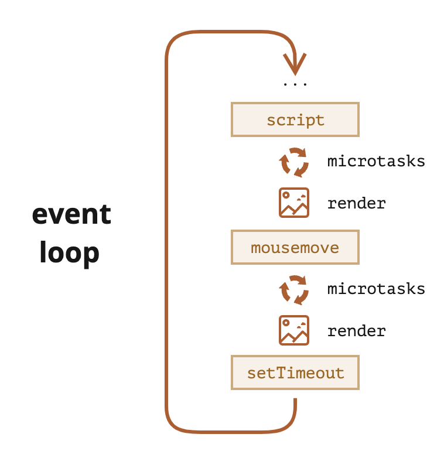
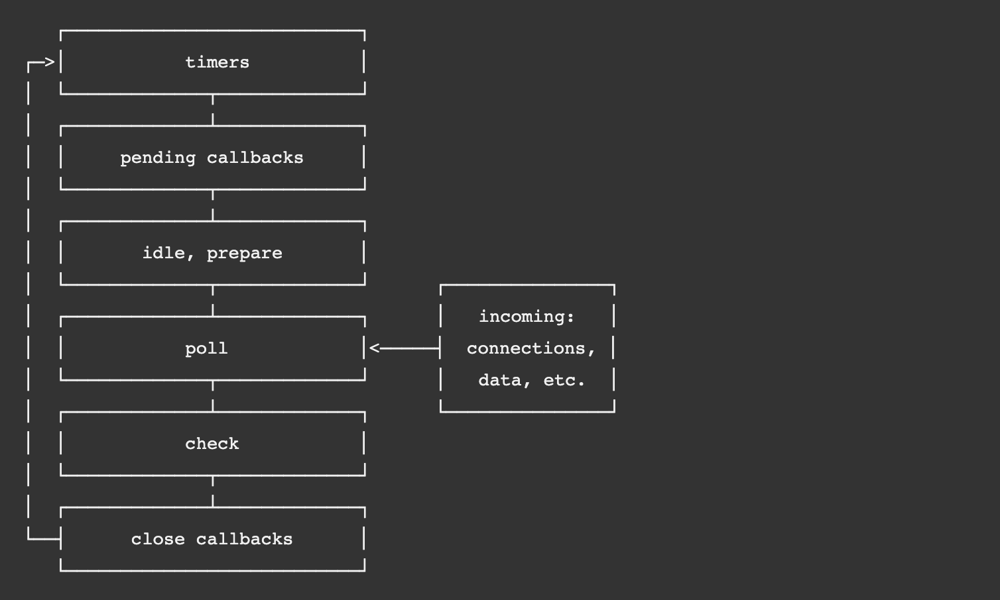

事件循环（Event Loop 或 Message Loop），浏览器及 Node 环境下，为了不阻塞主线程的任务执行，而引入的一种任务处理机制

# 异步与同步
同步执行是指在渲染主线程中，任务会一次性的执行完毕，而异步执行，则是渲染主线程为了避免阻塞而不等待当前任务完成而执行后面的任务都过程

## 何为 JS 中的异步？
>JS是一门单线程的语言，这是因为它运行在浏览器的渲染主线程中，而渲染主线程只有一个。而渲染主线程承担着诸多的工作，渲染页面、执行 JS都在其中运行。如果使用同步的方式，就极有可能导致主线程产生阻塞，从而导致消息队列中的很多其他任务无法得到执行。这样一来，一方面会导致繁忙的主线程白白的消耗时间，另一方面导致页面无法及时更新，给用户造成卡死现象。
>
>所以浏览器采用异步的方式来避免。具体做法是当某些任务发生时，比如计时器、网络、事件监听，主线程将任务交给其他线程去处理，自身立即结束任务的执行，转而执行后续代码。当其他线程完成时，将事先传递的回调函数包装成任务，加入到消息队列的末尾排队，等待主线程调度执行。0n在这种异步模式下，浏览器永不阻塞，从而最大限度的保证了单线程的流畅运行。

PS. 
这里的其他任务、微任务仅仅说浏览器和`nodejs`的`v8`相同的地方，`nodejs`独有的一些其他任务函数暂且不提
且后面提到的`事件循环Event Loop`都以浏览器为准
`nodejs`要和系统打交道，不会涉及到渲染、鼠标移动这些界面上的操作，而浏览器的环境正是要和这些东西打交道，所以这两者不太相同


# 任务
任务在同一个队列中是不分前后，不分优先级的，遵循队列的先进先出原则
- **其他任务**（task）：常规的 js 代码，定时器，计时器，ui交互，I/O，一些脚本script，渲染等
- **微任务**（micro task）：Promise、网络请求（本质也是Promise）、`MutationObserve`API

微任务和其他任务都是`Web APIs`，浏览器提供的

这些任务都是为了不影响主线程的执行，不阻塞主线程的代码而引入的

## 消息队列
消息队列是存放任务的队列，消息队列是**有优先级的**，在一次事件循环中，浏览器可以根据实际情况从当前优先级最高的任务队列中取出一个任务来执行

### 队列类型
- 微队列：优先级最高，其中存放需要最快执行的任务
- 延时队列：优先级中等，定时器、计时器相关回调
- 交互队列：用户和浏览器交互的相关事件等，优先级次高
- 等等其他队列...


# 浏览器事件循环 Event Loop
事件循环又叫做消息循环，是浏览器渲染主线程的工作方式。在 Chrome 的源码中，它开启一个不会结束的`for`循环，每次循环从消息队列中取出第一个任务执行，而其他线程只需要在合适的时候将任务加入到队列末尾即可。过去把消息队列简单分为宏队列和微队列，这种说法目前已无法满足复杂的浏览器环境，取而代之的是一种更加灵活多变的处理方式
根据 W3C官方的解释，每个任务有不同的类型，同类型的任务必须在同一个队列，不同的任务可以属于不同的队列。不同任务队列有不同的优先级，在一次事件循环中，由浏览器自行决定取哪一个队列的任务。但浏览器必须有一个微队列，微队列的任务一定具有最高的优先级，必须优先调度执行



这里有一些细节

其他任务的执行是从一个其他任务队列（这里是把除了微队列之外的队列的统称，并不是指只有微队列和其他任务队列）中取出的，执行一个其他任务队列中的一个最早的任务，就要完成一遍上面的事件循环机制（但这个队列不是数据结构的队列，按照先进先出的原则。而是取出一个可以执行的其他任务来执行）
微任务则会全部执行完毕，也就是取出当前微任务队列中的所有微任务，并执行完毕

以下代码的执行结果
```js
Promise.resolve().then(() => {
  // 微任务1
  console.log("Promise1");
  setTimeout(() => {
    // 任务2
    console.log("setTimeout2");
  }, 0);
});
setTimeout(() => {
  // 任务1
  console.log("setTimeout1");
  Promise.resolve().then(() => {
    // 微任务2
    console.log("Promise2");
  });
}, 0);

// 结果
Promise1 -> setTimeout1 -> Promise2 -> setTimeout2
```

### Node中的事件循环



+ `timers`：本阶段执行已经被 `setTimeout()` 和 `setInterval()` 的调度回调函数。
+ `pending callbacks`：执行延迟到下一个循环迭代的 I/O 回调。
+ `idle、prepare`：仅系统内部使用。
+ `poll`：检索新的 I/O 事件;执行与 I/O 相关的回调（几乎所有情况下，除了关闭的回调函数，那些由计时器和 `setImmediate()` 调度的之外），其余情况 node 将在适当的时候在此阻塞。
+ `check`：`setImmediate()` 回调函数在这里执行。
+ `close callbacks`：一些关闭的回调函数，如：`socket.on('close', ...)`


## 面试题
### JS 中的计时器能做到精确计时吗?为什么?
参考答案:
不行，因为
1. 计算机硬件没有原子钟，无法做到精确计时
2. 操作系统的计时函数本身就有少量偏差，由于 JS 的计时器最终调用的是操作系统的函数，也就携带了这些偏差
3. 按照 W3C的标准，浏览器实现计时器时，如果嵌套层级超过5层，则会带有4毫秒的最少时间，这样在计时时间少于4 毫秒时又带来了偏差
4. 受事件循环的影响，计时器的回调函数只能在主线程空闲时运行，因此又带来了偏差