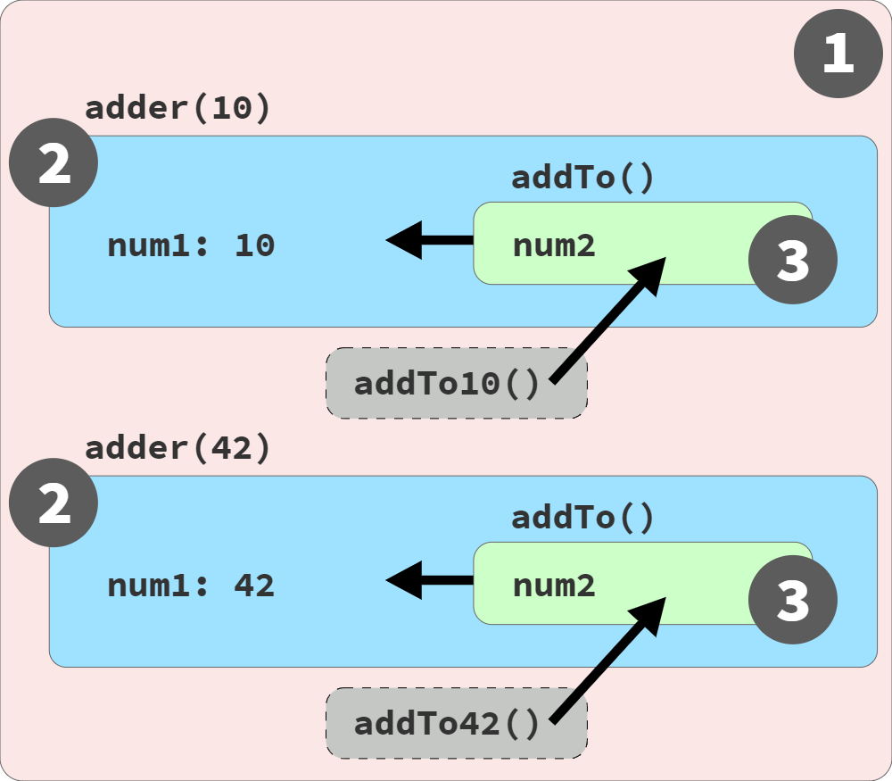

# 作用域、执行上下文、this指向

> 标题为了好找，所以写了一堆概念，并不代表他们之间没关系，或者等同

# JS引擎解析执行代码的过程

## **解释阶段**

* 词法分析（原始代码字符串输入状态机得到Tokens）  
* 语法分析（得到Parse Node语法树）  
* 作用域规则分析（确定作用域链）   

PS. Parse Node是ECAMScript规范中的解析节点生成语法树的过程，AST语法树更多是Babel等工具使用的，排除掉了Parse Node生成的语法树里面不用的一些属性，更简洁
 
## **执行阶段**

* 创建执行上下文
  * 创建全局词法环境、全局变量环境、`this`指向（全局this指向）
  * 如果函数调用，还要创建函数词法环境、函数变量环境，`this`执行（调用函数里的this指向）
* Agent执行函数代码，在执行上下文中有环境记录，领域等信息
* 垃圾回收

# 术语

下面为一些前置概念，需要了解

## 环境记录（Environment Records）
是一种规范，用来定义标识符与函数、特殊变量之间关系的规范。按照JS代码的逻辑结构有不同的环境记录器（环境记录类型），一个环境记录里会有类型，标识符，还有`[[OuterEnv]] `（指向外部环境）

环境记录下有三个不同的环境记录类型
* 声明环境记录
  * 函数环境记录
  * 模块环境记录（Module Environment Records ）
* 对象环境记录（Object Environment Record）
* 全局环境记录

### 声明环境记录（ Declarative Environment Record）
包括作用域范围内的所有类型变量、函数、类、模块、`import`导入的这些定义的标识符和他们的值做关联
```js
const foo = 'bar'

// 环境记录伪代码
EnvironmentRecord: {     
  // 环境记录器：存储变量和函数声明的实际位置
    Type: "const",      
    // 在这里绑定标识符
    foo: <'bar'>
}
```

#### 函数环境记录（Function Environment Records）
函数调用会对应特定的环境记录，包括函数范围内的顶层声明变量，函数内的`this`指向，捕获一些属性来支持`super`调用（比如对象字面量里，子类的`constructor`里，都要调用`super`，所以子类的函数环境记录里要捕获父类构造函数中的状态）

### 全局环境记录（ Global Environment Record）
`<script></script>`标签体中的全局声明，全局环境记录中的`[[OuterEnv]] `为空，全局声明里有自定义的一些标识符，一个全局对象（global object），属性是全局环境的标识符绑定关系

PS. global object全局对象：上面有一些很熟悉的属性，如：globalThis，NaN，Infinity，undefined

### 领域 Realm
规范新概念，包含一个全局环境记录，一个全局对象，加载了全局环境关联的代码，还有一些其他属性和资源（比如下面提到的agent，记录了一个agent的id）

PS. 简单理解比全局环境记录更上层的一个概念，两者是包含关系，相当于一个独立的`js`世界，包括一套完整的js中所需的东西

### 抽象执行单元 Agent
**概念**：执行js代码的单元，Agent也可以有多个，不同线程的

包括一堆的执行上下文，一个执行上下文栈，一个运行时的执行上下文，一个`Agent`记录，一个执行线程，执行线程不是这个agent独享的，可以共享（不共享单开线程代价也太大了）  

Agent可以被挂起，想象线程被挂起就可以

# 作用域分析 Scope Analysis

## 作用域
是变量、函数、对象等生效的最大范围，出了这个范围访问就无效了，也有人称之为最大可访问性，都是一个道理

作用域分析是静态语义（Static Semantics）分析，可以确定各个作用域的环境记录，var记录变量环境，会导致提升等，标记`[[OuterEnv]]`属性创建作用域链

### 作用域分类
- 全局作用域
- 函数作用域

### 块
比如 `for(){ ... }`、直接使用 `{ ... }`（直接写大括号在 js 中也是合法的，会被作为一个块）， `if{...}else{...}`，如果内部使用了块级声明关键字 `let`、 `const`就会变成一个作用域
例外. `try{  }catch{  }`，会形成块级作用域，不管里面有没有块级关键字


### 提升
- var 声明提升
- 函数提升

#### `var`、 `let`、 `const`提升
上面两种声明都会将其名称标识符提升到外层的 `function scope`函数作用域中，如果外层没有函数作用域那就是提升到了全局作用域，注意，只提升一层
所以，可以不使用声明关键字直接使用标识符的名称就可以赋值，或者执行函数
```js
foo = 'bar'
bar()

var foo = 'last'
function bar() {
}
```

PS. 声明变量时，js 编译器会先提升变量，`var`、`let`、`const` 都会插入“自动初始化”编译指令，但是⚠️， `var`变量会在作用域顶部插入初始化指令，相当于提升了声明，也提升了自动初始化指令。而 `let`和 `const`就不同了，他们只会在声明的位置插入初始化指令，这就导致如果在一个作用域内没有先声明变量而直接使用就会报 `ReferenceError`
```js
studentName = "Suzy"; // 让我们试着初始化它！
// ReferenceError

console.log(studentName);

let studentName;
```
但是，`let`和 `const`都是提升了变量的，要不然怎么会报“未初始化变量不可使用”的错误❌呢

上面的情况，被称为 TDZ(Temporal Dead Zone)暂时性死区，即变量在提升后（声明后），在没有执行完初始化指令前的这段时间


#### 函数提升
`function` 声明的一个特殊特性，称为 **函数提升 (function hoisting)**。当一个 `function`声明的名称标识符被注册在其作用域的顶部时，它就会被自动初始化为该函数的引用

`function foo()`函数定义会提升，类似 `var`，下面的函数都不会提升
```js
var foo = function (params) {
}

var foo = () => {
}
```


## 作用域链
每一个静态分析的范围都有对应的环境记录，环境记录在对应的词法组件中，每一个环境记录有对应的`[[OuterEnv]]`属性，正是指向上一层的环境
所以，查找标识符就会顺着作用域链依次往上找
```js
var foo = 'bar'

function bar() {
  console.log(foo)
}

function funcScope() {
  var foo = 'func scope'
  bar()
}

funcScope()

// 输出：'bar' 而不是 'func scope'
// 原因：bar函数的外部作用域[[OuterEnv]]指向的是全局，全局下面的foo的值为'bar'
// 作用域链是静态分析生成的，不是再调用 bar() 的时候生成的
```

## 闭包
> 闭包描述的是一种保持函数实例及其整个作用域环境和链的活力的魔法，只要程序的任何其他部分中还存在至少一个对该函数实例的引用（出自 You Dont Know JS）

下面代码注释包括了上面一句话中的术语解释
```js
// 外部/全局作用域：红色 (1)

function adder(num1) {
    // 函数作用域：蓝色 (2)

    return function addTo(num2) {
        // 函数作用域：绿色 (3)

        return num1 + num2;
    };
}

var add10To = adder(10);   // adder() 是 函数实例  add10To 是 实例引用
var add42To = adder(42);

add10To(15); // 25
add42To(9); // 51

```

下面图片展示了上文中的作用域


# 执行上下文
运行时的js代码需要有东西能记录这些代码的运行状态，所在领域，词法环境和变量环境。类的执行上下文还有私有环境（比如私有变量）  
这提到的**词法环境**就是上文的环境记录，变量环境（VariableEnvironment）是指用`var`关键字定义的变量的标识符的绑定关系

## 执行上下文栈 
栈顶：永远都是运行时执行上下文，只能有这一个
栈中：都是些执行上下文，等待被执行

## 领域、Agent、执行上下文间关系

Agent可以跨领域，在领域之间切换。执行上下文是在领域中的

## this指向

[Click Link this指向](./this.md)