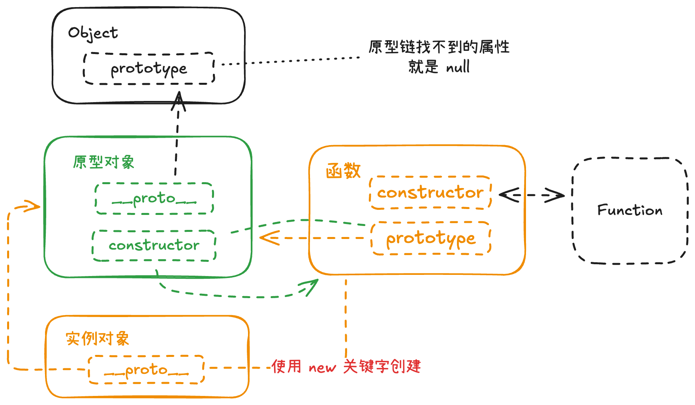

这是js里面的一个核心概念，可以实现类似继承，面向对象语言的一些特性。可以用原型组成一个原型链


# `[[Prototype]]`和`prototype`

`[[Prototype]]`：这个是对象的原型，这种写法一般都是内部属性

`prototype`：这个是函数`Function`的一个属性

不要混淆上面的两个东西了

## `[[Prototype]]`

对象的属性，可以通过访问器添加到一个常规对象，字面量对象的身上

⚠️注意，这里不能直接的去设置这个属性，比如下面的写法

```JavaScript
const foo = {
  bar: 'hello',
  [[Prototype]]: {...} // Error：这是错误的
}
```

可以通过访问器`__proto__`设置此对象的原型

```JavaScript
const foo = {
  bar: 'hello',
  __proto__ : {...}
}
```

好，理解上面的东西后来看看函数的`prototype`怎么用

这里要有构造函数的概念

比如想让一堆对象都有一个相同的方法，该怎么做？

- 设置每一个对象的`__proto__`的原型访问器都是一样的方法，这样每一个对象都有了相同的方法，可以直接通过`.`调用

- 通过构造器和`new`来创建对象，指定构造函数，也可以实现每一个对象都有相同的方法

```JavaScript
// 一个构造函数
function Box(value) {
  this.value = value;
}

// 使用 new Box() 构造函数创建的所有盒子都将具有的属性
Box.prototype.getValue = function () {
  return this.value;
};

const boxes = [new Box(1), new Box(2), new Box(3)];
```

上面用的是函数，和类不太一样，类里面可以指定一个`construct`函数，这也是类式和函数式的不同，只是显式和隐式的区别，类式写法为一种语法糖。函数式和类式都是可以互相转换的

同时，构造函数`Box`有一个`constructor`属性，这个属性引用了构造函数本身，有啥用？就是使用`new`的时候用，所以，必须用`new`关键字去构造一个对象，在类式写法中那就是显式的`constructor()`了

```JavaScript
Box.prototype.constructor === Box
```

下面展示下`Class`类式写法

```JavaScript
class Box {
  constructor(value) {
    this.value = value;
  }

  // 在 Box.prototype 上创建方法
  getValue() {
    return this.value;
  }
}
```


### 隐式`[[Prototype]]`

有些字面量对象会创建这个东西，为了啥呢，比如说为了可以迭代的方法等

例子

```JavaScript
// 对象字面量（没有 `__proto__` 键）自动将
// `Object.prototype` 作为它们的 `[[Prototype]]`
const object = { a: 1 };
Object.getPrototypeOf(object) === Object.prototype; // true

// 数组字面量自动将 `Array.prototype` 作为它们的 `[[Prototype]]`
const array = [1, 2, 3];
Object.getPrototypeOf(array) === Array.prototype; // true

// 正则表达式字面量自动将 `RegExp.prototype` 作为它们的 `[[Prototype]]`
const regexp = /abc/;
Object.getPrototypeOf(regexp) === RegExp.prototype; // true
```
line 7创建了一个数组，数组是可以迭代，比如用`for .. of` 等方法，所以就会创建一个隐式的原型让其指向`Array.prototype`

# 原型对象
介绍完上面的概念，就可以理解原型对象是什么了



黄色线
```js
// new 关键字创建的实例，会创建原型链
实例 = new 函数
实例.__proto__ = 函数.prototype
```

绿色线
```js
// 一个函数如果被当做构造函数，那么原型对象的 constructor 属性为函数本身
函数.prototype.constructor = 函数
```

# 原型链

当访问一个对象的属性时，会先访问对象本身有没有这个属性，对象本身不存在访问的属性时，就会去`[[Prototype]]`上找，找不到又会去原型对象的 `[[Prototype]]` 属性上找，（指向`Object.prototype`），最后如果还是找不到就返回一个`undefined`

比如说：找`Foo`上的一个`Bar`属性

`Foo`身上没有`Bar` → 去`Foo.[[Prototype]]`上找，如果没有就继续找 → `Foo.[[Prototype]].[[Prototype]]`对应的是`Object.prototype`，没有就会继续找，但是万物都继承的`object`身上再没有就会返回`undefined`了，要不然就无穷尽的寻找了

## 设置原型属性

### new
使用 `new` 关键字创建，会默认关键字后方的东西当为构造函数，并且会设置后方东西的 `prototype`属性为创建的新实例对象的 `[[Prototype]]`

#### 类
会调用类的 `constructor`函数，如果 `constructor`函数返回一个对象，则使用这个返回的对象，如果没有返回（一般都没有返回值）就会创建新的类实例
除 `constructor`构造函数内部定义在其 `this`上的属性，定义在 `class{}`块内的其他方法会默认添加到类的原型对象上 `类.prototype`上

### `__proto__`

这里有两种方法

1. `Foo.__proto__`：这个会通过`Object.prototype.__proto__`去创建，现在已经废弃了

2. `Foo = {bar: 'hello', __proto__: {c: 'hi'}}`：通过这个构造器设置原型属性已经在上面的例子中有展示了，IE10以下不支持，性能比下面`Object.create()`好

### `Object.setPrototypeOf()`

性能不佳，且是动态设置对象的原型属性，会导致一些问题，太灵活了，比如可以直接改变一个已经有原型属性的对象，会重新分配原型属性在内存中的地址

### `Object.create()`

也是性能不佳，主要在创建对象的过程中的性能不佳，比如创建上万的对象，会有延迟过慢的问题


### `Object.hasOwnPrototype()` 或 `Object.Own()`(现在推荐这个)

可以检查一个对象上是否有某一个属性，不会去原型链上找，并且还会规避一种变态写法，比如在属性身上定义了一个属性，但是值是`undefined`。如果用单纯的`.`调用去判断，就会得到`false`。这时就应该使用`hasOwnPrototype()`


