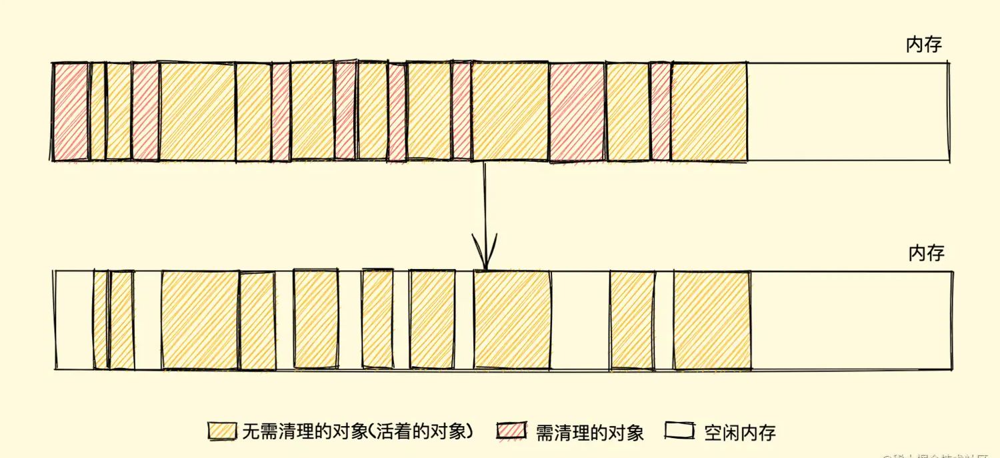
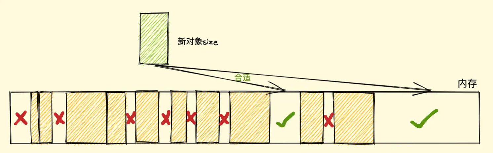
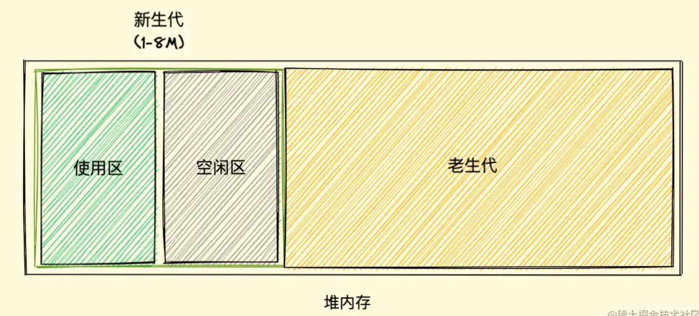
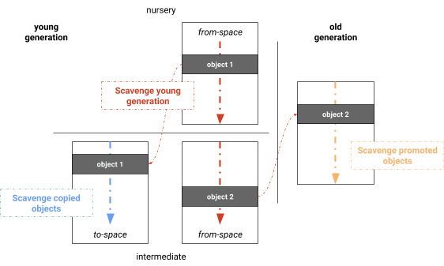
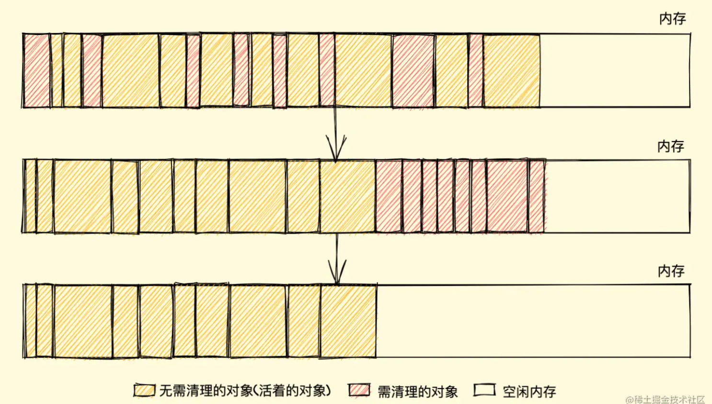

# 概念
垃圾回收，简称 GC（Garbage Collection）程序运行后会产生一些不**可达**的变量、对象等产生的内存空间，需要一种机制来管理这部分不用的内存空间

> 虽然有很多种垃圾回收的方法，但是，浏览器及 v8 的垃圾回收是多种垃圾回收方法的集合，并没有说用一个大一统的垃圾回收方法

# 基本机制
- 标记清除法
- 引用计数法

# 标记清除法
## 概述
垃圾收集器会从“根”开始，**标记阶段**会使用的活动对象，**清除阶段**则把没有标记的对象销毁，**根**是标记清除法的起始点，从“根”开始，依次遍历对象树 -> 标记活动对象 -> 清理没有标记的对象

### 标记清除法存在的问题
因为标记了内存中的活动对象，这些活动对象在内存中不是连续的，当清除掉这些对象后，内存空间将出现很多碎片
如果现在有一个新的对象需要分配内存，这些碎片中只能找一块大于等于这个对象的地方，不巧没有的话，只能分配到后面的整块内存中
如果正好又是分配到了最后新的内存，那就得遍历整个前面的内存块了





下面有三种方法用于确定新活动对象如何分配内存
- First-fit：在剩余内存中找到大于等于需要的size直接返回
- Best-fit：找到一块大于等于size 的最小分块（这里说的是最接近 size 的分块，和First-Fit 不一样）
- Worst-fit：找到最大的剩余空间，切出来size 大小的空间返回用于分配（这里每次找的都是最大的剩余空间再切割，反而会导致更多的内存碎片）

# 引用计数法

## 概述
每一个活动对象都会被记录引用的数量，如果对象没有引用（引用记录数为 0）那么就代表可以被回收，如果有引用，引用计数就不为 0，有几个引用就为几

## 问题
如果`a`变量引用了`b`，`b`又引用了`a`，就出现了循环引用，这时这两个对象的引用计数都是 2，而且基本程序不再使用这两个变量，这两个变量的引用计数也不会被清空

```js
function problem(){
	let a = {}
	let b = {}
	
	a.obj = b
	b.obj = a
}
```

PS. IE8及以前版本中的`DOM`和`BOM`对象，是通过 C++实现的，不是 js 的原生对象，被称为`COM`（组件对象模型），就会出现上面的问题，如何解决呢？只能通过手动设置对象为`null`
```js
// 续上面的代码
a.obj = null
b.obj = null
```

# V8 中的内存管理

[v8 官方 blog 新生代内存管理](https://v8.dev/blog/orinoco-parallel-scavenger)

V8 中将堆内存分为了两个部分，新生代和老生代，分别管理访问频次高的对象和不太常使用的对象

## 新生代

新生代内存中的对象的管理，v8有下面的两种方法

### 单线程Cheney 复制算法
1. 新生代内存空间一分为二，一部分称为 From 空间，剩下的是 To 空间
2. From 空间（使用区）中的活动对象要复制到 To 空间（闲置区）
3. 清理 From 空间中的非活动对象（清理垃圾）
4. 之后，From 空间和 To 空间身份调换，From 空间变 To 空间，To 空间变 From 空间




### 对象晋升

新生代对象晋升为老生代对象

有下面两个满足条件
- 对象是否经历过一次复制
- To 空间的内存占比是否已经超过 25%

###  并行 Scavenger 复制算法

相较于上面的单线程，这次引入了其他 worker 工作线程，每一个线程的垃圾回收操作都是一致的，都是和上面复制法相同
不过，垃圾回收任务在一个公共 worker 列表下，每一个工作线程都会从列表中取出任务，这些任务执行都得保证不能中断，能最大化的进行垃圾回收任务

## 老生代

### 标记法
- 标记清除法
- 标记整理法

PS. 上文已经介绍过了标记清除法，现在来介绍 V8 中针对标记清除法缺点的改进算法
### 标记整理法

#### 概述
三个阶段：标记 -> 清除 -> 整理
可以看到相比于标记清除的两个阶段，多了一个整理的步骤，整理正是为了解决内存碎片的问题

#### 步骤
标记和清理的阶段都一样，整理则将活动对象全部移动到堆空间的前端移动，让他们连到一起。非活动空间则移动到后端，就不会产生内存碎片了



