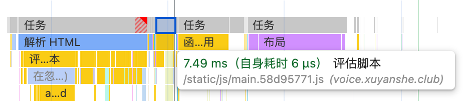

   # wwwwwww从url到页面

## DNS解析

### DNS(Domain Name System)域名系统
只讨论浏览器范围内的，DNS就是域名解析为IP的服务，有了IP才能向对应HTML的服务器发请求  

### 名词解释
* 根服务器：`.`，最顶级的域名服务器，记录了顶级域名的服务器地址
* 顶级域名服务器：保存着顶级域名的服务器，`.top .org`
* 二级域名服务器：一般申请的域名都为二级域名，二级域名服务器保存着三次域名缓存，通过分发系统分发
* 权威服务器：DNS服务器有多个的情况下，比如在一个范围内有多个顶级域名服务器，其中一台记录其他顶级域名服务器的记录，这一台就是这个区域的权威服务器
  

### 解析过程
先在本地的Host文件查询有无DNS记录。如果没有，使用递归查询的方式，去找上游的服务器，上游服务器会进行多次的迭代查询，把查询到的信息返回给客户端


* **递归查询**  
  客户端发起一个DNS解析请求，若本地DNS服务器若不能为客户端直接解析域名，则域名服务器会代替客户端（下级服务器）向域名系统中的各分支的上下级服务器进行递归查询，直到有服务器响应回答了该请求后，将该请求结果返回客户端

* **迭代查询**   
  客户端（下级服务器）发起一个DNS解析请求后，若上级DNS服务器并不能直接提供该DNS的解析结果，则该上级DNS服务器会告知客户端（下级服务器）另一个可能查询到该DNS解析结果的DNS服务器IP，客户端（下级服务器）再次向这个DNS服务器发起解析请求，如此类推，直到查询到对应的结果为止

# TCP三次握手，建立连接

拿到服务器IP了，就准备建立TCP连接，及建立连接后通信

[参见TCP部分](../计算机网络/TCP.md#三次握手)

# 解析HTML

字节序列解析出`DOM`、`CSSOM`的过程

## 转换到字符

从服务器拿回的数据包解包，都是`UTF-8`字节序列，需要转换成字符。
字节序列使用`UTF-8`编解码规则。请求头部的`Content-Type`属性可以确定请求的文件类型及编码规则，HTML文件中的`<meta>`标签也可以指定

## 构建DOM

### 字符分词，转换为Tokens
`Tokens`：一种标记，标记开始标签、结束标签、自闭合标签、元素内容等HTML中的元素  
`状态机`：可以处于不同的状态，并根据输入条件执行相应的动作来改变状态  
```
  <div>Foo</div>

  <!-- 转换后如下 -->
  [
  {
    "type": "StartTag",
    "tagName": "div",
    "attributes": [],
  },
  {
    "type": "Text",
    "content": "Foo",
  },
  {
    "type": "EndTag",
    "tagName": "div",
  }
]
```


作为解码后的字符串，输入状态机，状态机会依次按照字符来分词，转换成不同类型的`Token`

### 创建Node节点，构建DOM树
1. 现在开始处理`Token`，分类`Token`后，`Token`中表示HTML开始标签的标记通过浏览器内部方法会创建对应的元素，之后会先入一个栈  
2. 创建的这个元素的属性，父节点，子节点的关系通过内部方法的临时变量来指定，子节点创建之后再赋值，父节点的子节点属性为一个引用 
3. 碰到闭合标签的标记，会一直`pop`栈中的元素，直到遇到起始标签  
PS.如果遇到自定义的标签，则会默认使用`<span>`标签代替

处理了所有`Token`后会触发`DOMContentLoaded`事件，这个事件标致着HTML完成解析

一张图总结下上面流程


## 预加载js、css
`<script>`和`<link>`标签，都有一些属性，可以支持异步的加载

### js请求、加载
`<script>`有两个属性，`async`和`defer`，区别如下图

图中还有`type=module`的情况，作为补充
区别在于执行这个下载的js脚本的时机，看阻不阻塞HTML的解析。现在的React、Vue应用多为引入一个js，框架打包好的js文件里会调用各种DOM API去创建页面的元素


### css请求、加载
`<link>`标签可以设置一个属性值，`rel="preload"`，`prefetch`苹果的Safari不支持
`preload`要求浏览器不阻塞页面解析，但要异步下载资源。只管下载，同时要指定属性`as`，来表明下载的资源，比如样式表`as="style"`。也可以下载js脚本

# 布局、绘制
### css解析
`style`标签中的样式，还有下载的样式，都会解析为`CSS Tokens`，和上面的`HTML Token`差不多

### CSSOM、合成渲染树
计算出一颗和DOM树类似的节点树，这棵树的每个节点包含了Node节点的样式。之后会和DOM树合成渲染树，渲染树会根据CSS设置一些节点的可见（`display: none`）的节点不会出现在渲染树中

### Layout节点布局计算
上面计算好的render树中的每一个节点要计算出Layout节点，这个节点包括了Node节点的所有应用在上面的布局信息
最终生成一颗Layout树，之后还要计算元素的布局信息，盒子大小位置，定位的位置，滚动区域的大小和位置以及计算层叠关系

### 绘制
根据每个元素的css属性，会去生成对应的绘制指令，指令集创建一个顺序列表，浏览器严格按照列表去绘制样式  
之后浏览器会考虑是否分层，分层的层叠关系正是层叠上下文的关系，不同层经由光栅化（GPU参与）后会再次合成到一起供浏览器显示

## 重绘与回流
### 回流
改变了元素的布局信息，宽高窄胖上下左右，字体粗细大小排版分词等都会触发回流  
为浏览器要重新计算节点布局信息，重新排列页面元素的显示

### 重绘
元素颜色、背景色、阴影、外边距等不影响元素布局的属性的改变，会触发浏览器重绘

PS. 根据上面的浏览器渲染的步骤可知，布局计算后面一定有绘制步骤，所以回流必定重绘

## 虚研社按钮网页解析的过程
  
下面的图清晰一点


这里有一些浏览器拓展的js加载，不去理会


`script`脚本是异步加载，而样式表不是

  
首先解析样式表，和最初的HTML元素形成渲染树，布局，绘制（解析样式表这个部分后有很细小的两个紫色块，那个就是布局和绘制的过程）
因为没什么元素，所以很短很窄


这里是浏览器编译虚研社按钮js，后面的函数调用是react创建dom等操作，以及最后还有微任务的执行

  
之后就是虚研社按钮通过js创建的dom的绘制过程

  
还有支持按钮部分有很多webp的头像图片，才开始下载，之后加载。触发回流

  
音声面板的动画

  
这里是加载了一个svg的`loading`图标，懒加载虚研社按钮音声数据，如果用户没下滑到下面，就不发送音声信息的request，且触发了`DOMContentLoaded`事件

至此完成了虚研社按钮主站的显示