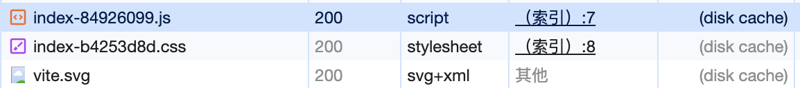
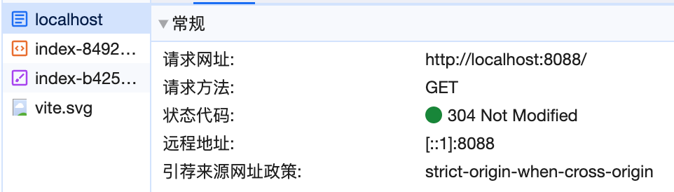
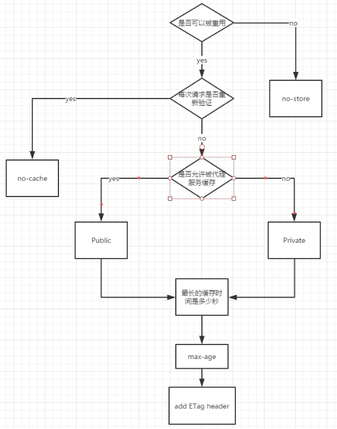
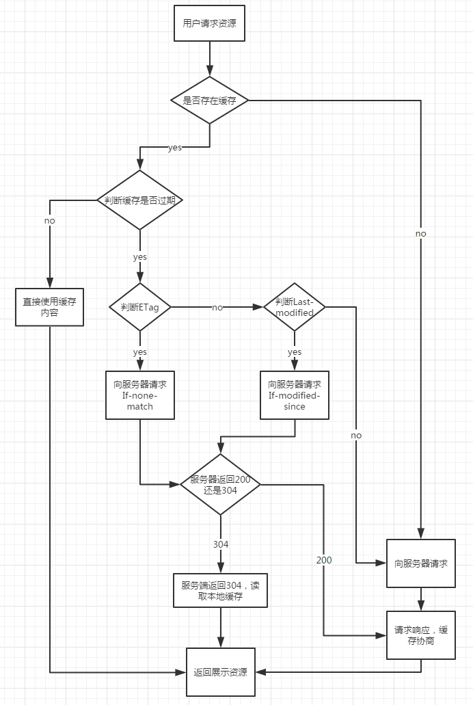

# 缓存

（[根据MDN的定义](https://developer.mozilla.org/zh-CN/docs/Web/HTTP/Caching#%E6%A6%82%E8%A7%88)）

自己分为浏览器存储（浏览器缓存）和http缓存

**但实际上，按照http标准**，分为：私有缓存、共享缓存

## 私有缓存

这里会和`cache-control`头扯上关系，不能单纯的将`cache-control`头理解为只有共享缓存独有

根据标准来讲就是：`cache-control: private`（[MDN](https://developer.mozilla.org/zh-CN/docs/Web/HTTP/Headers/Cache-Control#%E6%8C%87%E4%BB%A4)）响应头设置了缓存的行为，只能是单个用户缓存，比如用户访问一个网站，网站有CDN，网站的有些资源设置私有缓存，CDN就不可以缓存这些资源，只能是这个用户缓存这些资源

## 共享缓存

### 浏览器存储（浏览器缓存）

共享缓存中的“托管缓存”，意味着可以删除，可以新增等管理方式来控制

#### localStorage、sessionStorage、cookie

#### 前端数据库indexDB

### http缓存

共享缓存中的“代理缓存”，意味着需要双方的协商，不能删除（一般浏览器自己控制）

PS. 下面的缓存都说的是`http缓存`，跟`http协议`相关，会附加到请求头或者响应头上

#### 强缓存

有一点得明确，第一次和服务器通信是必须有的，得由服务器返回给客户端`Expires`头或者`Cache-Control`

之后走本地的缓存，不会和服务器发生通信，**协商缓存**需要和服务器通信，只不过服务器返回的响应体为空或者很小，只是一个响应头

涉及到的请求头、响应头（在请求中出现了，不一定在响应头中也出现）

`Expires`（这个头在`Cache-Control`头没有设置`max-age`或者`s-maxage`头的时候会自动添加上）：指定一个缓存的过期时间，但是因为此过期时间参考的是本地时间，本地时间一旦更改可以使缓存失效，现已废弃⚠️

`Cache-Control`：相对时间，其中作为请求头的值和响应头的值有些许不同

|值|说明|
|-|-|
|no-cache|不是字面意思不走缓存，而是在缓存资源前，发往服务器的请求上会携带这个这个值，且这个请求会要求服务器强制验证缓存是否过期（协商缓存验证，这也就是有了这个请求标头`Cache-Control: no-cache`后，服务器的响应头会有协商缓存相关的响应头）|
|no-store|不存储任何服务器的响应资源，这才是不使用缓存|
|max-age|缓存最大有效时间，相对于请求时间|
|public|共享缓存，资源可以被每一级代理服务器缓存，比如cdn等|
|private|私有缓存，只能被客户端缓存，其他级的代理服务器都不能缓存|

强缓存的响应都是`200`，但是来源不同可以分成下面的两种

会有两种强缓存

- `(from disk cache)`来自本地磁盘

- `(from memory cache)`来自内存

来自本地磁盘

来自内存

具体缓存在本地磁盘，还是缓存在内存是由浏览器控制。本地磁盘可以保证关闭浏览器后缓存在下次打开后还是生效的，内存只能保证在当前的tab页里缓存是生效的

同时发现，内存缓存`memory cache`后，关闭当前tag页面，下次再打开后会变为`disk cache`磁盘缓存

#### 启发式缓存

这个不算一类，是没有设置`cache-control`和`expires`，服务端也没有设置明确的缓存策略。浏览器会自行缓存能缓存的资源

缓存的时间计算公式：`(Date - Last-Modified)*0.1`

根据这个公式可以看到，上次更新时间越久，相应的缓存时间也就越长，问题就在于此

有时控制缓存不能完全交给浏览器，否则就只有强制性的清空缓存来查看页面更新了

#### 协商缓存

和服务器通信过后，服务器给出是否走缓存的一种协商的过程。是客户端和服务器要进行通信过的，才能确定的

上面提到的强缓存没有命中，会验证协商缓存是否命中。命中的协商缓存会返回`304 Not Modified`

`Last-Modified`，`If-Modified-Since`

`Last-Modified`是响应头里的，表示文件的最后修改日期，`If-Modified-Since`是请求头里面的，用的上次返回的`Last-Modified`的值

但由于日期格式难以解析，分布式系统的日期不好同步等问题，使用下面的新控制缓存的响应头

`ETag/If-None-Match`

`ETag`是服务器生成的，一般根据文件内容生成哈希（指纹）或者一个版本号

客户端下次询问资源更新状态就会添加上一个`If-None-Match`（这货也是请求头里的）头，里面放的上次响应返回的`ETag`（这是响应头里面的），这俩一致，就返回`304`

协商缓存都会使用（MDN也推荐请求头都加上）上面的四个头，所以他们有一个优先级，浏览器会优先判断

`ETag`>`Last-Modified`

如果`ETag`值一样，那么就继续对比`Last-Modified`

#### 服务器加载资源的流程（只涉及缓存部分的过程）

这里的强缓存并非是从浏览器地址栏输入一个网址开始的

## 拓展：Service Worker管理浏览器缓存

