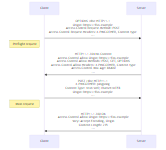

# 跨源

## 什么是跨源（跨域）  
严格来说，跨域说法只是**跨源**的一种。跨源：代表`js`代码请求一些不同源的资源这样的行为

## 同源策略  
从一个源访问不同协议、域名、端口的另一个源的资源时，浏览器会触发的一种保护机制，阻止跨源的一些行为  
但父域名和子域名之间不是跨源的，比如`abc.example.com`和`example.com`

### 跨源行为
1. 跨源写操作：`POST`、`DELETE`、`PUT`、`PATCH`这些会修改服务器数据的操作，使用`window`、`location`等修改url的api，重定向等，都是允许的
2. 跨源资源嵌入：``、`<video>`、`<embed>`、`<script>`、`<link>`、`@font-face`、`<ifream>`这些标签访问一些资源
3. 跨源读操作：`GET`、`HEAD`（一般都是不允许的，会被浏览器阻拦）  
PS. 第一第二种行为一般浏览器都是放行的，允许的。第一二种是浏览器发起的`GET`请求，后面一种行为一般不允许

## CORS (Cross-Origin Resource Sharing) 跨源资源共享

解决**XHR**、**FETCH**跨域的一种方法，得前端和后端一块设置。允许服务器通过一系列的`HTTP`头来标识当前的浏览器请求是否允许跨源  
注意，针对的是`HTTP`请求

### 简单请求  
满足下面条件的请求
+ `HEAD`、`GET`、`POST`的表单提交
+ 请求头: `Accept`、`Accept-Language`、`Content-Language`、`Range`
`Content-Type` 仅限以下三种
  + `text/plain`
  + `multipart/form-data`
  + `application/x-www-form-urlencoded`
+ 请求中的任意`XMLHttpRequestUpload` 对象均没有注册任何事件监听器；`XMLHttpRequestUpload`对象可以使用`XMLHttpRequest.upload` 属性访问
+ 请求中没有使用`ReadableStream`对象

### 复杂请求  
不满足上述请求的其他请求，其实区分也挺容易，就看是否有非简单请求的方法、是否添加了一些其他的请求头（或自定义请求头）

#### 预检请求
`OPTIONS`请求，前端发送复杂请求前，需要先发送预检请求，询问服务器允许的请求头`Access-Control-Request-Headers`，请求方法`Access-Control-Request-Method`（这俩请求头都是预检请求专用的，其他请求则会在发送跨源时自动添加一些诸如`Origin`等的请求头），后端会返回响应(预检请求的响应不包含响应体204)，包含对应头（也有不返回的情况）、`cookie`等
  + `Access-Control-Allow-Origin`
  + `Access-Control-Allow-Methods`
  + `Access-Control-Allow-Headers`
  + `Access-Control-Max-Age`
  
简单请求往往都是跨源内嵌资源请求，或者是一些简单的表单提交发出的。对于简单的表单提交，**如果是跨源的表单提交**服务器不会返回响应。不返回响应不代表不能在前端发送这些请求，而且这些请求服务器很可能已经是收到了的  



### CSRF攻击 (跨站请求伪造攻击)  
如果没有预检请求(这里指任何请求不受跨源限制)，就可以发送诸如`DELETE`请求删除服务器上的用户数据。服务器得处理很多非法跨源请求  
有预检请求，会事先和服务器商量好，达成约定。只能发送哪些方法，哪些源可以发送，是否携带凭证等


## 下面是开发中使用一些工具、技巧解决跨源问题
### vue解决跨源问题

- http-proxy

- vite、nuxt自带代理模块，用时配置。内置了http-proxy
- nginx等（生产环境）

### react解决跨源问题

- http-proxy-middleware  
- nginx等（生产环境）

都是设置了本地代理服务，相当于弄了一个同源环境的后端应用等，直接去掉了限制

### JSONP

### 概念

JSONP（JSON with Padding）利用`script`标签的`src`属性没有跨源限制来完成`GET`请求

#### 优点

1. 兼容性好，古老浏览器都支持

#### 缺点

1. 只能发送`GET`请求

2. 前端和后端代码耦合，需要后端调用前端传的回调函数

3. 后端代码也得是js

```HTML
<script type='text/javascript'>
  window.jsonpCallback = function (res) {
    console.log(res)
  }
</script>
<script src='http://localhost:8080/api/jsonp?id=1&cb=jsonpCallback' type='text/javascript'></script>
```

在`script`标签中，传递了`cb`参数，参数的值为上面定义的回调函数`jsonpCallback`

```JavaScript
const Koa = require('koa');
const app = new Koa();
const items = [{ id: 1, title: 'title1' }, { id: 2, title: 'title2' }]
app.use(async (ctx, next) => {
  if (ctx.path === '/api/jsonp') {
    const { cb, id } = ctx.query;
    const title = items.find(item => item.id == id)['title']
    ctx.body = `${cb}(${JSON.stringify({title})})`;
    return;
  }
})
console.log('listen 8080...')
app.listen(8080);
```

从`ctx`中拿到对应的参数，调用前端传递的这个函数，这个函数中传递后端需要给前端发送的数据


