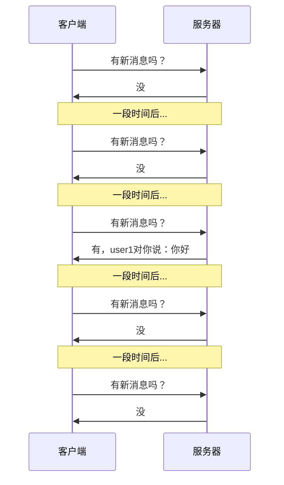
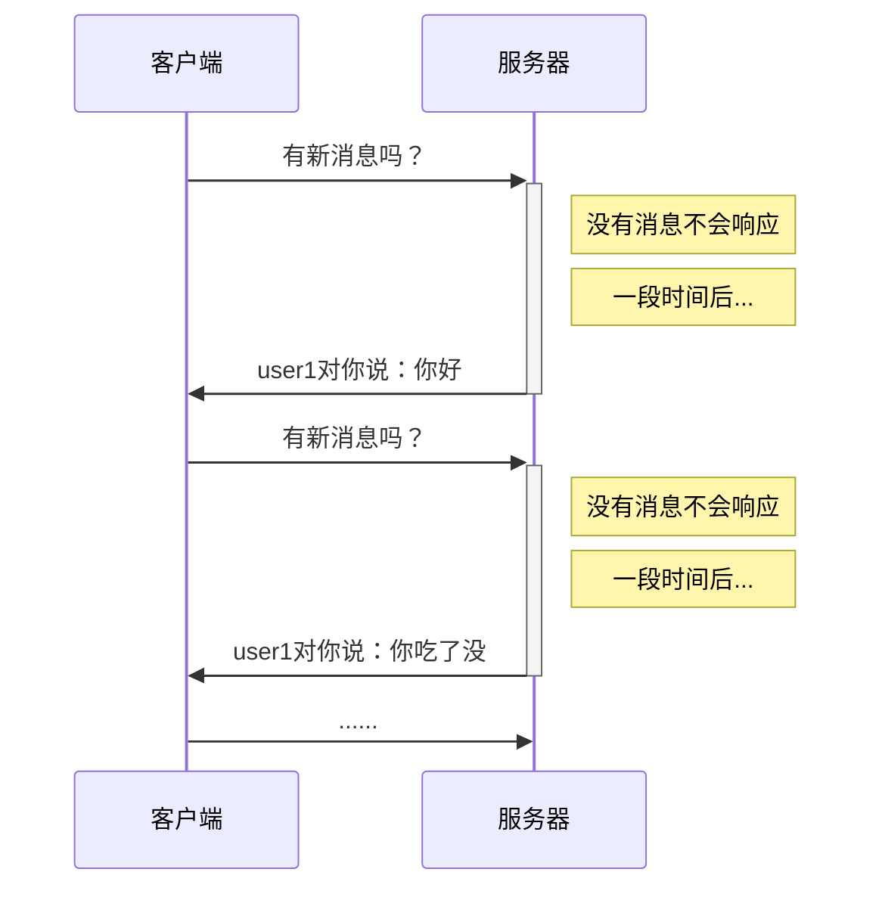
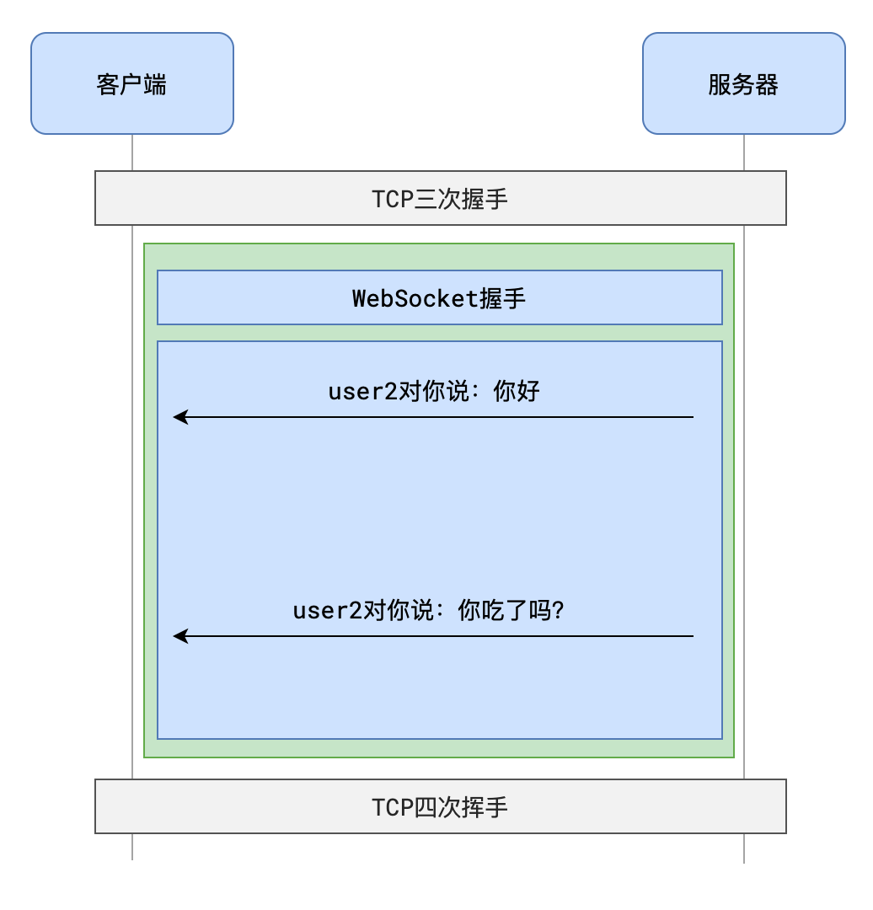

# 短轮询
客户端每隔一小段时间就向服务器请求一次，询问有没有新消息

这种方案的缺陷是非常明显的：

- 会产生大量无意义的请求
- 会频繁打开关闭连接
- 实时性并不高

# 长轮询

长轮询与轮询的不同之处在与，当没有新数据时，服务器会挂起这个请求，并时不时去查看是否有新数据，直到有新数据时才响应，或者连接超时后自动断开。然后与轮询相同的是，长轮询在得到响应后也会在setTimeout时间以后发起另一次长轮询请求。与轮询相比，减少了无用的轮询，也就是减少了无用的HTTP频繁建立和断开的损耗


长轮询仍然存在问题：

- 客户端长时间收不到响应会导致超时，从而主动断开和服务器的连接
	- 这种情况是可以处理的，但ajax请求因为超时而结束时，立即重新发送请求到服务器
	- 虽然这种做法会让之前的请求变得无意义，但毕竟比短轮询好多了
- 由于客户端可能「过早的」请求了服务器，服务器不得不挂起这个请求直到新消息的出现。这会让服务器长时间的占用资源却没什么实际的事情可做。

# 长连接

指在一个连接上可以连续发送多个数据包，在连接保持期间，如果没有数据包发送，需要双方发链路检测包。也就是说，利用`Connection: keep-alive`，在连接超时之前，只建立一次TCP连接实现后续同样的Ajax多次请求都通过这个连接传输，而不需要重复建立连接和断开连接

# 服务器事件推送


# webSocket
全双工通信，伴随着HTML5出现的WebSocket，从**协议**上赋予了服务器主动推送消息的能力



## 建立连接的两个过程

### 握手
当客户端需要和服务器使用WebSocket进行通信时，首先会使用**HTTP协议**完成一次特殊的请求-响应，这一次请求-响应就是**WebSocket握手**

在握手阶段，首先由客户端向服务器发送一个请求，请求地址格式如下：

```sh
# 使用HTTP
ws://mysite.com/path
# 使用HTTPS
wss://mysite.com/path
```

请求头如下：

```sh
Connection: Upgrade /* 嘿，后续咱们别用HTTP了，升级吧 */
Upgrade: websocket /* 我们把后续的协议升级为websocket */
Sec-WebSocket-Version: 13 /* websocket协议版本就用13好吗？ */
Sec-WebSocket-Key: YWJzZmFkZmFzZmRhYw== /* 暗号：天王盖地虎 */
```

服务器如果同意，就应该响应下面的消息

```sh
HTTP/1.1 101 Switching Protocols /* 换，马上换协议 */
Connection: Upgrade /* 协议升级了 */
Upgrade: websocket /* 升级到websocket */
Sec-WebSocket-Accept: ZzIzMzQ1Z2V3NDUyMzIzNGVy /* 暗号：小鸡炖蘑菇 */
```

**握手完成，后续消息收发不再使用HTTP，任何一方都可以主动发消息给对方**


