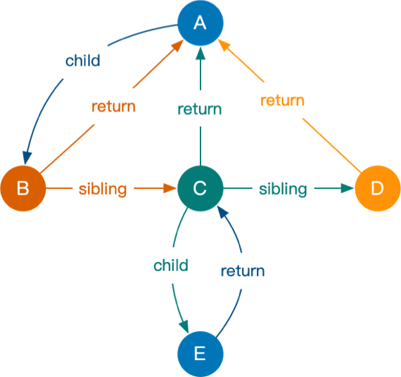
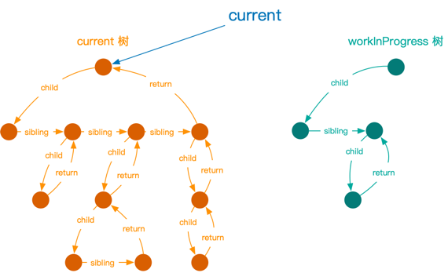
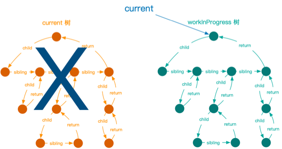
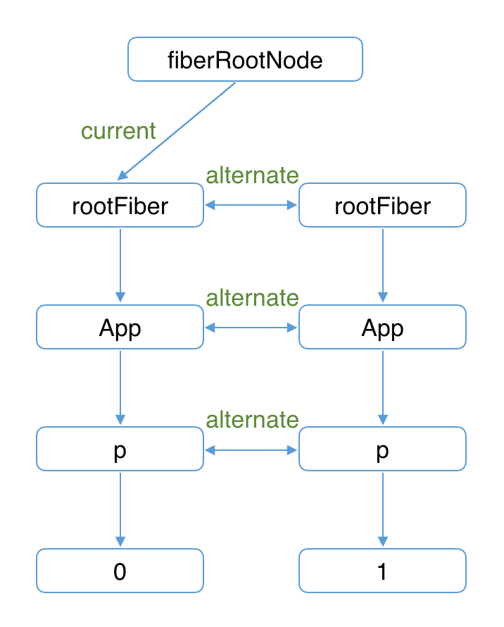

# React Fiber

## 概念

React从16开始引入的一套新的体系，体系中的架构主要实现任务的中断、恢复功能，其中还包括任务的调度，任务优先级排序执行  
体系中的数据结构有以下部分
- Fiber节点：每一个DOM都会变成一个Fiber节点，节点记录原始DOM类型，属性分别链接到父节点、子节点
- Fiber链表：也可以说是Fiber树，此树记录待Current DOM树（用来渲染到屏幕上的树）和WIP（Work-in-progress）树，WIP树是更新完的DOM树会直接替换Current树

### Fiber节点

节点用来表示一个真实DOM节点的各种属性，和其他Fiber节点的关系等信息，数据结构类似虚拟DOM  

比如下面属性
- child（这里是保存第一个子节点的指针）
- sibling（这是兄弟节点指针）
- return（父节点指针）
- alternate（这是记录current树上的节点在WIP树对应节点的指针）



根据上图也可知是描述Fiber节点间的关系

```js
A = { child: B }
B = { return: A, sibling: C }
C = { return: A, sibling: D, child: E }
D = { return: A }
E = { return: C }

```

### Fiber树

两棵树
- Current树（页面上渲染出来的节点的对应树结构）
- WIP树（要处理的节点树，会在这棵树上做diff，之后替换current树）

#### 双缓存技术  
WIP树在内存之中，current是显示在屏幕上的，需要用WIP树直接替换掉current树，这样屏幕上的DOM也就完成了更新等操作，这种在内存中构建并直接替换的技术叫做**双缓存**


这里开始时，指针指向的是current树，且新生成的WIP树已经在内存中就绪（右边绿色）


这时的current指针就指向了WIP树，WIP树已经根据老的current树完成了节点的更新，创建，复用等工作。直接用WIP作为新的current树



current树和WIP树都是在一个节点下的（FiberRootNode节点）


