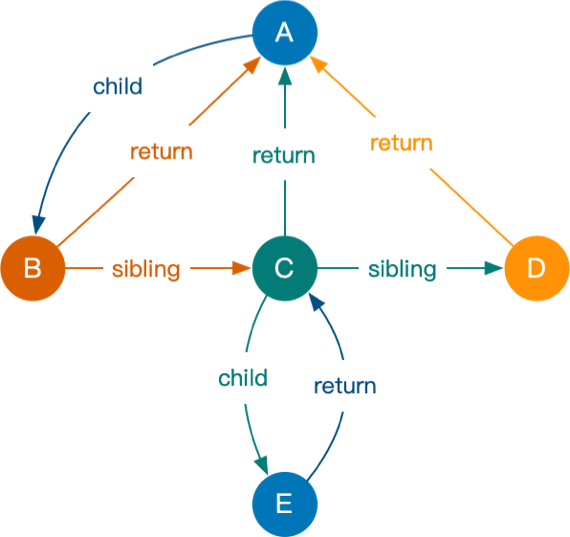
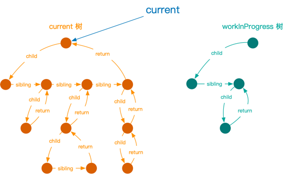
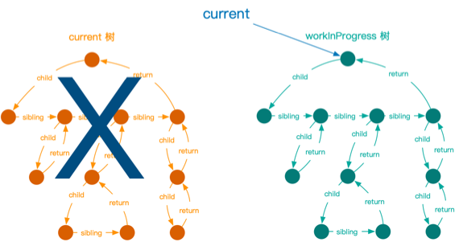
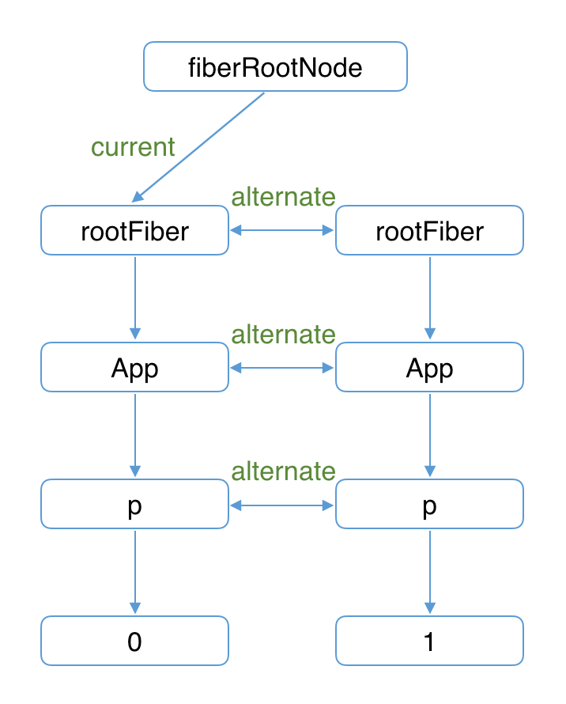

# React Fiber

## 概念

React从16开始引入的一套新的体系，体系中的架构主要实现任务的中断、恢复功能，其中还包括任务的调度，任务优先级排序执行  
体系中的数据结构有以下部分
- Fiber节点：每一个DOM都会变成一个Fiber节点，节点记录原始DOM类型，属性分别链接到父节点、子节点
- Fiber链表：也可以说是Fiber树，此树记录待Current DOM树（用来渲染到屏幕上的树）和WIP（Work-in-progress）树，WIP树是更新完的DOM树会直接替换Current树

## React v15 stack架构的问题
为什么需要 Fiber 架构，以前的 stack 架构进行 dom 比对使用的是“从头走到黑”的 dfs 深度优先遍历，无法被打断。如果 dom 树庞大，在 js 操作的时间上就会影响到页面的渲染，交互等

需要调度器实现不同dom 优先级操作的调度，也是为了能中断 dom 操作，因此，需要引入时间切片，一种新的系统（Fiber）

### Fiber
使用链表来描述虚拟 dom 树，

#### 节点

节点用来表示一个真实DOM节点的各种属性，和其他Fiber节点的关系等信息，数据结构类似虚拟DOM  

比如下面属性
- child（这里是保存第一个子节点的指针）
- sibling（这是兄弟节点指针）
- return（父节点指针）
- alternate（这是记录current树上的节点在WIP树对应节点的指针）



根据上图也可知是描述Fiber节点间的关系

```js
A = { child: B }
B = { return: A, sibling: C }
C = { return: A, sibling: D, child: E }
D = { return: A }
E = { return: C }

```

### Fiber树

两棵树
- Current树（页面上渲染出来的节点的对应树结构）
- WIP树（要处理的节点树，会在这棵树上做diff，之后替换current树）

#### 双缓存技术  
WIP树在内存之中，current是显示在屏幕上的，需要用WIP树直接替换掉current树，这样屏幕上的DOM也就完成了更新等操作，这种在内存中构建并直接替换的技术叫做**双缓存**

  
这里开始时，指针指向的是current树，且新生成的WIP树已经在内存中就绪（右边绿色）

  
这时的current指针就指向了WIP树，WIP树已经根据老的current树完成了节点的更新，创建，复用等工作。直接用WIP作为新的current树

  

current树和WIP树都是在一个节点下的（FiberRootNode节点），之间通过 `alternate` 属性（这个属性用来在更新阶段方便节点复用）来链接，旧 current 树的节点和 WIP 树节点通过此属性**互相指向**

##### 例子
现在假设有这么一个结构：

```html
<body>
  <div id="root"></div>
</body>
```

```jsx
function App(){
  const [num, add] = useState(0);
  return (
  	<p onClick={() => add(num + 1)}>{num}</p>
  );
}
const rootElement = document.getElementById("root");
ReactDOM.createRoot(rootElement).render(<App />);
```

当执行 ReactDOM.createRoot 的时候，会创建如下的结构：


此时会有一个 HostRootFiber，FiberRootNode 通过 current 来指向 HostRootFiber。

接下来进入到 mount 流程，该流程会基于每个 React 元素以深度优先的原则依次生成 wip FiberNode，并且每一个 wipFiberNode 会连接起来，如下图所示：


生成的 wip FiberTree 里面的每一个 FiberNode 会和 current FiberTree 里面的 FiberNode进行关联，关联的方式就是通过 alternate。但是目前 currentFiberTree里面只有一个 HostRootFiber，因此就只有这个 HostRootFiber 进行了 alternate 的关联。

当 wip FiberTree生成完毕后，也就意味着 render 阶段完毕了，此时 FiberRootNode就会被传递给 Renderer（渲染器），接下来就是进行渲染工作。渲染工作完毕后，浏览器中就显示了对应的 UI，此时 FiberRootNode.current 就会指向这颗 wip Fiber Tree，曾经的 wip Fiber Tree 它就会变成 current FiberTree，完成了双缓存的工作：


**update 阶段**

点击 p 元素，会触发更新，这一操作就会开启 update 流程，此时就会生成一颗新的 wip Fiber Tree，流程和之前是一样的


新的 wip Fiber Tree 里面的每一个 FiberNode 和 current Fiber Tree 的每一个 FiberNode 通过 alternate 属性进行关联。

当 wip Fiber Tree 生成完毕后，就会经历和之前一样的流程，FiberRootNode 会被传递给 Renderer 进行渲染，此时宿主环境所渲染出来的真实 UI 对应的就是左边 wip Fiber Tree 所对应的 DOM 结构，FiberRootNode.current 就会指向左边这棵树，右边的树就再次成为了新的 wip Fiber Tree


这个就是 Fiber双缓存的工作原理。

另外值得一提的是，开发者是可以在一个页面创建多个应用的，比如：

```js
ReactDOM.createRoot(rootElement1).render(<App1 />);
ReactDOM.createRoot(rootElement2).render(<App2 />);                                     ReactDOM.createRoot(rootElement3).render(<App3 />);
```

在上面的代码中，我们创建了 3 个应用，此时就会存在 3 个 FiberRootNode，以及对应最多 6 棵 Fiber Tree 树

## 流程


### 调度阶段 scheduler
调度任务，为任务排序优先级，让优先级高的任务先进入到 Reconciler

任务会分为两个队列来存储
- 延时任务队列
- 普通任务队列

调度器会判断当前循环是否有剩余时间，如果有剩余时间，分别按照优先级从普通任务中取出任务，执行任务，并且会在任务执行完通知任务循环，是否还可以添加新任务或者结束当前轮
延时任务在延时到期时会自动提升为普通任务，按照普通任务的执行流程
对于给调度器的任务，react scheduler 会自动的使用各个环境支持的异步方法包装，异步任务的包装使用的是 `MessageChannel`，兜底使用的是 `setTimeout`
必须使用异步任务，首先是不阻塞主线程，其次是对任务做控制，实现任务中断


### 调和阶段 reconciliation

从 fiberRoot 节点开始，从上向下深度优先遍历创建，期间每一个节点调用`beginWork`方法  
当碰到叶子节点，执行`completeWork`，之后就要回朔，如果存在 sibling 指针（兄弟节点）就返回兄弟节点执行`completeWork`方法，如果没有兄弟节点，就看有没有 return 指针，去找父节点  
直到 fiberRoot 节点

### 提交阶段 commit

- 同步执行，一次性完成所有渲染，不像调和调度阶段可打断
- 处理 uesEffect 副作用函数，为了性能副作用函数收集后会批量一次性执行  
- 触发生命周期钩子
- 切换到新 Fiber 树
