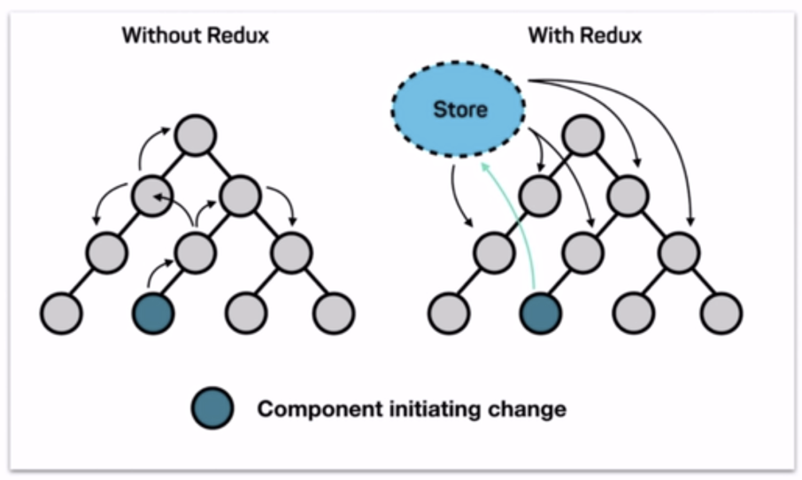
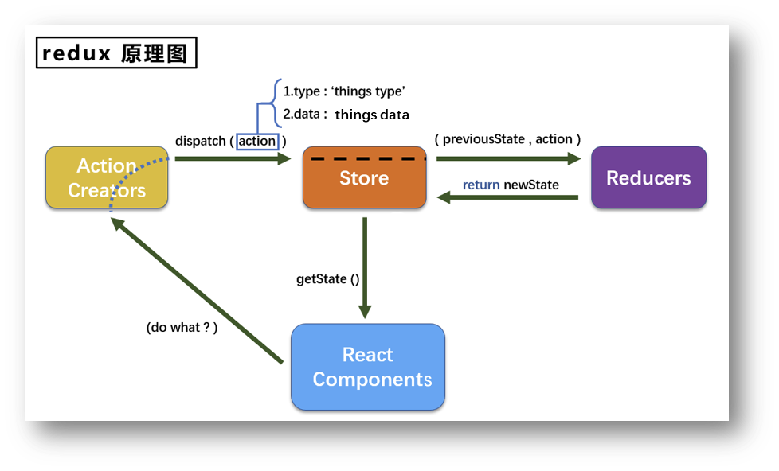
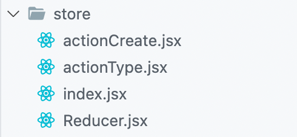
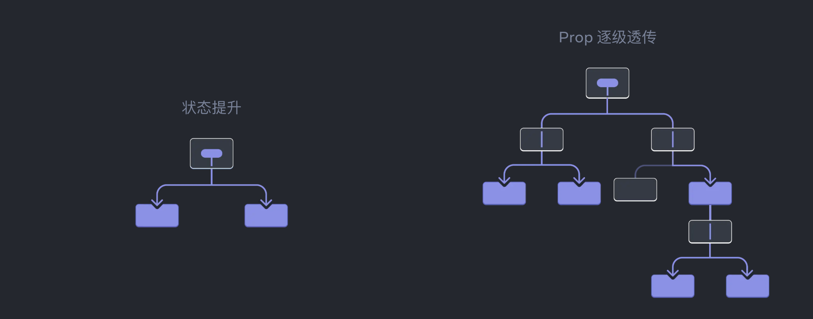

# Redux、react-redux

### redux

数据层的框架，解决react的数据传递问题。react的数据传递仅能在两个有关联的组件之间传递，如果第一层的组件要传递数据到第n层，就会很麻烦，所以需要一个数据层框架。 Redux = Reducer + Flux（最初的数据层框架）

图解




redux的工作流程：



根据上图的工作流程，可以得到

**redux的三个核心部分**

- action
- reducer
- store

用一个简单的例子来描述这三个核心部分：

- React Component：借书的人（使用redux的组件）

- Action Creators：借书的话（动作对象）

- Store：图书馆（将state，action，reducer联系到一起的方式）

- Reducers：记录书的本（用于初始化状态，加工状态的）

redux的工作流程：一个“借书的人” 说了一句“我要借书”的话，之后会在图书馆的“图书记录本”中查找书，找到了书就直接告诉借书的人



项目中的基本结构如上

- actionCreate：创建动作，动作要提供给组件和reducer使用，组件使用对应的action，会发送到reducer中加工之后返回一个新的state

- actionType：定义action的类型

- reducer：定义初始化store中的state，接收不同的action对state进行加工处理，之后返回一个新的state给store对象

```JavaScript
// actionCreate.js
import {
    PLAYINGVOICE
} from '../constant'

export const createPlayingAction = data => ({type: PLAYINGVOICE, data})
```

```JavaScript
// actionType.js
export const PLAYINGVOICE = 'playingvoice'
```

```JavaScript
// reducer.js
import {
    PLAYINGVOICE
} from '../constant'

var playingVoice = {voice: {path: '', desc: ''}}

export default function playerReducer(preState = playingVoice, action){
    const { data, type } = action
    if(type === PLAYINGVOICE){
        preState = Object.assign(preState, {voice: data.onevoice})
    }
    return newState;
}
```

```JavaScript
// store.js
import reducer from './Reducer.jsx'

const store = createStore(reducer);

export default store
```

```JavaScript
import React, { Component } from 'react'
import { deleteitem, } from './store/actionCreate'
import store from './store'

class ListItem extends Component{
    constructor(props){
        super(props);
        this.state={isFinished: false}
        this.deleteItem=this.deleteItem.bind(this);
    }
    componentDidMount(){
        store.subscribe(() => {
            if(this.state.isFinished){
                // do something
            }else{
                // do something
            }
        })
    }
    render(){
        return (
          <button id="deleteBtn" onClick={this.deleteItem}>删除</button>
        );
    }
    deleteItem(){
        const action = deleteitem(this.props.data.id);
        store.dispatch(action);
    }
export default ListItem;
```

上面演示了，在组件中redux的简单使用

### redux中的一些API

`combineReducers({})` 将多个Reducer拼接成一个大的reducer

### react-redux

- UI组件
- 容器组件

# Context
## useContext
上下文，作为组件间传递数据使用，一般要配合两个 Hook，`useContext`和 `useReducer`

一般组件如果跨层级，传递数据是一个有点麻烦的问题，见上图

使用也很简单，就是使用创建出来的 `context`组件来包裹住需要使用上下文数据的组件
```js
// 这里创建一个 context
import { createContext } from 'react';
export const LevelContext = createContext(0);

// 这里要消费
import { LevelContext } from './LevelContext.js';

export default function Section({ children, isFancy }) {
  const level = useContext(LevelContext);
  return (
    <section className={
      'section ' +
      (isFancy ? 'fancy' : '')
    }>
      <LevelContext value={level + 1}>
        {children}
      </LevelContext>
    </section>
  );
}
```

老的教程中会使用 `Consumer`来消费上下文，这种方式已经不被官方文档推荐 [文档](https://react.docschina.org/reference/react/createContext#consumer)

## useRecuder
这个Hook是用来提交数据到 `context`的，相当于修改数据，使用也很简单，使用 `useReducer`

```js
// 这里创建一个派发修改事件的 reducer
import { useReducer } from 'react';

export function TasksProvider() {
  const [tasks, dispatch] = useReducer(
    tasksReducer,
    initialTasks
  );

  return (
	  <button onClick={dispatch({
          type: 'added',
          text: 'foo',
        })}>
		  Add Tasks
	  </button>
  );
}

function tasksReducer(tasks, action) {
  switch (action.type) {
    case 'added': {
      return [...tasks, {
        text: action.text,
        done: false
      }];
    }
    default: {
      throw Error('Unknown action: ' + action.type);
    }
  }
}

const initialTasks = [
  { id: 0, text: 'Philosopher’s Path', done: true },
  { id: 1, text: 'Visit the temple', done: false }
];

```

官方提供的 `context`和 `reducer`其实和 redux 中的概念很相近，所以很好理解