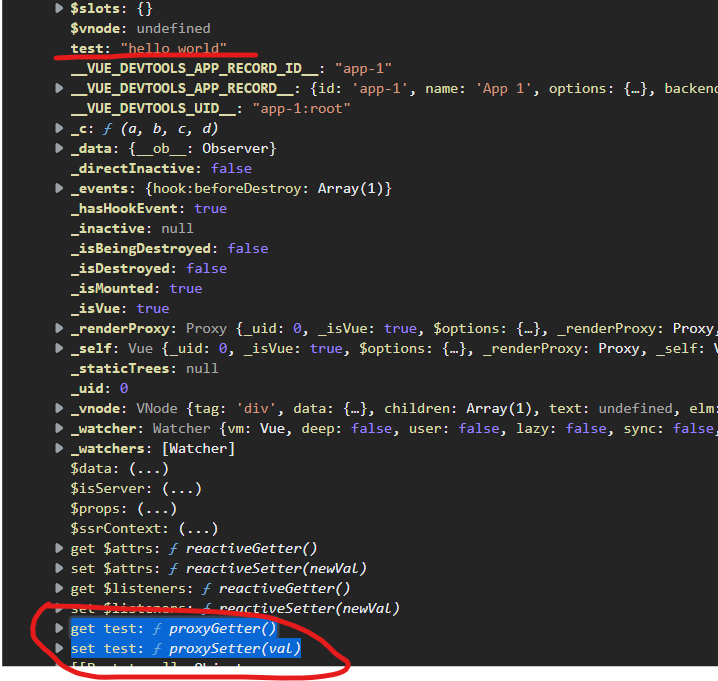
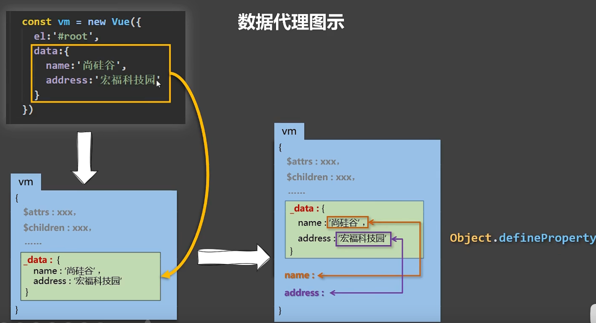

```JavaScript
const vm = new Vue({
    el: "#root",
    data:{abc: 123},
})
```

前言：通过观察，可以看到vue对象下的data属性中的变量都跑到了vm身上。而且，vm身上所有的属性 及 Vue原型上所有属性，在Vue模板中都可以直接使用

### 数据代理的概念：

通过一个对象来代理另一个对象的读写操作

### 原理：

```JavaScript
Object.defineProperty()
```

[MDN](https://developer.mozilla.org/zh-CN/docs/Web/JavaScript/Reference/Global_Objects/Object/defineProperty)



有了数据代理可以在模板中直接使用在data中定义的变量，不需要使用_data.xxx来使用变量

```JavaScript
<script>
  Object.defineProperty(person, 'age', {
    get(){
      // 此方法为getter，在获取person.age的时候执行
    },
    set(){
      // 此方法为setter，在设置修改person.age的时候执行
    }
  })
</script>
```

在vue实例中的下的属性，是vue的data对象下的属性，及为代理



如上图，获取 `vm.name`就是获取 `vm.data.name`

### vue2数据代理存在的问题

1. 属性的增加和删除无法响应式

2. 直接通过数组的下标来修改数组也是无法响应式

**原因：数据代理的本质是getter和setter，是针对某一个数据的修改，获取会分别的调用setter和getter。所以增加一个新的属性和删除一个属性是没有效果的** `this.$set()`和`Vue.set()`都可以解决上面提到的问题


## Vue3 响应式原理


