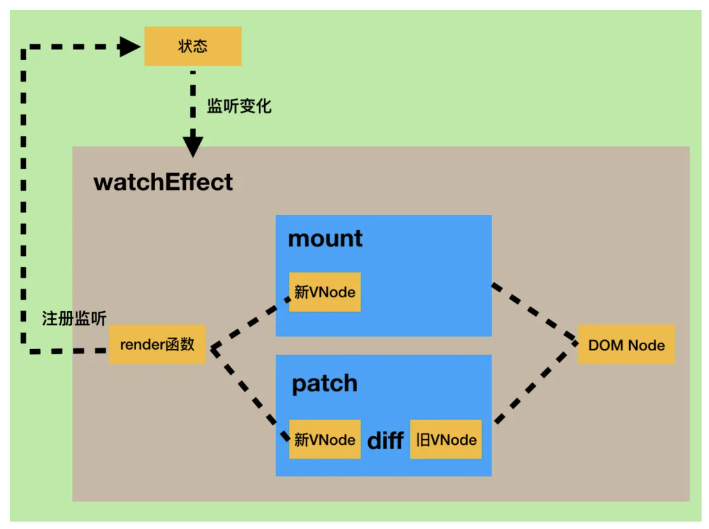

# 数据监听_视

### vue监视数据的原理：

`Observe`对象

```JavaScript
//创建一个监视的实例对象，用于监视data中属性的变化
const obs = new Observer(data)		
//准备一个vm实例对象
let vm = {}
vm._data = data = obs
function Observer(obj){
  //汇总对象中所有的属性形成一个数组
  const keys = Object.keys(obj)
  //遍历
  keys.forEach((k)=>{
    Object.defineProperty(this,k,{
      get(){
        return obj[k]
      },
      set(val){
        console.log(`${k}被改了，我要去解析模板，生成虚拟DOM.....我要开始忙了`)
        obj[k] = val
      }
    })
  })
}
```

### 上面的代码干了什么

1. 定义了一个**监视器**

2. 监视器会便利一个对象（obj）中的所有东西，并且往this身上添加对象（obj）中的所有属性

3. 这些属性有`getter`和`setter`，调用属性时回调用`getter`，被改变时回调用`setter`

### 小总结：

- vue会监视data中所有层次的数据

- 监视对象中的数据 通过setter监视，且在创建vue对象前就要传入监视的数据 vue对象后添加的属性，vue默认不做监视处理。如果需要监视，则要使用`Vue.set(target，propertyName/index，value)`或者`vm.$set(target，propertyName/index，value)`

- 监视数组中的属性 通过包裹数组更新元素的方法实现，调用原生对应的方法对数组进行更新。或者，重新解析模板，进而更新页面 **更新数组注意**：不要使用`arr[0]='hello'`这种方式更新，要使用`array.prototype.function`来更新，eg. `push(), shift()`等

### 监视属性watch：

### 概念：

当被监视的属性变化时, 回调函数自动调用, 进行相关操作

### 监视属性的两种写法：

- watch属性

- `vm.$watch`

```JavaScript
watch:{
  isHot:{
    immediate:true, //初始化时让handler调用一下
      //handler什么时候调用？当isHot发生改变时。
      handler(newValue,oldValue){
      console.log('isHot被修改了',newValue,oldValue)
    }
  }
}
```

```JavaScript
vm.$watch('isHot',{
  immediate:true, //初始化时让handler调用一下
  //handler什么时候调用？当isHot发生改变时。
  handler(newValue,oldValue){
    console.log('isHot被修改了',newValue,oldValue)
  }
})
```

### 深度监视：

- Vue中的watch默认不监测对象内部值的改变（仅监视一层数据）

- 配置`deep:true`可以监测对象内部值改变（多层）

- `immediate:true`表示在watch中首次绑定数据的时候是否执行`handler`

```JavaScript
watch:{
    //监视多级结构中所有属性的变化
    isHot:{
      deep:true,
        handler(){
        console.log('isHot改变了')
      }
    }
  	//简写 不要深度监视和初始化调用的时候才能简写
    /* isHot(newValue,oldValue){
      console.log('isHot被修改了',newValue,oldValue,this)
    } */
}
```

### vue3中的监听属性

写法

```JavaScript
//情况一：监视ref定义的响应式数据
watch(sum,(newValue,oldValue)=>{
	console.log('sum变化了',newValue,oldValue)
},{immediate:true})

//情况二：监视多个ref定义的响应式数据
watch([sum,msg],(newValue,oldValue)=>{
	console.log('sum或msg变化了',newValue,oldValue)
}) 

/* 情况三：监视reactive定义的响应式数据
			若watch监视的是reactive定义的响应式数据，则无法正确获得oldValue！！
			若watch监视的是reactive定义的响应式数据，则强制开启了深度监视 
*/
watch(person,(newValue,oldValue)=>{
	console.log('person变化了',newValue,oldValue)
},{immediate:true,deep:false}) //此处的deep配置不再奏效

//情况四：监视reactive定义的响应式数据中的某个属性
watch(()=>person.job,(newValue,oldValue)=>{
	console.log('person的job变化了',newValue,oldValue)
},{immediate:true,deep:true}) 

//情况五：监视reactive定义的响应式数据中的某些属性
watch([()=>person.job,()=>person.name],(newValue,oldValue)=>{
	console.log('person的job变化了',newValue,oldValue)
},{immediate:true,deep:true})

//情况六：特殊情况
watch(()=>person.job,(newValue,oldValue)=>{
    console.log('person的job变化了',newValue,oldValue)
},{deep:true}) //此处由于监视的是reactive素定义的对象中的某个属性，所以deep配置有效
```

**情况六注意**

**如果只定义了一个对象，默认开启了深度监视。但是如果一个对象里面又套了一个对象，需要监视这个对象里面的对象中的某一个属性，就需要配置开启深度监视**


#### vue3中的监听

vue3的数据如果使用`ref`API且是非引用类型（数组，对象）默认使用`refImpl`接口

数组使用`Proxy`做数据代理，和`reactive`一样


#### `watchEffect()`

**使用**

```Vue
// 监听状态变化
watchEffect(() => {
  console.log(state.count);
})
```
`watchEffect`参数是一个回调函数，默认会监听里面响应式状态的变化，响应式状态一般都是会影响页面变化的一些变量等

原理如下

这个Hook可以侦听其内部的回调函数里面的响应式状态的变化，这个状态会关系导致页面的更新，或者也可以说产生一个新的`VNode`，都会触发给`watchEffect`传递的回调函数



