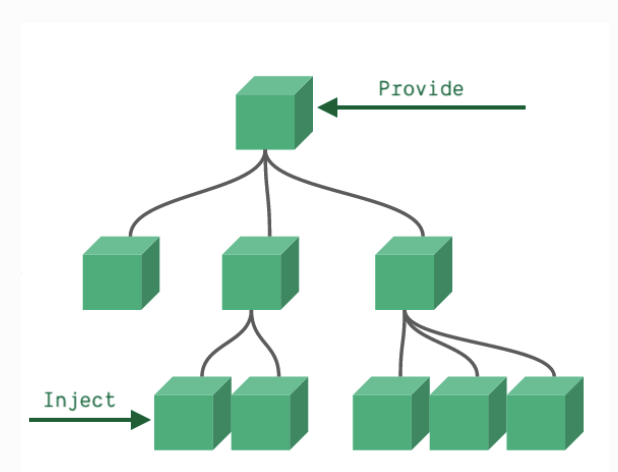

# Vue3

支持TS，新特性等

# Composition API

## setup()或者`<script setup>`

vue3中不需要（但是可以用以前的写法）使用去写vue2中的配置，（data、method、computed等配置）。是一种全新的 风格。vue2类似于OOA语言的风格（面向对象），vue3则偏向函数式

**在vue3中，不能随意的使用解构，否则会丢失对应状态的响应式**

### setup()

```JavaScript
<script>
	// import {h} from 'vue'
	export default {
		name: 'App',
		setup(){
			//数据
			let name = '张三'
			//方法
			function sayHello(){
				alert(`我叫${name}，我${age}岁了，你好啊！`)
			}
			//返回一个对象（常用）
			return {
				name,
				sayHello
			}
			//返回一个函数（渲染函数）
			// return ()=> h('h1','尚硅谷')
		}
	}
</script>
```

setup会在`beforeCreate()`之前会执行一次，而且这种风格类似于函数式，没有`this` 并且可以接受`props`和`context`参数

- props：值为对象，包含：组件外部传递过来，且组件内部声明接收了的属性。

- context：上下文对象

    - attrs: 值为对象，包含：组件外部传递过来，但没有在props配置中声明的属性, 相当于 `this.$attrs`

    - slots: 收到的插槽内容, 相当于 `this.$slots`

    - emit: 分发自定义事件的函数, 相当于 `this.$emit`

### setup属性

```JavaScript
<script setup>
import { ref, onMounted } from 'vue'
// reactive state
const count = ref(0)
// functions that mutate state and trigger updates
function increment() {
  count.value++
}
// lifecycle hooks
onMounted(() => {
  console.log(`The initial count is ${count.value}.`)
})
</script>
<template>
  <button @click="increment">Count is: {{ count }}</button>
</template>
```

`setup(){}`函数和`<script setup></script>`的区别 setup属性是语法糖的写法，不需要导出需要在模版中使用的变量，但是如果要接收`props`和`emit`需要从`defineProps`和`defintEmits`中接收 `defintExpose`可以暴漏一个子组件的属性，父组件通过`ref`属性可以使用子组件的属性`myref.value.xxx` 以前需要在`components`属性中注册一个组件，现在在语法糖中不需要注册组件了。只需要使用`import`引入即可，并且状态和方法都可以直接使用

### 宏编译指令

- `defineProps`：定义接收的props

- `defineExpose`：暴漏出组件的属性（状态）

- `defineEmits`：接收父组件传入的方法

### 全局自定义参数

在vue2中配置全局的属性需要在Vue.prototype下面去指定（是Vue组件的原型对象）详见 [组件](组件.md) 而在vue3中，需要使用`app.config.globalProperties.xxx`定义全局属性，使用这个全局属性需要用到`getCurrentInstance`方法获取**当前的组件实例**，之后在`instance.appContext.config.globalProperties`上（这是在script setup之下这样使用）如果不是在setup语法糖之下，就可以直接在`setup()`函数中接收的形参`context`

## Ref、reactive

`ref()` 是一个函数，不单单是一个标签的属性。 定义一个响应式数据，可以定义基本类型的数据，或者对象类型的数据等 定义基本类型数据和vue2相同，原理还是`object.defineproperty` 定义对象类型的数据，使用的底层是`reactive函数`。基本的工作原理是ES6的proxy（代理）

```JavaScript
<script setup>
import { ref } from 'vue'
const a = 1
const b = ref(2)
defineExpose({
  a,
  b
})
</script>
```

`reactive()` 可以使用函数定义一个响应式的**对象类型**的数据，默认是deep模式监听，能深度监听对象中的所有层的变化。 如果使用`reactive`定义了一个响应式对象，之后可以直接使用`.`往其身上添加属性，这些属性会自动的转成响应式对象，如果不想让其自动的转换，就要使用`markRaw`

PS. 不能使用解构赋值在一个`reactive`响应式对象上`const {a, b} = reactive({a: 123, b: {c: 456}})` 是一个引用传递和值传递的问题，`a`解构会“值传递”。会直接替换掉原来的`a`，而`b`还有响应式，是因为`b`是“引用传递”

## toRef、toRefs

作用：创建一个 ref 对象，其value值指向另一个对象中的某个属性。  语法：`const name = toRef(person,'name')`

应用:   要将响应式对象中的某个属性单独提供给外部使用时、**reactive数据要解构时**

扩展：`toRefs` 与`toRef`功能一致，但可以批量创建多个 ref 对象，语法：`toRefs(person)`

## vue3中的响应式

Proxy代理和Reflect反射

Proxy可以拦截对于一个对象的写、读等操作，Reflect可以将源对象的get和set等方法提供出来，设置这个对象的值，获取值等操作

所以，vue3中对于一个对象的读和写的操作使用proxy代理来拦截，之后完成响应式。对于这些值的修改，使用reflect反射对象来完成

## watchEffect

```JavaScript
watchEffect(async () => {
  const response = await fetch(url.value)
  data.value = await response.json()
})
```

在回调中使用的值，比如定义的`ref(url)`可以自动的跟踪他的更新，之后会调用回调函数。

watchEffect不是惰性的，会在组件`setup()`生命周期执行完后执行，可以在其中获取数据等等工作。而watch是惰性的，不会自己执行。

watchEffect只有在同步的回调中才能监听到数据的变化，如果同步的回调中有一个异步的方法就不能监听到其中的属性的变化了

## 自定义hook（逻辑复用：有状态函数）

通过一个自定义函数，封装一些composition API来完成相应的功能。类似于vue2的mixin混入

```JavaScript
import {reactive,onMounted,onBeforeUnmount} from 'vue'
export default function (){
	//实现鼠标“打点”相关的数据
	let point = reactive({
		x:0,
		y:0
	})
	//实现鼠标“打点”相关的方法
	function savePoint(event){
		point.x = event.pageX
		point.y = event.pageY
		console.log(event.pageX,event.pageY)
	}
	//实现鼠标“打点”相关的生命周期钩子
	onMounted(()=>{
		window.addEventListener('click',savePoint)
	})
	onBeforeUnmount(()=>{
		window.removeEventListener('click',savePoint)
	})
	return point
}
```

```JavaScript
<template>
	<h2>当前点击时鼠标的坐标为：x：{{point.x}}，y：{{point.y}}</h2>
</template>
<script>
	import usePoint from '../hooks/usePoint'
	export default {
		name:'Test',
		setup(){
			const point = usePoint()
			return {point}
		}
	}
</script>
```

# 其他的composition API

## shallowReactive、shallowRef

`shallowReactive`只能创建监听一层数据的`reactive`，比如对象有多层，只能监听最外层 `shallowRef`不能监听对象类型的数据，而`ref`不受限制 **什么时候使用?**

- 如果有一个对象数据，结构比较深, 但变化时只是外层属性变化 ===> shallowReactive。

- 如果有一个对象数据，后续功能不会修改该对象中的属性，而是生新的对象来替换 ===> shallowRef。

## readonly、shallowReadonly

readonly: 让一个响应式数据变为只读的（深只读） shallowReadonly：让一个响应式数据变为只读的（浅只读） 比如其他组件提供了一些数据，为了不产生副作用，可以使用上面的两个API

## toRaw、markRaw

- `toRaw`：

    - 作用：将一个由`reactive`生成的**响应式对象**转为**普通对象**。

    - 使用场景：用于读取响应式对象对应的普通对象，对这个普通对象的所有操作，不会引起页面更新。

- `markRaw`：

    - 作用：标记一个对象，使其永远不会再成为响应式对象。

    - 应用场景:

        1. 有些值不应被设置为响应式的，例如复杂的第三方类库等。

        2. 当渲染具有不可变数据源的大列表时，跳过响应式转换可以提高性能。

## customRef

自定义ref，使用自定义函数并对其依赖项跟踪和更新触发进行显式控制

例子（便于理解）防抖效果（多次执行会刷新执行的间隔时间，间隔时间结束才能执行）

```JavaScript
<template>
	<input type="text" v-model="keyword">
	<h3>{{keyword}}</h3>
</template>
<script>
	import {ref,customRef} from 'vue'
	export default {
		name:'Demo',
		setup(){
			// let keyword = ref('hello') //使用Vue准备好的内置ref
			//自定义一个myRef
			function myRef(value,delay){
				let timer
				//通过customRef去实现自定义
				return customRef((track,trigger)=>{
					return{
						get(){
							track() //告诉Vue这个value值是需要被“追踪”的
							return value
						},
						set(newValue){
							clearTimeout(timer)
							timer = setTimeout(()=>{
								value = newValue
								trigger() //告诉Vue去更新界面
							},delay)
						}
					}
				})
			}
			let keyword = myRef('hello',500) //使用程序员自定义的ref
			return {
				keyword
			}
		}
	}
</script>
```

## Provide、inject

组件间的通信方式（适合祖孙组件、跨级组件之间的的通信）



```JavaScript
setup(){
		//......
    let car = reactive({name:'奔驰',price:'40万'})
    provide('car',car)
    //......
}
```

```JavaScript
setup(props,context){
	  //......
    const car = inject('car')
    return {car}
	  //......
}
```

## 响应式数据的判断

- isRef: 检查一个值是否为一个 ref 对象

- isReactive: 检查一个对象是否是由 `reactive` 创建的响应式代理

- isReadonly: 检查一个对象是否是由 `readonly` 创建的只读代理

- isProxy: 检查一个对象是否是由 `reactive` 或者 `readonly` 方法创建的代理

## 几个新的内部组件

### Fragment组件：`<Fragment>`

和react的同名标签一个作用

### Teleport组件：`<Teleport></Teleport>`

```HTML
<teleport to="移动位置">
  <div v-if="isShow" class="mask">
    <div class="dialog">
      <h3>我是一个弹窗</h3>
      <button @click="isShow = false">关闭弹窗</button>
    </div>
  </div>
</teleport>
```

可以将组件传送到指定的位置（标签名，css选择器）

### suspend组件

作用和react的`suspend`组件一样，定义一个异步加载的组件，底层为一个插槽，可以两个组件，一个组件是保底机制，在第一个组件加载不出来时挂载到页面

```JavaScript
import {defineAsyncComponent} from 'vue'const Child = defineAsyncComponent(()=>import('./components/Child.vue'))
```

```HTML
<template>
  <div class="app">
    <h3>我是App组件</h3>
    <Suspense>
      <template v-slot:default>
        <Child/>
      </template>
      <template v-slot:fallback>
        <h3>加载中.....</h3>
      </template>
    </Suspense>
  </div>
</template>
```

## 其他

### 全局API的转移

Vue 2.x 有许多全局 API 和配置。

- 例如：注册全局组件、注册全局指令等

```JavaScript
//注册全局组件
Vue.component('MyButton', {
  data: () => ({
    count: 0
  }),
  template: '<button @click="count++">Clicked {{ count }} times.</button>'
})

//注册全局指令
Vue.directive('focus', {
  inserted: el => el.focus()
}
```

Vue3.0中对这些API做出了调整：

- 将全局的API，即：`Vue.xxx`调整到应用实例（`app`）上

|2.x 全局 API（Vue ）|3.x 实例 API (  app )|
|-|-|
|Vue.config.xxxx|app.config.xxxx|
|Vue.config.productionTip|移除|
|Vue.component|app.component|
|Vue.directive|app.directive|
|Vue.mixin|app.mixin|
|Vue.use|app.use|
|Vue.prototype|app.config.globalProperties|

### 过渡动画中类名的变化

Vue2.x写法

```CSS
.v-enter,
.v-leave-to {
  opacity: 0;
}
.v-leave,
.v-enter-to {
  opacity: 1;
}
```

Vue3.x写法

```CSS
.v-enter-from,
.v-leave-to {
  opacity: 0;
}
.v-leave-from,
.v-enter-to {
  opacity: 1;
}
```

