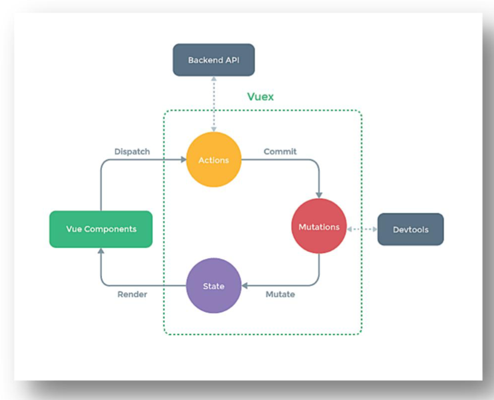

状态管理工具，可以实现组件间共享状态（也就是组件间状态通信）的功能，同时可以在状态变化时通知注册的回调，执行一些我们指定的操作

# vuex

## 前言
### 题外话：什么时候使用Vuex？也许并不需要使用vuex

- 多个组件依赖于同一个状态
- 来自不同组件的行为要变更同一个状态
- 共享状态

但是，如果要完成组件间的状态共享，可以用很多其他的方式，比如手动实现一个极简的 `store`，注册到 vue 的实例对象上，也可以实现共享

## 原理图



## vuex中的概念

### 术语解释

**state**：`vuex`下面的一个公共的`state`，或者说是“单一状态树”，表示整个项目的所有状态

**getter**：`state`状态的获取器，可以对状态做一些处理操作（比如过滤等）并返回操作后的结果状态

**action**：负责接收组件派发的事件，如果组件派发的事件仅有事件的类型，没有具体的值。具体的值需要从其他的后端API（也就是图中的Backend API）、获取或者做数据的加工，那么就需要action拿到这个值，之后`commit`给`mutations`，也可以直接返回值给调用的组件

**mutations**：拿到对应的事件类型和值，来对`state`进行处理。`mutation`对象里的方法不能有返回值，返回值拿不到数据，仅仅可以操作模块里面的数据

**store**：上面几个部分的管理者

**module**：模块，可以理解为小的 `store`，从 `store`中拆分出来的部分。模块中可以开启 `namespace: true`的选项，表示开启命名空间，命名空间的名称为“模块对象”的名字

### 白话vuex

vc（顾客）要点餐，点的菜名（dispatch派发的事件类型和数据），服务员（action）拿到了顾客点的菜之后就提交（commit）给后厨（mutations）后厨负责拿到顾客要的菜后做菜（拿到事件类型和值进行处理），之后做好的菜（state）给顾客（state数据给到对应的组件，会重新渲染组件）

### 代码实现（基础）

```js
//该文件用于创建Vuex中最为核心的store
import Vue from 'vue'
//引入Vuex
import Vuex from 'vuex'
//应用Vuex插件
Vue.use(Vuex)
//准备actions——用于响应组件中的动作
const actions = {
    jiaOdd(context,value){
        console.log('actions中的jiaOdd被调用了')
        if(context.state.sum % 2){
            context.commit('JIA',value)
        }
    }
}
//准备mutations——用于操作数据（state）
const mutations = {
    JIA(state,value){
        console.log('mutations中的JIA被调用了')
        state.sum += value
    }
}
//准备state——用于存储数据
const state = {
    sum:0 //当前的和
}
//创建并暴露store
export default new Vuex.Store({
    actions,
    mutations,
    state,
})
```

**注意：** 上面的`action`中的 `jiaOdd`中接收了一个`context`，这个对象身上带有`commit`、`dispatch`等方法，也有`state`可以在dispatch中做一些判断。但注意`context`对象并不是`store`实例

```js
export default {
        name:'Count',
        data() {
            return {
                n:1, //用户选择的数字
            }
        },
        methods: {
            increment(){
                this.$store.commit('JIA',this.n)
            },
            incrementOdd(){
                this.$store.dispatch('jiaOdd',this.n)
            }
        },
        mounted() {
            console.log('Count',this)
        },
    }
```

## store中的方法

### getter

用于派生state数据，派生出来的数据可以做其他的操作

```js
getters: {
  // ...
  doneTodosCount (state, getters) {
    return this.$store.state.todos.filter(todo => todo.done).length
  }
}
```

接收state，有时候可以接收第二个参数`getter`（和上面的dispatch中的`context`对象中的dispatch方法差不多，可以继续使用对应的`dispatch`或者`getter`

### dispatch

用于触发对应的 `action`

```js
// 函数签名
dispatch(type: string, payload?: any, options?: Object): Promise<any>
// or
dispatch(action: Object, options?: Object): Promise<any>
```

### commit
用于触发对应的 `mutation`

```js
// 函数签名
commit(type: string, payload?: any, options?: Object)
// or
commit(mutation: Object, options?: Object)
```

### subscribe
每一个 `mutation`执行完毕后，执行传入的 `handler`函数

```js
// 函数签名
subscribe(handler: Function, options?: Object): Function
```

### subscribeAction
每一个 `action`执行前，都会执行传入的 `handler`函数

```js
// 函数签名
subscribeAction(handler: Function, options?: Object): Function
```

### watch
监听第一个参数（第一个参数是一个函数）的返回值，返回值有变化，执行第二个传入的参数（也是一个函数）

```js
// 函数签名
watch(fn: Function, callback: Function, options?: Object): Function
```

##  vue组件中使用的辅助函数

### mapState和mapGetter

mapState：将`store`中的`state`映射到组件的计算属性上。

```js
computed:{
  //靠程序员自己亲自去写计算属性
  sum(){
      return this.$store.state.sum
  }
  //借助mapState生成计算属性，从state中读取数据。（对象写法）
  // ...mapState({he:'sum'}),
  //借助mapState生成计算属性，从state中读取数据。（数组写法）
  ...mapState(['sum','school','subject']),
}
```

mapGetters和上面的用法一致

### mapMutations和mapActions

```js
methods: {
  //程序员亲自写方法
  increment(){
    this.$store.commit('JIA',this.n)
  },
  //借助mapMutations生成对应的方法，方法中会调用commit去联系mutation
  ...mapMutations({increment:'JIA',decrement:'JIAN'}),
  // ...mapActions(['jiaOdd','jiaWait'])
}
```

## vuex模块化

单一的状态树会在项目中越来越大，越来越臃肿。所以可以将单一的store分割成多个store 每个模块拥有自己的 state、mutation、action、getter、甚至是嵌套子模块——从上至下进行同样方式的分割

```js
const moduleA = {
  namespaced:true,   // 将此模块注册成带有命名空间的模块，这样在下面的vue组件中使用才不会报错
  state:{
        sum:0, //当前的和
        school:'尚硅谷',
        subject:'前端',
    },
  mutations: { 
    JIA(state,value){
            console.log('mutations中的JIA被调用了')
            state.sum += value
        }
  },
  actions: { 
    jiaWait(context,value){
            console.log('actions中的jiaWait被调用了')
            setTimeout(()=>{
                context.commit('JIA',value)
            },500)
        }
  },
  getters:{
        bigSum(state){
            return state.sum*10
        }
    }
}
const moduleB = {
  namespaced:true,
  state: {
     personList:[{id:'001',name:'张三'}]
  },
  mutations: { ... },
  actions: { ... }
}
const store = createStore({
  modules: {
    countAbout: moduleA,
    personAbout: moduleB
  }
})
store.state.a // -> moduleA 的状态
store.state.b // -> moduleB 的状态

// vue组件中
<h1>当前求和为：{{sum}}</h1>
<h3>当前求和放大10倍为：{{bigSum}}</h3>
<h3>我在{{school}}，学习{{subject}}</h3>

computed: {
  // 直接将子store中的state映射出来就可以直接使用了，不需要用‘.’调用
   ...mapState('countAbout',['sum','school','subject']),
   ...mapState('personAbout',['personList']),
   ...mapMutations('countAbout',{increment:'JIA'}),
   ...mapActions('countAbout', {incrementWait:'jiaWait'})
},
methods: {
  add(){
    const personObj = {id:nanoid(),name:this.name}
    // 下面的写法是简写的形式
    this.$store.commit('personAbout/ADD_PERSON',personObj)
  }
}
```


# Pinia

作用和 vuex 一致，都是为了组件间共享状态。但是vuex5 开发团队已经把 pinia 作为 vue 的主要状态管理工具，且 pinia 基本就是从 vuex5 的概念里做出来的，换了个名字

## 为什么要选pinia

老生常谈的问题，第一个 `composition API`，更佳复合 vue3 的官方写法规范，第二，不在需要 `mutation`，那么如何操作 `store`中的状态呢？直接暴露出来操作就可以，pinia 返回的是响应式数据，就和在组件中定义的响应式数据一致，所以，在组件中如何使用，就如何使用 pinia 暴露出来的 `state`
第三，去掉了类似 `subscribe`等 API，如果需要触发回调函数，直接监听 `state`即可，且也没有命名空间，模块等概念了，因为不需要。而且，对 ts 支持很好

## 方法

### defineStore
```js
import { defineStore } from 'pinia'

export const useAlertsStore = defineStore('alerts', {
  // other options...
})
```

这里要⚠️注意，导出的名称最好都已 `use`开头，符合 vue  composition API 的命名规范

传入的第一个参数，仅仅是作为在 devtool 中使用的唯一 id，所以必须要填写

defineStore 的 options 有：
- state
- getter
- action

下面来一个一个说明

### state
定义 `store`中用到的状态

```js
export const useCounterStore = defineStore('counter', {
  state: () => ({ count: 0, name: 'Eduardo' })
  
})

// 第二种写法
export const useCounterStore = defineStore('counter', {
  const count = ref(0)
  const foo = reactive({bar: ''})
  
  return {
	  count, foo
  }
})

```

#### mapState()和 mapWritableState()
在选项式 API 中使用，映射出只读的状态，注意⚠️不可修改的
```js
import { mapState } from 'pinia'
import { useCounterStore } from '../stores/counter'

export default {
  computed: {
    ...mapState(useCounterStore, ['count'])
    ...mapState(useCounterStore, {
      myOwnName: 'count',
      double: store => store.count * 2,
      magicValue(store) {
        return store.someGetter + this.count + this.double
      },
    }),
  },
}
```
如果需要映射可以修改的属性，要使用 `mapWritaleState`方法

```js
import { mapWritableState } from 'pinia'
import { useCounterStore } from '../stores/counter'

export default {
  computed: {
    ...mapWritableState(useCounterStore, ['count']),
    ...mapWritableState(useCounterStore, {
      myOwnName: 'count',
    }),
  },
}
```

#### $subscribe()
此方法是监听 `state`的变化，如果变化，执行传入的回调，也就是 vuex 中的 `mutation`执行后执行
```js
cartStore.$subscribe((mutation, state) => {

})
```


### getter
类似组件中的 `computed`，对状态做二次处理，派生新状态的，和 vuex 类似

```js
export const useCounterStore = defineStore('counter', () => {
  const doubleCount = computed(() => count.value * 2)

  return { doubleCount }
})

// or

export const useCounterStore = defineStore('counter', {
  state: () => ({ count: 0 }),
  getters: {
    doubleCount: (state) => state.count * 2,
  }
})

```

### action
类似组件中的 `methods`，可以写一些方法，也可以像 vuex 一样处理请求逻辑，也可以写一下业务逻辑

```js
export const useCounterStore = defineStore('counter', () => {
  function increment() {
    count.value++
  }

  return { increment }
})

// or

export const useCounterStore = defineStore('counter', {
  state: () => ({ count: 0 }),
  actions: {
    increment() {
      this.count++
    },
  },
})

```

#### mapActions()
这个方法是在选项式写法中使用的，和 vuex 的同名方法作用一致
```js
import { mapActions } from 'pinia'
import { useCounterStore } from '../stores/counter'

export default {
  methods: {
    ...mapActions(useCounterStore, ['increment']),
    ...mapActions(useCounterStore, { myOwnName: 'increment' }),
  },
}
```


#### $onAction()
类似于 vuex 的 `subscribeAction`，订阅 action，函数签名如下

```js
const unsubscribe = someStore.$onAction(
  ({
    name, // name of the action
    store, // store instance, same as `someStore`
    args, // array of parameters passed to the action
    after, // hook after the action returns or resolves
    onError, // hook if the action throws or rejects
  }) => {
    // a shared variable for this specific action call
    const startTime = Date.now()
    // this will trigger before an action on `store` is executed
    console.log(`Start "${name}" with params [${args.join(', ')}].`)

    // this will trigger if the action succeeds and after it has fully run.
    // it waits for any returned promise
    after((result) => {
      console.log(
        `Finished "${name}" after ${
          Date.now() - startTime
        }ms.\nResult: ${result}.`
      )
    })

    // this will trigger if the action throws or returns a promise that rejects
    onError((error) => {
      console.warn(
        `Failed "${name}" after ${Date.now() - startTime}ms.\nError: ${error}.`
      )
    })
  }
)

// manually remove the listener
unsubscribe()
```

### storeToRefs
解构从 store 中返回的响应式数据

```js
<script setup>
import { useCounterStore } from '@/stores/counter'
import { storeToRefs } from 'pinia'

const store = useCounterStore()
const { name, doubleCount } = storeToRefs(store)
const { increment } = store
</script>

```
响应式数据的状态需要使用上面的 API 去解构，但是 action 方法就不需要

### 插件 plugin
插件可以添加属性、`store`的选项 Options 到到每一个 `store` 上

```js
import { createPinia } from 'pinia'

function SecretPiniaPlugin() {
  return { secret: 'the cake is a lie' }
}

//  使用.use()方法来应用pinia 插件
const pinia = createPinia()
pinia.use(SecretPiniaPlugin)

const store = useStore()
store.secret // 'the cake is a lie'

```