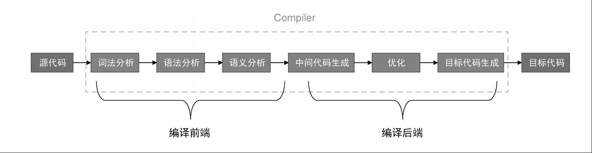

# 思路
vue的模板解析和编译的过程可以简化为下面的图片



这里都以vue3为例

# 解析
vue模板文件会被vue解析器解析，生成vue ast语法树。语法树节点会描述标签名、属性、子节点、绑定事件、绑定样式、静态节点标记等信息

## 步骤
针对SFC文件的解析，会通过模板状态机来完成，类似HTML状态机解析成tokens

开始标签 -> 标签名 -> 标签属性（vue中独有的动态绑定，vfor，vif特殊属性的解析，事件绑定解析，指令解析等
）-> 开始标签结束 -> 其中子节点的解析或内容解析 -> 结束标签解析 -> 标签名 -> 结束标签结束

PS. 换行符、回车、制表符、多行连接符等都要解析，解析成对应的节点

## 结果
生成出来的AST树分析优化后交由生成器处理

# 优化
vue会分析节点是否为静态节点，静态节点不会改变，意味着生成一次渲染函数就可以缓存起来，方便以后使用


# 编译

AST数据要通过vue代码生成器生成最终的**渲染函数**，渲染函数都是js函数，可以直接执行。生成的渲染函数相当于上图中的**目标代码**

## SFC编译
SFC中的`<template>、<script>、<style>`标签会有不同的编译器编译，最终生成对应的js文件

### script

SFC中，仅允许一个带有`export default`默认导出的`script`标签。例外的是，允许两个`script`标签，一个是`script setup`标签，一个是不带默认导出的`script`标签，vue会自动把`script`标签中定义的东西合并到`setup`导出中去

针对import导入部分，defineProps等这些宏定义，变量声明，函数声明，函数声明等都要生成对应js代码，最终生成的js代码

vue sfc文件中的代码
```js
<script>
import {clone} from 'lodash'
export default {
  setup() {
    let foo = {prop: 'bar'}
    let fooClone = clone(foo)
    
    return {
      isSecondOdd: new Date().getSeconds() % 2 === 0,
      fooSetup: fooClone
    }
  }
}
</script>

```

生成的代码
```js
import __vite__cjsImport0_lodash from "/node_modules/.vite/deps/lodash.js?v=8d62954f";
const clone = __vite__cjsImport0_lodash["clone"]
const _sfc_main = {
    setup() {
        let foo = {
            prop: 'bar'
        }
        let fooClone = clone(foo)

        return {
            isSecondOdd: new Date().getSeconds() % 2 === 0,
            fooSetup: fooClone
        }
    }
}

```


### template

`template`会生成对应的`render`函数，`render`函数中会描述`<template>`标签中的DOM结构

sfc template标签中的代码
```html
<template>
  <div>If Condition Block</div>
  <div v-if="isSecondOdd">
    Odd
  </div>
  <div v-else>
    No Odd
  </div>
</template>
```

生成的渲染函数
```js
function _sfc_render(_ctx, _cache, $props, $setup, $data, $options) {
    return (_openBlock(),
    _createElementBlock(_Fragment, null, [_cache[0] || (_cache[0] = _createElementVNode("div", null, "If Condition Block", -1 /* CACHED */
    )), ($setup.isSecondOdd) ? (_openBlock(),
    _createElementBlock("div", _hoisted_1, " Odd ")) : (_openBlock(),
    _createElementBlock("div", _hoisted_2, " No Odd "))], 64 /* STABLE_FRAGMENT */
    ))
}

```

vue中的元素存在vue定义的很多属性，比如绑定，v-if，插槽等。针对每一个特殊属性都有对应的生成器生成对应代码

**下面仅展示部分元素，属性的代码生成**

- v-for：生成列表，列表每一项都会创建一个VNode（v-for列表渲染）
  ```js
  //  <div v-for="(item, index) in 5" :key="index"> 
  //    {{ item }}
  //  </div>

  // 简化后的关键代码
  _renderList(5, (item, index) => {
    return (_openBlock(), _createElementBlock("div", { key: index }, item, 1))
  })
  ```
- v-if：生成的都是js代码，生成一个三元表达式块就可以，块里面有对应不同判断条件下创建不同VNode的代码（毕竟写v-if指令也是条件渲染，对应不同元素）
  ```js
  //  <div v-if="isSecondOdd">
  //    Odd
  //  </div>
  //  <div v-else>
  //    No Odd
  //  </div>

  // 简化后的关键代码
  ($setup.isSecondOdd)
    ? (_openBlock(), _createElementBlock("div", _hoisted_1, " Odd "))
    : (_openBlock(), _createElementBlock("div", _hoisted_2, " No Odd "))
  ```


### style

`<style>`标签中的内容会生成成一个独立的`js`文件  
我这里的demo项目的文件名是这个：`If.vue?vue&type=style&index=0&lang.css`  
下面是生成的文件的代码（别看这个文件是.css结尾，但这个文件确是js类型文件）
```js
// 热更新部分的代码已去除

const __vite__id = "C:/Users/lyh/Documents/vite-vue3-frontend-engineering/src/components/If.vue?vue&type=style&index=0&lang.css"

const __vite__css = "\n.conditionClass{\r\n  width: 100%;\r\n  text-align: center;\r\n  color: brown;\n}\r\n"

```

标签的类选择器和内联样式则是生成在`render`函数中，其实就是`_createElementBlock`函数的接收参数（属性）

生成的代码。可以看到下面的`_createElementVNode`接收的属性`class`和`style`
```js
function _sfc_render(_ctx, _cache, $props, $setup, $data, $options) {
    return (_openBlock(),
    _createElementBlock(_Fragment, null, [_cache[0] || (_cache[0] = _createElementVNode("div", {
        class: "conditionClass",
        style: {
            "background-color": "aqua"
        }
    }, "If Condition Block", -1 /* CACHED */
    ))
    // ...其他生成的代码
    ]))}
```

# 解析 -> 编译

vue源码，比较容易看懂，没有精简
```ts
export function baseCompile(
  source: string | RootNode,
  options: CompilerOptions = {},
): CodegenResult {
  // 合并配置
  const resolvedOptions = extend({}, options, {
    prefixIdentifiers,
  })

  // 源代码字符串解析为ast语法树
  const ast = isString(source) ? baseParse(source, resolvedOptions) : source

  // 转换 理解为vue ast（里面包含一些vue指令v-if等要转换成js代码）要转换为标准的js ast，html ast
  // 并且会缓存静态ast节点（永远不可能改变的元素）等操作
  const [nodeTransforms, directiveTransforms] =
    getBaseTransformPreset(prefixIdentifiers)
  transform(
    ast,
    {
      nodeTransforms,
      directiveTransforms,
      ...TransformOptions
    }
  )

  // 代码生成 生成js代码
  return generate(ast, resolvedOptions)
}

```

SFC文件中，官方说必须包含三个必要的标签`<template>、<script>、<style>`，但编译检测只要包含其中两个即可

## 使用vite构建vue项目

这里只针对代码解析+编译的过程，不会从浏览器请求代码开始说起

### vite:vue-plugin

会在开发服务器、打包阶段都有调用，目的是将vue文件转换成对应的js代码文件。开发阶段有`transform`的Hook，打包阶段有`build`相关Hook。都会编译SFC文件
同时这个插件也会生成HMR所需的代码
