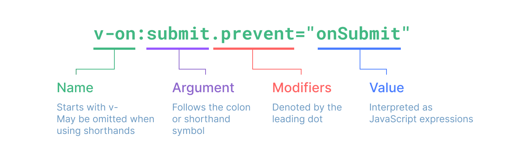
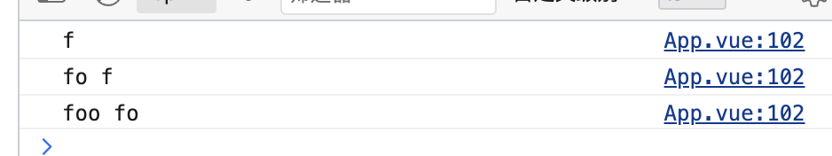
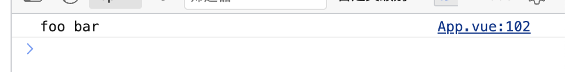

# vue 知识速查

# 目录


# vue 语法

## 定义响应式变量

响应式数据原理，[参加](./响应式原理.md)

下面都是vue3的

### ref()

支持所有类型，官方也推荐用ref来创建响应式数据

```js
const foo = ref('bar')

<div>{{ foo }}</div>
```

### reactive()

只能接受对象作为参数,返回的代理对象不能解构，解构就丢了响应式

```js
const foo = reactive({bar: 'bar'})
<div>{{ foo.bar }}</div>
```

如果给reactive传入一个ref变量，会自动解包

```js
const count = ref(0)
const state = reactive({
  count
})

state.count = 1 // state.count和ref的count建立了关联
console.log(count.value) // 1
```

下面是vue2

```html
<script>
  export default {
    data(): {
      return {
        foo: 'bar'
      }
    }
  }
</script>

<div>{{ foo }}</div>
```

## 插值语法

语法：解析标签体的内容。 写法：`{{xxx}}`（类似Mustache模板语法，但解析用vue自己的解析器）xxx为变量、单个表达式，会直接读取vue对象下的data属性中的值

```HTML
<h3>foo，{{name}}</h3>
```

## 指令语法（属性绑定）

语法：用于解析标签（包括：标签属性、标签体内容、绑定事件…..） 写法：`v-bind:href="xxx"`或简写为 `:href="xxx"`（xxx同样要写单个表达式、变量）

构成


```HTML
<a v-bind:href="school.url.toUpperCase()" x="hello">点我去{{school.name}}学习1</a>

<a :href="school.url" x="hello">点我去{{school.name}}学习2</a>
```

### v-bind、v-model

- v-bind：单向数据绑定
- v-model：双向数据绑定

```HTML
<!-- 单向数据绑定： -->
<input type="text" v-bind:value="name">

<!-- 简写形式： -->
<input type="text" :value="name">

<!-- 组件数据绑定 -->
<BlogPost :author="post.author" />

<!-- 一次性绑定多个属性 -->
<!-- const post = {
  id: 1,
  title: 'My Journey with Vue'
} -->
<BlogPost v-bind="post" />


<!-- 双向数据绑定： -->
<!-- vue2 -->
<input type="text" v-model:value="name" />

<!-- vue3 -->
<input type="text" v-model:modelValue="name"/>

<!-- 简写形式： -->
<input type="text" v-model="name"/>
```
#### input、textarea

v-bind绑定需要自己手动处理input事件，v-model则不需要

#### select、input[type="radio|checkbox"]

v-bind要手动处理change事件，v-model则不需要

```html
<input type="radio" value="A" v-model="picked" /> A
<input type="radio" value="B" v-model="picked" /> B

<select v-model="multiSelected" multiple>
  <option value="A">A</option>
  <option value="B">B</option>
  <option value="C">C</option>
</select>
```

可见灵活使用v-model是多么的方便

#### v-model原理

很简单，就是v-bind+处理事件

```html
<input type="text" v-model="name"/>
<!-- 等同于 -->
<input type="text" :value="name" @input="val => name = val" />

<input type="radio" value="A" v-model="picked" /> A
<!-- 等同于 -->
<input type="radio" value="C" @change="handleInput" />
```

##### 组件的v-model

```html
<!-- vue3 -->
<Component
  :modelValue="searchText"
  @update:modelValue="newValue => searchText = newValue"
/>
<!-- 上面的写法就等效于下面的写法 -->
<Component v-model="searchText" />
```

在子组件中接收可以使用`defineModel()`宏定义，就不需要使用`defineProps`和`defineEmits`来处理绑定的变量和值变化时的处理方法

```js
// 指定默认值
const model = defineModel({ default: 1 })

// 给子组件双向绑定 v-model:title
// <Component v-model:title="searchText" />
const title = defineModel('title')
```

使用也很简单，`defineModel`返回一个`ref`变量，直接使用.value

```js
const model = defineModel({ default: 1 })

model.value = 2
console.log(model.value)
```

vue2中，需要定义`model`属性，只支持配置一个子组件v-model绑定，不支持vue3中的多个
```js
Vue.component('my-checkbox', {
  model: {
    prop: 'checked',   // v-model 绑定到哪个 prop
    event: 'change'    // v-model 用哪个事件更新
  },
  //...

})
```

#### 修饰符

修饰符可以修饰绑定指令、事件指令

+ `.trim`：去除输入的空格的，'    `a   bc`    ' => '`abc`'

+ `.number`：自动转换输入的数据为`float`，如果不能转换的数据会原模原样的输出

+ `.lazy`：触发`onChange`事件，不触发`onInput`事件，表现结果如下  

  ```html
  <input type="text" v-model="testfoo" />
  ```

  

  如果加上`.lazy`

  ```html
  <input type="text" v-model.lazy="testfoo" />
  ```

  

  只会在最后失焦或者回车，不是触发`change`事件的时候去更新值

+ `.sync`：简化绑定在子组件上的数据的双向更新

  ```html
    <!-- 子组件 -->
    <template>
      <div>
        <input @input="updateTitle" :value="title" />
      </div>
    </template>

    <script>
      export default {
      props: ['title'],
      methods: {
        updateTitle(event) {
          this.$emit('update:title', event.target.value);
          }
        }
      }
    </script>
  ```

  ```html
    <!-- 父组件 -->
    <template>
      <child-component :title.sync="docTitle" />
    </template>

    <script>
    import ChildComponent from './ChildComponent.vue';

    export default {
      components: {
        ChildComponent
      },
      data() {
        return {
          docTitle: 'Initial Title'
        };
      }
    }
    </script>
  ```
  父组件不需要再提供一个事件绑定到子组件上，子组件也不需要在`docTitle`数据变化的时候去触发绑定到自己身上的自定义事件。而是直接触发`update:title`事件即可完成子组件对绑定到自身值（`docTitle`）的更新，为了方便不写`@update:title="val => docTitle = val"`这么一坨，用这个`.sync`修饰符

### v-on

使用`v-on:xxx`或者`@xxx`绑定事件，xxx是事件名称

```HTML
<!-- 内联事件处理器 -->
<button v-on:click="alert('提示信息')">点我提示信息</button>
<!-- 方法事件处理器 -->
<button @click="showInfo1">点我提示信息1（不传参）</button>
<!-- 在内联处理器中调用方法 -->
<button @click="showInfo2(66, $event)">点我提示信息2（传参）</button>
```

**PS. 注意：**
`@click="demo"` 和 `@click="demo(参数1, 参数2, $event)"` 效果一致，但后者可以传参

如果绑定的方法事件处理为闭包，要注意
```html
<button @click="foo()">Add 1</button>

<!-- foo() {
  console.log('foo')
  return () => {
    console.log('bar')
  }
} -->
```

理论上想让其触发`foo`方法返回的那个`箭头函数`，但实际上触发的还是`foo`函数。也就是控制台打印的为`foo`

**因为`vue`会认为你调用这个函数想往里传递自己的参数，而不是先执行这个函数**  
拿到返回的函数再作为click事件传递给组件，让组件触发。如果碰到既需要默认参数，又需要自定义参数，就得在外面包装一层，外面接受默认参数，里头放自定义参数

#### 组件自定义事件

组件自定义事件就是放到组件标签身上的事件，而不是一般的`html`标签所使用的事件 可以实现子组件向父组件传递数据

##### 绑定事件
以下都为vue2写法，vue3同理

1. 第一种方法（属性绑定）：
```HTML
<!-- 通过父组件给子组件传递函数类型的props实现：子给父传递数据 -->
<School :getSchoolName="getSchoolName"/>

<template>
  <button @click="sendSchoolName">把学校名给App</button>
</template>
<script>
  export default {
    name:'School',
    props:['getSchoolName'],
    methods: {
      sendSchoolName(){
        this.getSchoolName(this.name)
      }
    },
  }
</script>
```

2. 第二种方法（事件绑定）：
```HTML
<!-- 通过父组件给子组件绑定一个自定义事件实现：子给父传递数据（第一种写法，使用@或v-on） -->
<Student @atguigu="getStudentName" />

<template>
  <button @click="sendStudentlName">把学生名给App</button>
</template>
<script>
  export default {
    name:'Student',
    methods: {
      sendStudentlName(){
        this.$emit('atguigu',666,888,900)
      }
    },
  }
</script>
```

使用ref
```HTML
<!-- 通过父组件给子组件绑定一个自定义事件实现：子给父传递数据（第二种写法，使用ref） -->
<Student ref="student" @click.native="show"/>
<script>
  methods: {
    getStudentlName(...args){
      // do something
    }
  },
  mounted() {
    this.$refs.student.$on('atguigu',this.getStudentName) //绑定自定义事件
    // this.$refs.student.$once('atguigu',this.getStudentName) //绑定自定义事件（一次性）
  },
</script>
```

#### 解绑事件

`this.$off`

```JavaScript
this.$off('atguigu') //解绑一个自定义事件
this.$off(['atguigu','demo']) //解绑多个自定义事件
this.$off() //解绑所有的自定义事件
```

注意：销毁后`$destory`所有的组件的自定义事件都无效了

#### 事件修饰符

1. prevent：阻止默认事件（常用）
2. stop：阻止事件冒泡（常用）
3. once：事件只触发一次（常用）
4. capture：使用事件的捕获模式
5. self: 只有 `event.target` 是当前操作的元素时才触发事件
6. passive：事件的默认行为立即执行，无需等待事件回调执行完毕

#### 键盘事件

vue中的键盘按键别名：

- 回车 => enter
- 删除 => delete (捕获“删除”和“退格”键)
- 退出 => esc
- 空格 => space
- 换行 => tab (特殊，必须配合keydown去使用)
- 上 => up
- 下 => down
- 左 => left
- 右 => right

**系统修饰键（用法特殊）**：ctrl、alt、shift、meta

事件绑定：`@keyup`和`@keydown`

- 配合keyup使用：按下修饰键的同时，再按下其他键，随后释放其他键，事件才被触发
- 配合keydown使用：正常触发事件

注意：

- Vue未提供别名的按键，可以使用按键原始的key值去绑定，但注意要转为kebab-case（短横线命名）
- `Vue.config.keyCodes.自定义键名 = 键码`，可以去定制按键别名
- 也可以使用keyCode去指定具体的按键（不推荐）

```js
<input type="text" placeholder="按下回车提示输入" @keydown.huiche="showInfo">

Vue.config.keyCodes.huiche = 13
```

### v-if、v-for

#### v-if
条件渲染（动态控制节点是否存存在）  
`v-if`、`v-else`、`v-else-if`、`v-show`

#### v-for
可遍历数组、对象

```html
<!-- const myObject = reactive({
  title: 'How to do lists in Vue',
  author: 'Jane Doe',
  publishedAt: '2016-04-10'
}) -->

<li v-for="(value, key, index) in myObject">
  {{ index }}. {{ key }}: {{ value }}
</li>

<!-- 直接写整数也是可以遍历的 -->
<span v-for="n in 10">{{ n }}</span>
```

##### 老生常谈，为何不建议用索引值作为v-for列表项的key
在DOM更新时，双端比对、快速比对，都需要比对两个列表（新虚拟DOM列表，旧虚拟DOM列表）。如果列表出现了插入新增，删除列表项，旧虚拟DOM中原本没发生任何变化的节点会因为前方插入了新的节点导致自身索引改变，那么两个算法对比时，相同索引值对应的两个节点就发生了变化

例如. [1, 2, 3, 4]代表旧节点，在‘3’之前插入了一个‘5’，会变成[1, 2, 5, 3, 4]。用索引值做key，索引值为2的位置（也就是'3'节点嘛）变成了‘5’节点，索引值为3的位置变成了‘3’节点，最后多出来一项，要创建一个‘4’节点  

本来是一个简单的创建一个‘5’节点，插入到‘3’节点前。结果变成了，修改‘3’节点为‘5’，修改‘4’节点为‘3’，最后再创建一个‘4’节点，这不妥妥增加计算、渲染开销嘛  
所以，用一个不变值做Id就很重要

## 其他指令

### v-text

1. **作用**：向其所在的节点中渲染文本内容。  
2. **与插值语法的区别**：v-text会替换掉节点中的内容，{{xx}}则不会。

```HTML
<div v-text="name"></div>
```

### v-html

1. **作用**：向指定节点中渲染包含html结构的内容。  
2. **与插值语法的区别**
     - v-html会替换掉节点中所有的内容，{{xx}}则不会。
     - v-html可以识别html结构。

```HTML
<div v-html="name"></div>
```

注意：有安全性问题，错误使用会导致XSS攻击 `v-cloak`指令（没有值）：

1. 本质是一个特殊属性，**Vue实例创建完毕并接管容器后，会删掉v-cloak属性**。  
2. 使用css配合 `v-cloak`可以解决网速慢时页面展示出 `{{xxx}}`的问题。

```HTML
<h2 v-cloak>{{name}}</h2>
```

### v-once

1. v-once所在节点在**初次动态渲染后，就视为静态内容了**。  
2. 以后数据的改变不会引起 `v-once`所在结构的更新，可以用于优化性能。

```HTML
<h2 v-once>{{name}}</h2>
```

### v-pre

1. 跳过其所在节点的编译过程。  
2. 可利用它跳过：没有使用指令语法、没有使用插值语法的节点，会加快编译。

```HTML
<h2 v-pre>{{name}}</h2>
```

## 自定义指令

语法：在vue实例中添加配置对象`directives`，之后在里面添加自定义函数

```js
// vue3 模板内指令
// 在模板中启用 v-focus
const vFocus = {
  mounted: (el) => el.focus()
}

// vue2 模板内指令
new Vue({
    el:'#root',
    data:{
      name:'尚硅谷'
    },
    directives:{
      big(element,binding){
        console.log('big',this) //注意此处的this是window
        element.innerText = binding.value * 10
    }
  }
})
```

element和binding分别指的是什么：

- element（vue3为el）：使用自定义指令的DOM
- binding：一个对象，里面包含指令接收的参数名字，参数值等信息
- vnode：底层虚拟DOM

### 指令钩子 vue2 vs vue3

| Vue 2 钩子           | Vue 3 对应钩子                      | 说明                         |
| ------------------ | ------------------------------- | -------------------------- |
| `bind`             | `created`                       | 指令第一次绑定到元素时调用              |
| `inserted`         | `mounted`                       | 元素插入父节点时调用                 |
| `update`           | `beforeUpdate` + `updated`      | 所在组件VNode 更新时调用，Vue 3 拆成前后两个阶段，`beforeUpdate`绑定元素的父组件更新前调用，`updated`在绑定元素的父组件及他自己的所有子节点都更新后调用 |
| `componentUpdated` | `updated`                       | 组件和子组件更新完成后调用              |
| `unbind`           | `unmounted`                     | 指令与元素解绑时调用                 |
| ❌ 无                | `beforeMount` / `beforeUnmount` | Vue 3 新增，更精细的生命周期          |


### 注意：

- 指令定义时不加v-，但使用时要加v-
- `directives`里面的`this`指向`window`（vue2）

- 全局指令（类似于过滤器）

```JavaScript
// vue3
const app = createApp()
app.directive('color', (el, binding) => {
  // 这会在 `mounted` 和 `updated` 时都调用
  el.style.color = binding.value
})

// vue2
Vue.directive('fbind',function (element,binding){
  element.value = binding.value
})

```

## 计算属性
可以用已定义的响应式数据做简单处理得到一个新的响应式数据，这个响应式对象是带有缓存的，会缓存计算的结果（类似React useMemo()，不完全是）

```html
<!-- vue3 -->
<script setup>
//计算属性——完整
let fullName = computed({
  get(){
    return person.firstName + '-' + person.lastName
  },
  set(value){
    const nameArr = value.split('-')
    person.firstName = nameArr[0]
    person.lastName = nameArr[1]
  }
})
</script>


<!-- vue2 -->
<script type="text/javascript">
  const vm = new Vue({
    el:'#root',
    data:{
      firstName:'张',
      lastName:'三',
      x:'你好'
    },
    computed:{
      fullName:{
        get(){
          return this.firstName + '-' + this.lastName
        },
        set(value){
          const arr = value.split('-')
          this.firstName = arr[0]
          this.lastName = arr[1]
        }
      }
    }
  })
</script>
```

简写
```js
// vue3
//计算属性——简写
let fullName = computed(()=>{
  return person.firstName + '-' + person.lastName
})

// vue2
computed:{
  fullName(){
    return this.firstName + '-' + this.lastName
  }
}
```

PS. 注意  
上面的fullName计算属性自己提供了setter，所以可以直接使用`fullName.value = 'foo'`这种形式去改变的，但如果使用简写形式的计算属性，不可以更改计算属性返回的对象，vue会给出警告⚠️

## watch

监听一个响应式数据（普通数据也能监听，但非响应式数据不会依赖收集，没意义），变化时执行注册的回调

vue2和vue3的响应式原理不同，[参见](./响应式原理.md)

```JavaScript
// vue3
//情况一：监视ref定义的响应式数据
watch(sum,(newValue,oldValue)=>{
	console.log('sum变化了',newValue,oldValue)

  // vue 3.5+版本支持清理函数
  onWatcherCleanup(() => {
    // code
  })
})

//情况二：监视多个ref定义的响应式数据
watch([sum,msg],(newValue,oldValue)=>{
	console.log('sum或msg变化了',newValue,oldValue)
}) 

/* 情况三：监视reactive定义的响应式数据
    若watch监视的是reactive定义的响应式数据本身，则无法正确获得oldValue且强制开启了深度监视 
*/
watch(person,(newValue,oldValue)=>{
	console.log('person变化了',newValue,oldValue)
  console.log(newValue === oldValue) // 输出true
},{deep:false}) //此处的deep配置不再奏效

//情况四：监视reactive定义的响应式数据中的某个属性
watch(()=>person.job,(newValue,oldValue)=>{
	console.log('person的job变化了',newValue,oldValue)
},{deep:true}) 

//情况五：监视reactive定义的响应式数据中的某些属性
watch([()=>person.job,()=>person.name],(newValue,oldValue)=>{
	console.log('person的job变化了',newValue,oldValue)
},{deep:true})

//情况六：特殊情况
watch(()=>person.job,(newValue,oldValue)=>{
    console.log('person的job变化了',newValue,oldValue)
},{deep:true}) //此处由于监视的是reactive素定义的对象中的某个属性，所以deep配置有效(person.job是对象)

// vue2
watch:{
  isHot:{
    immediate:true, //初始化时让handler调用一下
    handler(newValue,oldValue){
      // code
    }
  },
  foo(newValue,oldValue) {
    // code
  },
  'obj.bar': {
    handler(newValue,oldValue){
      // code
    }
  }
}
```


## watchEffect()
仅vue3支持，接收一个回调函数，自动收集回调中的响应式依赖，并自动执行

### cleanup清理函数
```js
watchEffect((onCleanup) => {
  // ...
  onCleanup(() => {
    // 清理逻辑
  })
})

```

### 停止监听
```js
const unwatch = watchEffect(() => {})

// ...当该侦听器不再需要时
unwatch()

```

## vue中的复用逻辑

### Composition Api 组合式函数

vue3中有状态逻辑的函数（主要用于逻辑复用、代码组织）类似于一个纯逻辑的组件，没有模版`template`标签。⚠️但不是只有`<script>`标签的组件，不会经过组件编译器去解析标签等有这种复杂的开销

#### 实例：


```JavaScript
// useFetch示例 封装fetch useFetch.js
import { ref, isRef, unref, watchEffect } from 'vue'

export function useFetch(url) {
  const data = ref(null)
  const error = ref(null)

  function doFetch() {
    // 在请求之前重设状态...
    data.value = null
    error.value = null
    // unref() 解包可能为 ref 的值
    fetch(unref(url))
      .then((res) => res.json())
      .then((json) => (data.value = json))
      .catch((err) => (error.value = err))
  }

  if (isRef(url)) {
    // 若输入的 URL 是一个 ref，那么启动一个响应式的请求
    watchEffect(doFetch)
  } else {
    // 否则只请求一次
    // 避免监听器的额外开销
    doFetch()
  }

  return { data, error }
}
```

```html
<!-- 在其他的组件中使用 -->
<script setup>
import { useFetch } from './useFetch.js'

const { res, err } = useFetch('https://voice.xuyanshe.club')
</script>
```

在组合式函数中，可以使用vue的生命周期钩子，可以让组合式函数挂靠到对应组件的生命周期钩子上面去执行。

**接收参数**：接收的参数可以是一个`ref`响应式的值，也可以是一个普通的值。里面对响应式的值使用`unref`做了处理（响应式值只返回value，普通值原样返回）

**返回值**：返回值是一个普通的对象，不是响应式对象。可以在使用时，用reactive包裹自定义hook，返回的对象中的ref会自动解包，如果使用了响应式的值使用了解构就会破坏原有值的响应式

**PS. 注意**

mixin混入本质是把一堆代码flat扁平化展开成同级的，而组合式函数实现了逻辑隔离，不会耦合代码

### mixin混入

vue2和3都支持，vue3中不推荐使用，有composition api了

混合属性，来分发 Vue 组件中的可复用功能。一个混入对象可以包含任意组件选项

```JavaScript
// 定义一个混入对象
var myMixin = {
  created: function () {
    this.hello()
  },
  methods: {
    hello: function () {
      console.log('hello from mixin!')
    }
  }
}
// 定义一个使用混入对象的组件
var Component = Vue.extend({
  mixins: [myMixin]
})
var component = new Component() // => "hello from mixin!"
```

- 属性重名：会覆盖，优先使用组件身上的配置对象 
- 生命周期重名：组件的生命周期和混入对象配置的生命周期都会执行，执行顺序vue2为组件先，mixin后，vue3反过来

#### 全局混入

通过`Vue.mixin()`API创建，每一个组件都会自动使用到这个混入器。全局mixin都是先执行的

```JavaScript
// 为自定义的选项 'myOption' 注入一个处理器。
Vue.mixin({
  created: function () {
    var myOption = this.$options.myOption
    if (myOption) {
      console.log(myOption)
    }
  }
})

new Vue({
  myOption: 'hello!'
})
// => "hello!"
```

## 插件

通常用来为 Vue 添加全局功能（增强功能），比如组件库，vue-route，vuex等，也是一种代码复用方式

```js
// vue3
const app = createApp({})

app.use(myPlugin, myPluginOptions = {})

const myPlugin = {
  install(app, options) {
    // 配置此应用
  }
}
// 或者
const myPlugin = (app, options) => {
  // 直接是一个install方法
}

// vue 2
Vue.use(MyPlugin)

new Vue({
  // ...组件选项
})
```

# 组件

SFC（Single-File Component）单文件组件，一般是一个.vue结尾的文件，里面至少要有如下三个标签
- `<script>`
- `<template>`
- `<style>`
  
这里还有一些限制，只能有一个`<template>`、可以同时有`<script setup> <script>`这两个标签，但不能同时写两个`<script>`标签。可以有多个`<style>`，会在编译模版时合并

### 注册组件


## 模版

## 插槽


## 生命周期

