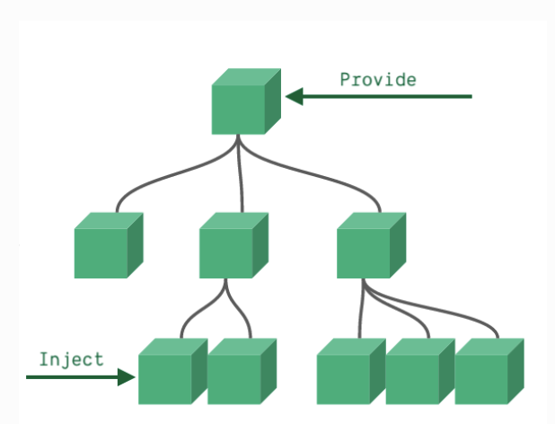
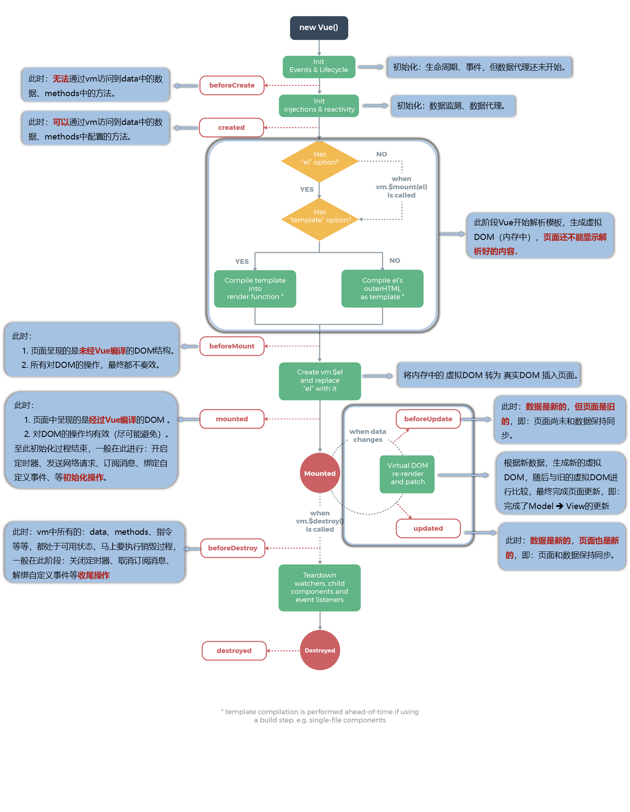

# 目录

- [目录](#目录)
- [vue 语法](#vue-语法)
  - [定义响应式变量](#定义响应式变量)
    - [ref()](#ref)
    - [reactive()](#reactive)
  - [插值语法](#插值语法)
  - [指令语法（属性绑定）](#指令语法属性绑定)
    - [v-bind、v-model](#v-bindv-model)
      - [input、textarea](#inputtextarea)
      - [select、input\[type="radio|checkbox"\]](#selectinputtyperadiocheckbox)
      - [v-model原理](#v-model原理)
        - [组件的v-model](#组件的v-model)
      - [修饰符](#修饰符)
    - [v-on](#v-on)
      - [组件自定义事件](#组件自定义事件)
        - [绑定事件](#绑定事件)
      - [解绑事件](#解绑事件)
      - [事件修饰符](#事件修饰符)
      - [键盘事件](#键盘事件)
    - [v-if、v-for](#v-ifv-for)
      - [v-if](#v-if)
      - [v-for](#v-for)
        - [老生常谈，为何不建议用索引值作为v-for列表项的key](#老生常谈为何不建议用索引值作为v-for列表项的key)
  - [其他指令](#其他指令)
    - [v-text](#v-text)
    - [v-html](#v-html)
    - [v-once](#v-once)
    - [v-pre](#v-pre)
  - [自定义指令](#自定义指令)
    - [指令钩子 vue2 vs vue3](#指令钩子-vue2-vs-vue3)
    - [注意：](#注意)
  - [计算属性](#计算属性)
  - [watch](#watch)
  - [watchEffect()](#watcheffect)
    - [cleanup清理函数](#cleanup清理函数)
    - [停止监听](#停止监听)
  - [vue中的复用逻辑](#vue中的复用逻辑)
    - [Composition Api 组合式函数](#composition-api-组合式函数)
      - [实例：](#实例)
    - [mixin混入](#mixin混入)
      - [全局混入](#全局混入)
  - [插件](#插件)
  - [ref引用](#ref引用)
  - [nextTick](#nexttick)
- [组件](#组件)
  - [注册组件](#注册组件)
    - [全局注册](#全局注册)
    - [局部注册](#局部注册)
      - [vue2 组件实例原型链](#vue2-组件实例原型链)
      - [为什么要这么做？](#为什么要这么做)
  - [组件通信](#组件通信)
    - [props属性](#props属性)
  - [Provide、inject](#provideinject)
  - [模版](#模版)
    - [占位标签template](#占位标签template)
    - [vue3 `<script setup>`](#vue3-script-setup)
    - [vue3 的 `setup()`](#vue3-的-setup)
  - [插槽](#插槽)
    - [默认插槽](#默认插槽)
    - [具名插槽](#具名插槽)
    - [作用域插槽](#作用域插槽)
  - [生命周期](#生命周期)
    - [vue3](#vue3)
    - [vue2](#vue2)
      - [mounted](#mounted)
      - [beforeDestory](#beforedestory)
      - [Destory流程 销毁组件流程](#destory流程-销毁组件流程)
    - [vue3 和 vue2 对比生命周期](#vue3-和-vue2-对比生命周期)
  - [KeepAlive](#keepalive)
    - [属性](#属性)
    - [特有的生命周期](#特有的生命周期)
- [样式](#样式)
  - [样式绑定](#样式绑定)
  - [scope](#scope)
  - [动画](#动画)
    - [Transition、TransitionGroup](#transitiontransitiongroup)
    - [过渡阶段的类名](#过渡阶段的类名)
    - [触发时机](#触发时机)
      - [Transition](#transition)
      - [TransitionGroup](#transitiongroup)
    - [过渡动画中类名的变化](#过渡动画中类名的变化)
- [vue3 中其他新特性](#vue3-中其他新特性)
  - [toRef、toRefs](#toreftorefs)
    - [应用](#应用)
    - [扩展](#扩展)
  - [shallowReactive、shallowRef](#shallowreactiveshallowref)
  - [readonly、shallowReadonly](#readonlyshallowreadonly)
  - [toRaw、markRaw](#torawmarkraw)
  - [customRef](#customref)
  - [几个工具函数](#几个工具函数)
  - [Fragment组件：`<Fragment>`](#fragment组件fragment)
  - [Teleport组件：`<Teleport></Teleport>`](#teleport组件teleportteleport)
  - [Suspend组件](#suspend组件)
- [vue2 中已过时特性](#vue2-中已过时特性)
  - [过滤器](#过滤器)
    - [语法](#语法)
    - [注意](#注意-1)
  - [自定义事件总线（用于任意组件通信）](#自定义事件总线用于任意组件通信)

<small><i><a href='http://ecotrust-canada.github.io/markdown-toc/'>Table of contents generated with markdown-toc</a></i></small>

# vue 语法

## 定义响应式变量

响应式数据原理，[参见](./响应式原理.md)

下面都是vue3的

### ref()

支持所有类型，官方也推荐用ref来创建响应式数据

```js
const foo = ref('bar')

<div>{{ foo }}</div>
```

### reactive()

只能接受对象作为参数,返回的代理对象不能解构，解构就丢了响应式

```js
const foo = reactive({bar: 'bar'})
<div>{{ foo.bar }}</div>
```

如果给reactive传入一个ref变量，会自动解包

```js
const count = ref(0)
const state = reactive({
  count
})

state.count = 1 // state.count和ref的count建立了关联
console.log(count.value) // 1
```

下面是vue2

```html
<script>
  export default {
    data(): {
      return {
        foo: 'bar'
      }
    }
  }
</script>

<div>{{ foo }}</div>
```

## 插值语法

语法：解析标签体的内容。 写法：`{{xxx}}`（类似Mustache模板语法，但解析用vue自己的解析器）xxx为变量、单个表达式，会直接读取vue对象下的data属性中的值

```HTML
<h3>foo，{{name}}</h3>
```

## 指令语法（属性绑定）

语法：用于解析标签（包括：标签属性、标签体内容、绑定事件…..） 写法：`v-bind:href="xxx"`或简写为 `:href="xxx"`（xxx同样要写单个表达式、变量）

构成


```HTML
<a v-bind:href="school.url.toUpperCase()" x="hello">点我去{{school.name}}学习1</a>

<a :href="school.url" x="hello">点我去{{school.name}}学习2</a>
```

### v-bind、v-model

- v-bind：单向数据绑定
- v-model：双向数据绑定

```HTML
<!-- 单向数据绑定： -->
<input type="text" v-bind:value="name">

<!-- 简写形式： -->
<input type="text" :value="name">

<!-- 组件数据绑定 -->
<BlogPost :author="post.author" />

<!-- 一次性绑定多个属性 -->
<!-- const post = {
  id: 1,
  title: 'My Journey with Vue'
} -->
<BlogPost v-bind="post" />


<!-- 双向数据绑定： -->
<!-- vue2 -->
<input type="text" v-model:value="name" />

<!-- vue3 -->
<input type="text" v-model:modelValue="name"/>

<!-- 简写形式： -->
<input type="text" v-model="name"/>
```
#### input、textarea

v-bind绑定需要自己手动处理input事件，v-model则不需要

#### select、input[type="radio|checkbox"]

v-bind要手动处理change事件，v-model则不需要

```html
<input type="radio" value="A" v-model="picked" /> A
<input type="radio" value="B" v-model="picked" /> B

<select v-model="multiSelected" multiple>
  <option value="A">A</option>
  <option value="B">B</option>
  <option value="C">C</option>
</select>
```

可见灵活使用v-model是多么的方便

#### v-model原理

很简单，就是v-bind+处理事件

```html
<input type="text" v-model="name"/>
<!-- 等同于 -->
<input type="text" :value="name" @input="val => name = val" />

<input type="radio" value="A" v-model="picked" /> A
<!-- 等同于 -->
<input type="radio" value="C" @change="handleInput" />
```

##### 组件的v-model

```html
<!-- vue3 -->
<Component
  :modelValue="searchText"
  @update:modelValue="newValue => searchText = newValue"
/>
<!-- 上面的写法就等效于下面的写法 -->
<Component v-model="searchText" />
```

在子组件中接收可以使用`defineModel()`宏定义，就不需要使用`defineProps`和`defineEmits`来处理绑定的变量和值变化时的处理方法

```js
// 指定默认值
const model = defineModel({ default: 1 })

// 给子组件双向绑定 v-model:title
// <Component v-model:title="searchText" />
const title = defineModel('title')
```

使用也很简单，`defineModel`返回一个`ref`变量，直接使用.value

```js
const model = defineModel({ default: 1 })

model.value = 2
console.log(model.value)
```

vue2中，需要定义`model`属性，只支持配置一个子组件v-model绑定，不支持vue3中的多个
```js
Vue.component('my-checkbox', {
  model: {
    prop: 'checked',   // v-model 绑定到哪个 prop
    event: 'change'    // v-model 用哪个事件更新
  },
  //...

})
```

#### 修饰符

修饰符可以修饰绑定指令、事件指令

+ `.trim`：去除输入的空格的，'    `a   bc`    ' => '`abc`'

+ `.number`：自动转换输入的数据为`float`，如果不能转换的数据会原模原样的输出

+ `.lazy`：触发`onChange`事件，不触发`onInput`事件，表现结果如下  

  ```html
  <input type="text" v-model="testfoo" />
  ```

  

  如果加上`.lazy`

  ```html
  <input type="text" v-model.lazy="testfoo" />
  ```

  

  只会在最后失焦或者回车，不是触发`change`事件的时候去更新值

+ `.sync`：简化绑定在子组件上的数据的双向更新

  ```html
    <!-- 子组件 -->
    <template>
      <div>
        <input @input="updateTitle" :value="title" />
      </div>
    </template>

    <script>
      export default {
      props: ['title'],
      methods: {
        updateTitle(event) {
          this.$emit('update:title', event.target.value);
          }
        }
      }
    </script>
  ```

  ```html
    <!-- 父组件 -->
    <template>
      <child-component :title.sync="docTitle" />
    </template>

    <script>
    import ChildComponent from './ChildComponent.vue';

    export default {
      components: {
        ChildComponent
      },
      data() {
        return {
          docTitle: 'Initial Title'
        };
      }
    }
    </script>
  ```
  父组件不需要再提供一个事件绑定到子组件上，子组件也不需要在`docTitle`数据变化的时候去触发绑定到自己身上的自定义事件。而是直接触发`update:title`事件即可完成子组件对绑定到自身值（`docTitle`）的更新，为了方便不写`@update:title="val => docTitle = val"`这么一坨，用这个`.sync`修饰符

### v-on

使用`v-on:xxx`或者`@xxx`绑定事件，xxx是事件名称

```HTML
<!-- 内联事件处理器 -->
<button v-on:click="alert('提示信息')">点我提示信息</button>
<!-- 方法事件处理器 -->
<button @click="showInfo1">点我提示信息1（不传参）</button>
<!-- 在内联处理器中调用方法 -->
<button @click="showInfo2(66, $event)">点我提示信息2（传参）</button>
```

**PS. 注意：**
`@click="demo"` 和 `@click="demo(参数1, 参数2, $event)"` 效果一致，但后者可以传参

如果绑定的方法事件处理为闭包，要注意
```html
<button @click="foo()">Add 1</button>

<!-- foo() {
  console.log('foo')
  return () => {
    console.log('bar')
  }
} -->
```

理论上想让其触发`foo`方法返回的那个`箭头函数`，但实际上触发的还是`foo`函数。也就是控制台打印的为`foo`

**因为`vue`会认为你调用这个函数想往里传递自己的参数，而不是先执行这个函数**  
拿到返回的函数再作为click事件传递给组件，让组件触发。如果碰到既需要默认参数，又需要自定义参数，就得在外面包装一层，外面接受默认参数，里头放自定义参数

#### 组件自定义事件

组件自定义事件就是放到组件标签身上的事件，而不是一般的`html`标签所使用的事件 可以实现子组件向父组件传递数据

##### 绑定事件
以下都为vue2写法，vue3同理

1. 第一种方法（属性绑定）：
```HTML
<!-- 通过父组件给子组件传递函数类型的props实现：子给父传递数据 -->
<School :getSchoolName="getSchoolName"/>

<template>
  <button @click="sendSchoolName">把学校名给App</button>
</template>
<script>
  export default {
    name:'School',
    props:['getSchoolName'],
    methods: {
      sendSchoolName(){
        this.getSchoolName(this.name)
      }
    },
  }
</script>
```

2. 第二种方法（事件绑定）：
```HTML
<!-- 通过父组件给子组件绑定一个自定义事件实现：子给父传递数据（第一种写法，使用@或v-on） -->
<Student @atguigu="getStudentName" />

<template>
  <button @click="sendStudentlName">把学生名给App</button>
</template>
<script>
  export default {
    name:'Student',
    methods: {
      sendStudentlName(){
        this.$emit('atguigu',666,888,900)
      }
    },
  }
</script>
```

使用ref
```HTML
<!-- 通过父组件给子组件绑定一个自定义事件实现：子给父传递数据（第二种写法，使用ref） -->
<Student ref="student" @click.native="show"/>
<script>
  methods: {
    getStudentlName(...args){
      // do something
    }
  },
  mounted() {
    this.$refs.student.$on('atguigu',this.getStudentName) //绑定自定义事件
    // this.$refs.student.$once('atguigu',this.getStudentName) //绑定自定义事件（一次性）
  },
</script>
```

#### 解绑事件

`this.$off`

```JavaScript
this.$off('atguigu') //解绑一个自定义事件
this.$off(['atguigu','demo']) //解绑多个自定义事件
this.$off() //解绑所有的自定义事件
```

注意：销毁后`$destory`所有的组件的自定义事件都无效了

#### 事件修饰符

1. prevent：阻止默认事件（常用）
2. stop：阻止事件冒泡（常用）
3. once：事件只触发一次（常用）
4. capture：使用事件的捕获模式
5. self: 只有 `event.target` 是当前操作的元素时才触发事件
6. passive：事件的默认行为立即执行，无需等待事件回调执行完毕

#### 键盘事件

vue中的键盘按键别名：

- 回车 => enter
- 删除 => delete (捕获“删除”和“退格”键)
- 退出 => esc
- 空格 => space
- 换行 => tab (特殊，必须配合keydown去使用)
- 上 => up
- 下 => down
- 左 => left
- 右 => right

**系统修饰键（用法特殊）**：ctrl、alt、shift、meta

事件绑定：`@keyup`和`@keydown`

- 配合keyup使用：按下修饰键的同时，再按下其他键，随后释放其他键，事件才被触发
- 配合keydown使用：正常触发事件

注意：

- Vue未提供别名的按键，可以使用按键原始的key值去绑定，但注意要转为kebab-case（短横线命名）
- `Vue.config.keyCodes.自定义键名 = 键码`，可以去定制按键别名
- 也可以使用keyCode去指定具体的按键（不推荐）

```js
<input type="text" placeholder="按下回车提示输入" @keydown.huiche="showInfo">

Vue.config.keyCodes.huiche = 13
```

### v-if、v-for

#### v-if
条件渲染（动态控制节点是否存存在）  
`v-if`、`v-else`、`v-else-if`、`v-show`

#### v-for
可遍历数组、对象

```html
<!-- const myObject = reactive({
  title: 'How to do lists in Vue',
  author: 'Jane Doe',
  publishedAt: '2016-04-10'
}) -->

<li v-for="(value, key, index) in myObject">
  {{ index }}. {{ key }}: {{ value }}
</li>

<!-- 直接写整数也是可以遍历的 -->
<span v-for="n in 10">{{ n }}</span>
```

##### 老生常谈，为何不建议用索引值作为v-for列表项的key
在DOM更新时，双端比对、快速比对，都需要比对两个列表（新虚拟DOM列表，旧虚拟DOM列表）。如果列表出现了插入新增，删除列表项，旧虚拟DOM中原本没发生任何变化的节点会因为前方插入了新的节点导致自身索引改变，那么两个算法对比时，相同索引值对应的两个节点就发生了变化

例如. [1, 2, 3, 4]代表旧节点，在‘3’之前插入了一个‘5’，会变成[1, 2, 5, 3, 4]。用索引值做key，索引值为2的位置（也就是'3'节点嘛）变成了‘5’节点，索引值为3的位置变成了‘3’节点，最后多出来一项，要创建一个‘4’节点  

本来是一个简单的创建一个‘5’节点，插入到‘3’节点前。结果变成了，修改‘3’节点为‘5’，修改‘4’节点为‘3’，最后再创建一个‘4’节点，这不妥妥增加计算、渲染开销嘛  
所以，用一个不变值做Id就很重要

## 其他指令

### v-text

1. **作用**：向其所在的节点中渲染文本内容。  
2. **与插值语法的区别**：v-text会替换掉节点中的内容，{{xx}}则不会。

```HTML
<div v-text="name"></div>
```

### v-html

1. **作用**：向指定节点中渲染包含html结构的内容。  
2. **与插值语法的区别**
     - v-html会替换掉节点中所有的内容，{{xx}}则不会。
     - v-html可以识别html结构。

```HTML
<div v-html="name"></div>
```

注意：有安全性问题，错误使用会导致XSS攻击 `v-cloak`指令（没有值）：

1. 本质是一个特殊属性，**Vue实例创建完毕并接管容器后，会删掉v-cloak属性**。  
2. 使用css配合 `v-cloak`可以解决网速慢时页面展示出 `{{xxx}}`的问题。

```HTML
<h2 v-cloak>{{name}}</h2>
```

### v-once

1. v-once所在节点在**初次动态渲染后，就视为静态内容了**。  
2. 以后数据的改变不会引起 `v-once`所在结构的更新，可以用于优化性能。

```HTML
<h2 v-once>{{name}}</h2>
```

### v-pre

1. 跳过其所在节点的编译过程。  
2. 可利用它跳过：没有使用指令语法、没有使用插值语法的节点，会加快编译。

```HTML
<h2 v-pre>{{name}}</h2>
```

## 自定义指令

语法：在vue实例中添加配置对象`directives`，之后在里面添加自定义函数

```js
// vue3 模板内指令
// 在模板中启用 v-focus
const vFocus = {
  mounted: (el) => el.focus()
}

// vue2 模板内指令
new Vue({
    el:'#root',
    data:{
      name:'尚硅谷'
    },
    directives:{
      big(element,binding){
        console.log('big',this) //注意此处的this是window
        element.innerText = binding.value * 10
    }
  }
})
```

element和binding分别指的是什么：

- element（vue3为el）：使用自定义指令的DOM
- binding：一个对象，里面包含指令接收的参数名字，参数值等信息
- vnode：底层虚拟DOM

### 指令钩子 vue2 vs vue3

| Vue 2 钩子           | Vue 3 对应钩子                      | 说明                         |
| ------------------ | ------------------------------- | -------------------------- |
| `bind`             | `created`                       | 指令第一次绑定到元素时调用              |
| `inserted`         | `mounted`                       | 元素插入父节点时调用                 |
| `update`           | `beforeUpdate` + `updated`      | 所在组件VNode 更新时调用，Vue 3 拆成前后两个阶段，`beforeUpdate`绑定元素的父组件更新前调用，`updated`在绑定元素的父组件及他自己的所有子节点都更新后调用 |
| `componentUpdated` | `updated`                       | 组件和子组件更新完成后调用              |
| `unbind`           | `unmounted`                     | 指令与元素解绑时调用                 |
| ❌ 无                | `beforeMount` / `beforeUnmount` | Vue 3 新增，更精细的          |


### 注意：

- 指令定义时不加v-，但使用时要加v-
- `directives`里面的`this`指向`window`（vue2）

- 全局指令（类似于过滤器）

```JavaScript
// vue3
const app = createApp()
app.directive('color', (el, binding) => {
  // 这会在 `mounted` 和 `updated` 时都调用
  el.style.color = binding.value
})

// vue2
Vue.directive('fbind',function (element,binding){
  element.value = binding.value
})

```

## 计算属性
可以用已定义的响应式数据做简单处理得到一个新的响应式数据，这个响应式对象是带有缓存的，会缓存计算的结果（类似React useMemo()，不完全是）

```html
<!-- vue3 -->
<script setup>
//计算属性——完整
let fullName = computed({
  get(){
    return person.firstName + '-' + person.lastName
  },
  set(value){
    const nameArr = value.split('-')
    person.firstName = nameArr[0]
    person.lastName = nameArr[1]
  }
})
</script>


<!-- vue2 -->
<script type="text/javascript">
  const vm = new Vue({
    el:'#root',
    data:{
      firstName:'张',
      lastName:'三',
      x:'你好'
    },
    computed:{
      fullName:{
        get(){
          return this.firstName + '-' + this.lastName
        },
        set(value){
          const arr = value.split('-')
          this.firstName = arr[0]
          this.lastName = arr[1]
        }
      }
    }
  })
</script>
```

简写
```js
// vue3
//计算属性——简写
let fullName = computed(()=>{
  return person.firstName + '-' + person.lastName
})

// vue2
computed:{
  fullName(){
    return this.firstName + '-' + this.lastName
  }
}
```

PS. 注意  
上面的fullName计算属性自己提供了setter，所以可以直接使用`fullName.value = 'foo'`这种形式去改变的，但如果使用简写形式的计算属性，不可以更改计算属性返回的对象，vue会给出警告⚠️

## watch

监听一个响应式数据（普通数据也能监听，但非响应式数据不会依赖收集，没意义），变化时执行注册的回调。不会自动执行，是惰性函数

vue2和vue3的响应式原理不同，[参见](./响应式原理.md)

```JavaScript
// vue3
//情况一：监视ref定义的响应式数据
watch(sum,(newValue,oldValue)=>{
	console.log('sum变化了',newValue,oldValue)

  // vue 3.5+版本支持清理函数
  onWatcherCleanup(() => {
    // code
  })
})

//情况二：监视多个ref定义的响应式数据
watch([sum,msg],(newValue,oldValue)=>{
	console.log('sum或msg变化了',newValue,oldValue)
}) 

/* 情况三：监视reactive定义的响应式数据
    若watch监视的是reactive定义的响应式数据本身，则无法正确获得oldValue且强制开启了深度监视 
*/
watch(person,(newValue,oldValue)=>{
	console.log('person变化了',newValue,oldValue)
  console.log(newValue === oldValue) // 输出true
},{deep:false}) //此处的deep配置不再奏效

//情况四：监视reactive定义的响应式数据中的某个属性
watch(()=>person.job,(newValue,oldValue)=>{
	console.log('person的job变化了',newValue,oldValue)
},{deep:true}) 

//情况五：监视reactive定义的响应式数据中的某些属性
watch([()=>person.job,()=>person.name],(newValue,oldValue)=>{
	console.log('person的job变化了',newValue,oldValue)
},{deep:true})

//情况六：特殊情况
watch(()=>person.job,(newValue,oldValue)=>{
    console.log('person的job变化了',newValue,oldValue)
},{deep:true}) //此处由于监视的是reactive素定义的对象中的某个属性，所以deep配置有效(person.job是对象)

// vue2
watch:{
  isHot:{
    immediate:true, //初始化时让handler调用一下
    handler(newValue,oldValue){
      // code
    }
  },
  foo(newValue,oldValue) {
    // code
  },
  'obj.bar': {
    handler(newValue,oldValue){
      // code
    }
  }
}
```


## watchEffect()
仅vue3支持，接收一个回调函数，自动收集回调中的响应式依赖，并自动执行。会在setup执行完毕后执行一次，非惰性函数

### cleanup清理函数
```js
watchEffect((onCleanup) => {
  // ...
  onCleanup(() => {
    // 清理逻辑
  })
})

```

### 停止监听
```js
const unwatch = watchEffect(() => {})

// ...当该侦听器不再需要时
unwatch()

```

## vue中的复用逻辑

### Composition Api 组合式函数

vue3中有状态逻辑的函数（主要用于逻辑复用、代码组织）类似于一个纯逻辑的组件，没有模版`template`标签。⚠️但不是只有`<script>`标签的组件，不会经过组件编译器去解析标签等有这种复杂的开销

#### 实例：


```JavaScript
// useFetch示例 封装fetch useFetch.js
import { ref, isRef, unref, watchEffect } from 'vue'

export function useFetch(url) {
  const data = ref(null)
  const error = ref(null)

  function doFetch() {
    // 在请求之前重设状态...
    data.value = null
    error.value = null
    // unref() 解包可能为 ref 的值
    fetch(unref(url))
      .then((res) => res.json())
      .then((json) => (data.value = json))
      .catch((err) => (error.value = err))
  }

  if (isRef(url)) {
    // 若输入的 URL 是一个 ref，那么启动一个响应式的请求
    watchEffect(doFetch)
  } else {
    // 否则只请求一次
    // 避免监听器的额外开销
    doFetch()
  }

  return { data, error }
}
```

```html
<!-- 在其他的组件中使用 -->
<script setup>
import { useFetch } from './useFetch.js'

const { res, err } = useFetch('https://voice.xuyanshe.club')
</script>
```

在组合式函数中，可以使用vue的钩子，可以让组合式函数挂靠到对应组件的钩子上面去执行。

**接收参数**：接收的参数可以是一个`ref`响应式的值，也可以是一个普通的值。里面对响应式的值使用`unref`做了处理（响应式值只返回value，普通值原样返回）

**返回值**：返回值是一个普通的对象，不是响应式对象。可以在使用时，用reactive包裹自定义hook，返回的对象中的ref会自动解包，如果使用了响应式的值使用了解构就会破坏原有值的响应式

**PS. 注意**

mixin混入本质是把一堆代码flat扁平化展开成同级的，而组合式函数实现了逻辑隔离，不会耦合代码

### mixin混入

vue2和3都支持，vue3中不推荐使用，有composition api了

混合属性，来分发 Vue 组件中的可复用功能。一个混入对象可以包含任意组件选项

```JavaScript
// 定义一个混入对象
var myMixin = {
  created: function () {
    this.hello()
  },
  methods: {
    hello: function () {
      console.log('hello from mixin!')
    }
  }
}
// 定义一个使用混入对象的组件
var Component = Vue.extend({
  mixins: [myMixin]
})
var component = new Component() // => "hello from mixin!"
```

- 属性重名：会覆盖，优先使用组件身上的配置对象 
- 重名：组件的和混入对象配置的都会执行，执行顺序vue2为组件先，mixin后，vue3反过来

#### 全局混入

通过`Vue.mixin()`API创建，每一个组件都会自动使用到这个混入器。全局mixin都是先执行的

```JavaScript
// 为自定义的选项 'myOption' 注入一个处理器。
Vue.mixin({
  created: function () {
    var myOption = this.$options.myOption
    if (myOption) {
      console.log(myOption)
    }
  }
})

new Vue({
  myOption: 'hello!'
})
// => "hello!"
```

## 插件

通常用来为 Vue 添加全局功能（增强功能），比如组件库，vue-route，vuex等，也是一种代码复用方式

```js
// vue3
const app = createApp({})

app.use(myPlugin, myPluginOptions = {})

const myPlugin = {
  install(app, options) {
    // 配置此应用
  }
}
// 或者
const myPlugin = (app, options) => {
  // 直接是一个install方法
}

// vue 2
Vue.use(MyPlugin)

new Vue({
  // ...组件选项
})
```

## ref引用
引用，和react的ref差不多，都是为了避免原生的DOM操作，给子组件注册引用信息。 普通的html标签上的`ref`指向的是这个DOM元素，普通的组件的`ref`属性指向的这个组件的实例对象

```HTML
<ChildComponent ref="childComponent" />
<!-- 可以是一个函数形式 -->
<ChildComponent :ref="(el) => child = el" />

<!-- 列表ref -->
<ul>
  <li v-for="item in list" ref="items">
    {{ item }}
  </li>
</ul>

<script setup>
  // 需要定义一个同名的ref变量 vue3.5版本前
  const childComponent = ref()

  // vue3.5+
  const child = useTemplateRef('childComponent')

  // 列表ref 返回值是一个列表，每一项都是一个ref引用
  const itemRefs = useTemplateRef('items')
</script>
```

## nextTick

会在本次DOM更新结束后，下一轮的微任务队列中执行。这么做目的就是能确保DOM是最新的，这里涉及一点[事件循环机制](../ECMAScript/事件循环.md)

vue3的用法和vue2有点差异，且nextTick默认返回一个Promise，可以await，vue2会根据环境自动调整是否使用Promise

```js
// vue3
// DOM 还未更新 vue会合并响应式数据值的更新，一次更新避免多次生成新虚拟DOM
count++
console.log(document.getElementById('counter').textContent) // 0

await nextTick()
nextTick(() => {
  // code
})
// DOM 此时已经更新
console.log(document.getElementById('counter').textContent) // 1


// vue2
this.$nextTick(()=> {
  // code
})
```

# 组件

SFC（Single-File Component）单文件组件，一般是一个.vue结尾的文件，里面至少要有如下三个标签
- `<script>`
- `<template>`
- `<style>`
  
这里还有一些限制，只能有一个`<template>`、可以同时有`<script setup> <script>`这两个标签，但不能同时写两个`<script>`标签。可以有多个`<style>`，会在编译模版时合并

## 注册组件

### 全局注册

```js
// vue3
import MyComponent from './App.vue'

app.component('MyComponent', MyComponent)

// vue2
Vue.component('component-c', { /* ... */ })

new Vue({ el: '#app' })
```

### 局部注册

```js
// vue3 直接在使用的组件中引入即可
<script setup>
import ComponentA from './ComponentA.vue'
</script>

// vue2 必须通过components属性注册
import ComponentA from './ComponentA.vue'

export default {
  components: {
    ComponentA
  },
}
```

#### vue2 组件实例原型链

关系：**vue构造->vue组件->vue实例**

```JavaScript
//vue构造
Vue.extend({
  props: [],
  data: function() {
    return {}
  },
  template: ""
});
//vue组件
Vue.component("mycomponent", {
  props: [],
  data: function() {
    return {}
  },
  template: ""
});
//vue实例
new Vue({
  el: "",
  data: {}
});
```

这三者之间类似于继承 重要的内置关系：

```JavaScript
VueComponent.prototype.__proto__ === Vue.prototype
```


上面一行代码的图片解释

#### 为什么要这么做？

让组件实例对象（vc）可以访问到 Vue原型上的属性、方法

## 组件通信

### props属性

类似react的props属性，都是接受父组件传递的值。接收的方式有下面的三种

```JavaScript
// vue3 setup()
// vue2
//简单声明接收
props:['name','age','sex'] 
//接收的同时对数据进行类型限制
props:{
  name:String,
  age:Number,
  sex:String
}
//接收的同时对数据：进行类型限制+默认值的指定+必要性的限制
props:{
  name:{
    type:String, //name的类型是字符串
    default:'midou', //默认值
    required:true, //name是必要的
  }
}
```

但是，传入子组件的prop属性，都是直接放到了子组件的身上，但是没有放到`_data`下。可以直接使用`this.xx`来使用。react中是放到了组件的props属性下，使用的时候要`this.props.xxx`

## Provide、inject

组件间的通信方式（适合祖孙组件、跨级组件之间的的通信）



```JavaScript
// root组件
setup(){
  //......
  let car = reactive({name:'奔驰',price:'40万'})
  provide('car',car)
  //......
}
```

```JavaScript
setup(props,context){
  //......
  const car = inject('car')
  return {car}
  //......
}
```

## 模版

### 占位标签template

和react的`Fragment`标签一致，vue中如下功能

- 作为单文件组件最外层标签
- 插槽模版标签
- 列表渲染、条件渲染也可以在`template`标签上使用`v-for、v-if`。标签不会渲染成真实dom，可以增加代码可读性，使代码结构清晰

### vue3 `<script setup>`

`<script setup>`以下简称setup

```html
<script setup>
const name = ref('midou')
const sayHello = () => alert(`我叫${name}`)

</script>
```

在setup中，定义的变量、方法是默认导出的，且支持下面三种宏定义

- `defineProps`：定义接收的props
- `defineExpose`：暴漏出组件的属性、方法（外部组件通过ref引用无法直接获取引用组件内部的属性，需要此宏暴漏）
- `defineEmits`：接收父组件传入的方法
- `defineModel`：处理组件v-model绑定
- `defineOptions`：配置组件定义时的一些选项

```html
<script setup>
const name = ref('midou')
const props = defineProps(['foo'])
const emits = defineEmits(['handleFoo'])

console.log(props.foo)
emits('handleFoo', props.foo)

defineExpose({
  name
})
</script>

```

### vue3 的 `setup()`

常规写法简称setup()函数

setup()函数签名

```js
setup(props, { attrs, slots, emit, expose }) {
  ...
}
```

- props：值为对象，包含：组件外部传递过来，且组件内部声明接收了的属性。
- context：上下文对象
  - attrs: 值为对象，包含：组件外部传递过来，但没有在props配置中声明的属性, 相当于 `this.$attrs`
  - slots: 收到的插槽内容, 相当于 `this.$slots`
  - emit: 分发自定义事件的函数, 相当于 `this.$emit`
  - expose：暴漏给外部组件的属性、方法

``` js
// 在普通script标签中的setup()函数写法
export default {
  name: 'App',
  setup(props, context){
    //数据
    let name = '张三'
    //方法
    function sayHello(){
      alert(`我叫${name}`)
    }
    //返回一个对象（常用）
    return {
      name,
      sayHello
    }
    //返回一个函数（渲染函数）
    // return ()=> h('h1','尚硅谷')
  }
}
```

## 插槽

vue提供的一种模版嵌套的功能，可以在一个组件的模版中放入另一个组件的模版

**PS. 注意**：下面的两个属性`slot`和`slot-scope`(vue2的)已经被废弃 **(vue3)** 但是没有被移除，所以还是可以使用这两个属性

### 默认插槽

```html
<!-- 父组件中： -->
<Category>
  <div>html结构1</div>
</Category>

<!-- Category组件中： -->
<template>
  <div>
    <!-- 定义插槽 -->
    <slot>插槽默认内容...</slot>
  </div>
</template>
```

父组件中的`Category`标签里面的`div`就会被加入到子组件中的`slot`标签中

### 具名插槽

给`slot`一个属性“name” `<slot name="xxx"></slot>`

```html
<!-- 父组件中： -->
<Category>
  <!-- 老写法 -->
  <template slot="center">
    <div>html结构1</div>
  </template>

  <!-- 新写法 -->
  <template v-slot:footer>
    <div>html结构2</div>
  </template>

  <!-- 新写法 缩写形式 -->
  <template #footer>
    <div>html结构2</div>
  </template>
</Category>

<!-- Category组件中： -->
<template>
  <div>
    <!-- 定义插槽 -->
    <slot name="center">插槽默认内容...</slot>
    <slot name="footer">插槽默认内容...</slot>
  </div>
</template>
```

### 作用域插槽

可以往`slot`标签中传递数据，按照属性的方式传递。传递的数据会给**插槽的使用者**用。官方称：**插槽 prop**

```html
<!-- 父组件中： -->
<Category>
  <template #game="{games}">
    <h4 v-for="g in games" :key="g">{{g}}</h4>
  </template>
</Category>

<!-- Category组件中： -->
<template>
  <div>
    <slot :games="games"></slot>
  </div>
</template>
<script setup>
const games = ref(['红色警戒','穿越火线','劲舞团','超级玛丽'])
</script>
```

PS. 有可能你会看见老vue代码中的作用域插槽中含有接收数据用属性`scope`或者`slot-scope`，这俩必须要使用`template`标签来接收数据，且**这俩属性已经在vue2.6+后废弃**

## 生命周期

### vue3


### vue2



#### mounted

vue完成模版解析以后，把真实DOM放到页面后调用mounted 发送ajax请求、启动定时器、绑定自定义事件、订阅消息等【初始化操作】

#### beforeDestory

vue执行销毁过程之前（马上要执行销毁操作） 清除定时器、解绑自定义事件、取消订阅消息等【收尾工作】

#### Destory流程 销毁组件流程

- 销毁后借助Vue开发者工具看不到任何信息。
- 销毁后自定义事件会失效，但原生DOM事件依然有效。
- 一般不会在beforeDestroy操作数据，因为即便操作数据，也不会再触发更新流程了。


**变化的部分为：**

vue2中需要先创建一个vue的实例对象（下面称之为vm）之后执行

`beforeCreate`和 `created`这两个钩子，之后会检查有没有 `el`配置项。vue3中则是在 `createApp`这个工厂函数中先行提供好vue要用的配置，比如 `el`等组件的卸载钩子变为：

`beforeUnmount`和 `unmounted`

### vue3 和 vue2 对比生命周期
|vue2|vue3|
|-|-|
|beforeCreate|setup()|
|created|setup()|
|beforeMount|onBeforeMount()|
|mounted|onMounted()|
|beforeUpdate|onBeforeUpdate()|
|updated|onUpdate()|
|beforeUnmount|onBeforeUnmount()|
|unmounted|onUnmounted()|

## KeepAlive

缓存组件，方便下次跳过渲染组件的流程

### 属性
```TypeScript
interface KeepAliveProps {
  /**
   * 让其缓存的，要包括那些缓存的组件，且组件有name属性指定了组件的名字
   */
  include?: MatchPattern
  /**
   * 哪些组件不缓存
   */
  exclude?: MatchPattern
  /**
   * 最大缓存几个组件，如果超出了最大缓存的组件，会按照LRU(Least recently use)最新最少使用的原则，将最近没有使用过的，没有再此插入到DOM树的组件移除缓存，给新的缓存腾位置
   */
  max?: number | string
}

// 可以填写一个正则，或者comma-delimit，或者一个数组
type MatchPattern = string | RegExp | (string | RegExp)[]
```

```html
<!-- 以英文逗号分隔的字符串 -->
<KeepAlive include="a,b" exclude="c">
  <component :is="view" />
</KeepAlive>

<!-- 正则表达式 (需使用 `v-bind`) -->
<KeepAlive :include="/a|b/">
  <component :is="view" />
</KeepAlive>

<!-- 数组 (需使用 `v-bind`) -->
<KeepAlive :include="['a', 'b']">
  <component :is="view" />
</KeepAlive>
```

### 特有的生命周期
```js
onActivated(() => {
  // 调用时机为首次挂载
  // 以及每次从缓存中被重新插入时
})

onDeactivated(() => {
  // 在从 DOM 上移除、进入缓存
  // 以及组件卸载时调用
})
```

# 样式

## 样式绑定

```HTML
<div id="root">
  <!-- 绑定class样式--字符串写法，适用于：样式的类名不确定，需要动态指定 -->
  <div class="basic" :class="mood" @click="changeMood">{{name}}</div> <br/><br/>

  <!-- 绑定class样式--数组写法，适用于：要绑定的样式个数不确定、名字也不确定 -->
  <div class="basic" :class="classArr">{{name}}</div> <br/><br/>

  <!-- 绑定class样式--对象写法，适用于：要绑定的样式个数确定、名字也确定，但要动态决定用不用 -->
  <div class="basic" :class="classObj">{{name}}</div> <br/><br/>

  <!-- 绑定style样式--对象写法 -->
  <div class="basic" :style="styleObj">{{name}}</div> <br/><br/>
  <!-- 绑定style样式--数组写法 -->
  <div class="basic" :style="styleArr">{{name}}</div>
</div>
```

```js
// script setup
const classArr = ['atguigu1','atguigu2','atguigu3']
const classObj = {atguigu1:false,atguigu2:false}
const styleObj = {fontSize: '40px',color:'red'}
const styleArr = [
  {
    fontSize: '40px',
    color:'blue',
  },
  {
    backgroundColor:'gray'
  }
]

```

## scope
可以限定组件的样式范围，让其仅在当前组件中生效 (写样式很常用)

```HTML
<style scoped>

</style>
```

原理：在编译时，会生成特定的属性`data-v-`开头的标签属性，样式会根据对应标签的对应属性进行绑定

## 动画

### Transition、TransitionGroup

- `<Transition>`：控制单个进入、离开动画
- `<TransitionGroup>`：控制内部多个元素的进入、离开动画

### 过渡阶段的类名


- `v-enter-from`：进入动画的起始状态。在元素插入之前添加，在元素插入完成后的下一帧移除。(比如文字显入的效果，文字从没显示到刚开始显示的过程)
- `v-enter-active`：进入动画的生效状态。应用于整个进入动画阶段。在元素被插入之前添加，在过渡或动画完成之后移除。这个 class 可以被用来定义进入动画的持续时间、延迟与速度曲线类型。（还是上面的效果，文字刚开始显示到动画执行完毕的这个过程）
- `v-enter-to`：进入动画的结束状态。在元素插入完成后的下一帧被添加 (也就是 v-enter-from 被移除的同时)，在过渡或动画完成之后移除。（还是续着上面的效果，文字刚显示完了，动画执行完毕的这个过程）
- `v-leave-from`：离开动画的起始状态。在离开过渡效果被触发时立即添加，在一帧后被移除。（比如文字隐出的过程，文字刚开始从显示到隐藏的过程）
- `v-leave-active`：离开动画的生效状态。应用于整个离开动画阶段。在离开过渡效果被触发时立即添加，在过渡或动画完成之后移除。这个 class 可以被用来定义离开动画的持续时间、延迟与速度曲线类型。（文字刚开始隐藏到完全隐藏的过程）
- `v-leave-to`：离开动画的结束状态。在一个离开动画被触发后的下一帧被添加 (也就是 v-leave-from 被移除的同时)，在过渡或动画完成之后移除。（文字刚完全隐藏到动画执行完的过程）

### 触发时机
- v-if、v-show切换，条件渲染
- `<component :is=""></component>`动态组件加载
- 标签的`key`属性改变

#### Transition

```html
<Transition>
  <p v-if="show">hello</p>
</Transition>

<Transition
  name="bounce"
>
  <p v-if="show">hello</p>
</Transition>

<!-- 可以控制动画曲线，Transition独有属性 -->
<Transition mode="out-in">
  ...
</Transition>

<!-- span动态绑定了一个count，强制vue去渲染这个span标签 -->
<Transition>
  <span :key="count">{{ count }}</span>
</Transition>
```

```css
.v-enter-active,
.v-leave-active {
  transition: opacity 0.5s ease;
}

/* 命名动画 */
.bounce-enter-active {
  animation: bounce-in 0.5s;
}
.bounce-leave-active {
  animation: bounce-in 0.5s reverse;
}
```

#### TransitionGroup

主要针对v-for渲染的列表中元素的动画

```html
<TransitionGroup name="list" tag="ul">
  <li v-for="item in items" :key="item">
    {{ item }}
  </li>
</TransitionGroup>

```

### 过渡动画中类名的变化

|vue2|vue3|
|-|-|
|v-enter|v-enter-from|
|v-leave|v-leave-from|

# vue3 中其他新特性

## toRef、toRefs

创建一个 ref 对象，其value值指向另一个对象中的某个属性。  语法：`const name = toRef(person,'name')`

### 应用
要将响应式对象中的某个属性单独提供给外部使用时、**reactive数据要解构时**

### 扩展
`toRefs` 与`toRef`功能一致，但可以批量创建多个 ref 对象，语法：`toRefs(person)`

## shallowReactive、shallowRef

浅层数据监听，对象，数组这种具有深层结构的数据仅监听最外层的属性变化，监听的数据类型看他们名字也就能类比到reactive和ref

**什么时候使用?**

- 如果有一个对象数据，结构比较深, 但变化时只是外层属性变化 ===> shallowReactive。
- 如果有一个对象数据，后续功能不会修改该对象中的属性，而是生新的对象来替换 ===> shallowRef。

## readonly、shallowReadonly

readonly: 让一个响应式数据变为只读的（深只读） shallowReadonly：让一个响应式数据变为只读的（浅只读） 比如其他组件提供了一些数据，为了不产生副作用，可以使用上面的两个API

## toRaw、markRaw

- `toRaw`：
  - 作用：将一个由`reactive`生成的**响应式对象**转为**普通对象**。
  - 使用场景：用于读取响应式对象对应的普通对象，对这个普通对象的所有操作，不会引起页面更新。

- `markRaw`：
  - 作用：标记一个对象，使其永远不会再成为响应式对象。
  - 应用场景:
    1. 有些值不应被设置为响应式的，例如复杂的第三方类库等。
    2. 当渲染具有不可变数据源的大列表时，跳过响应式转换可以提高性能。

## customRef

自定义ref，自定义处理响应式数据的依赖跟踪和更新触发，进行显式控制

例子（便于理解）防抖效果（多次执行会刷新执行的间隔时间，间隔时间结束才能执行）

```html
<template>
	<input type="text" v-model="keyword">
	<h3>{{keyword}}</h3>
</template>
<script>
import {ref,customRef} from 'vue'
export default {
  name:'Demo',
  setup(){
    // let keyword = ref('hello') //使用Vue准备好的内置ref
    //自定义一个myRef
    function myRef(value,delay){
      let timer
      //通过customRef去实现自定义
      return customRef((track,trigger)=>{
        return{
          get(){
            track() //告诉Vue这个value值是需要被“追踪”的
            return value
          },
          set(newValue){
            clearTimeout(timer)
            timer = setTimeout(()=>{
              value = newValue
              trigger() //告诉Vue去更新界面
            },delay)
          }
        }
      })
    }
    let keyword = myRef('hello',500) //使用程序员自定义的ref
    return {
      keyword
    }
  }
}
</script>
```

## 几个工具函数

- isRef: 检查一个值是否为一个 ref 对象
- isReactive: 检查一个对象是否是由 `reactive` 创建的响应式代理
- isReadonly: 检查一个对象是否是由 `readonly` 创建的只读代理
- isProxy: 检查一个对象是否是由 `reactive` 或者 `readonly` 方法创建的代理

## Fragment组件：`<Fragment>`

和react的同名标签一个作用

## Teleport组件：`<Teleport></Teleport>`

```HTML
<teleport to="移动位置">
  <div v-if="isShow" class="mask">
    <div class="dialog">
      <h3>我是一个弹窗</h3>
      <button @click="isShow = false">关闭弹窗</button>
    </div>
  </div>
</teleport>
```

可以将组件传送到指定的位置（标签名，css选择器）

## Suspend组件

作用和react的`Suspend`组件一样，定义一个异步加载的组件，底层为一个插槽，`name="fallback"`插槽的组件是保底机制，在第一个组件加载不出来时挂载到页面

```JavaScript
import {defineAsyncComponent} from 'vue'
const Child = defineAsyncComponent(()=>import('./components/Child.vue'))
```

```HTML
<template>
  <div class="app">
    <h3>我是App组件</h3>
    <Suspense>
      <template>
        <Child/>
      </template>
      <template #fallback>
        <h3>加载中.....</h3>
      </template>
    </Suspense>
  </div>
</template>
```

# vue2 中已过时特性

## 过滤器

模板中使用数据的再处理，或格式化

```HTML
<!-- 过滤器实现 -->
<h3>现在是：{{time | timeFormater}}</h3>
<!-- 过滤器实现（传参） -->
<!-- 数据的管道传递，依次向后传递处理后数据 -->
<h3>现在是：{{time | timeFormater('YYYY_MM_DD') | mySlice}}</h3>
<!-- v-bind绑定中也可用 -->
<h3 :x="msg | mySlice">尚硅谷</h3>

<script>
  new Vue({
    el:'#root',
    data:{
      time:1621561377603, //时间戳
      msg:'你好，尚硅谷'
    },
    //局部过滤器
    filters:{
      timeFormater(value,str='YYYY年MM月DD日 HH:mm:ss'){
        return dayjs(value).format(str)
      },
      mySlice(value) {
        return value.slice('，')
      }
    }
  })
</script>
```

### 语法

- 注册过滤器：`Vue.filter(name,callback)`或 `new Vue{filters:{}}`
- 使用过滤器：`{{ xxx | 过滤器名}}` 或 `v-bind:属性 = "xxx | 过滤器名"`

### 注意

- 过滤器也可以接收额外参数、多个过滤器也可以串联
- 并没有改变原本的数据, 是产生新的对应的数据
- vue3中已经放弃此写法


## 自定义事件总线（用于任意组件通信）

```JavaScript
new Vue({
	beforeCreate() {
    //安装全局事件总线，$bus就是当前应用的vm，$bus是自定义的，也可以叫别的名字
		Vue.prototype.$bus = this 
	},
})

// 在全局总线注册一个事件，用于接收数据
methods(){
  demo(data){}
}
mounted() {
  this.$bus.$on('customEvent',this.demo)
}

// 在其他组件触发事件，传递数据
this.$bus.$emit('customEvent',数据)
```

其实是利用了`vm.$on、vm.$once`和`vm.$emit`，监听自定义事件，注册回调用于接收数据
