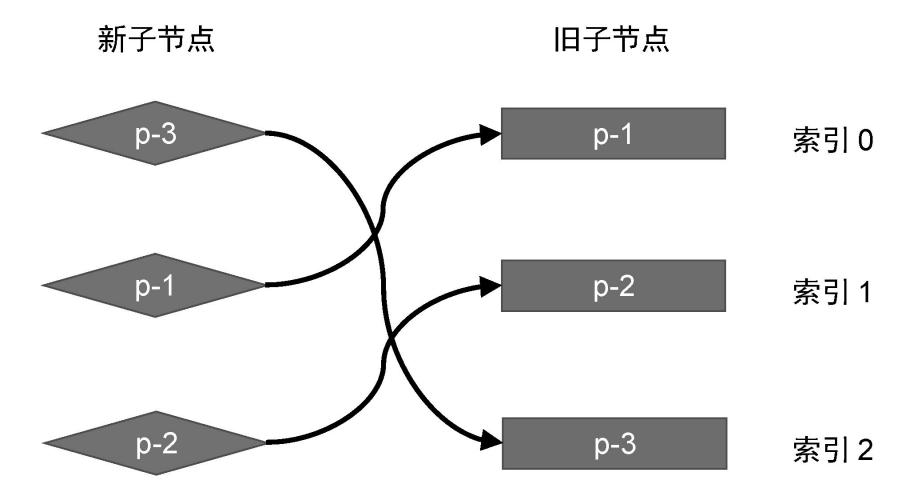
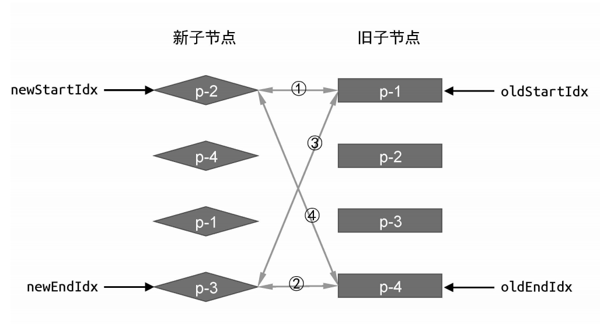

# 双端比对

> vue核心算法之一，vue2使用的虚拟DOM比对算法

核心：为了找出更新前、后不同的节点，方便给旧节点打patch，或只操作变化的节点。使用了四个指针，移动对比各个节点，从而节省不必要的DOM操作

## 前置准备

定义四个指针，分别指向新虚拟dom节点列表的头、尾，旧节点节点列表的头、尾  
分别称之为：新前，新后，旧前，旧后

## 比对过程

下面的几种情况都要求四个指针初始化指向了对应的位置，过程中就不重复说明了

## 移动

### 首轮

新的节点和旧节点相比没有增加，减少，仅仅是位置需要移动

1. 新前和旧前：节点不同，不可复用，跳过
2. 新后和旧后：节点不同，不可复用，跳过
3. 新后和旧前：节点不同，不可复用，跳过
4. 新前和旧后：节点相同，可以复用旧节点，对旧节点打patch操作

还没完呢，旧节点相当于跑到了新节点的头部，也就是**旧后指向的虚拟DOM节点要移动到旧前所指向的虚拟DOM节点**

PS. 上面可是在旧节点列表做操作，不是在新的节点列表。新的节点列表只是为了方便比对所用的，要不然直接用新的虚拟DOM节点列表生成真实DOM就可以了，但这样也就失去了意义

### 下一轮

更新指针：上一轮中改变的两个指针分别是新前，旧后。所以，新前要向下移动(指向`p-1`)，旧后要向上移动（指向`p-2`）

之后的步骤和第一轮一样，新前和旧前一样，可以复用，打patch

### 终止条件

当 新前 > 新后 且 旧前 > 旧后  
也就是两个节点列表都完成了比对，才行

## 新增、删除

前面的步骤和上面移动的首轮，下一轮步骤一样

* 新增：新节点列表绝对比旧节点列表要多元素
* 删除：旧节点列表绝对比新节点列表多元素

### 新增

旧前和旧后都已经到了终止条件了，但新前和新后还没有，新前和新后之间的所有元素就都是新增的元素，之间使用对应的方法创建真实DOM

### 删除

和上面的新增正好是相反的，不过是针对旧前和旧后。同样也是旧前和旧后之间的节点要删除，而且删除直接操作旧虚拟DOM指向的真实DOM就行

## 非理想情况

非理想情况：新前、旧前、新后、旧后所有四个指针指向的节点均不相同，双端比对算法没法往下走了，所以需要特殊处理

### 手动调整新节点列表头部

1. 在旧节点列表中，找到新节点在旧节点列表中的索引，能得到是一个索引列表
2. 找到了新`p-2`在旧索引列表中的位置为`1`
3. 移动旧节点列表中的`p-2`到旧节点列表的起始位置（旧前的位置）
4. 移动的位置补空，且要更新指针指向新的位置（旧前更新）
5. 之后就可以使用双端比对了

其实就是多了一个步骤，要手动的调整一下旧节点列表的位置，和索引的位置
