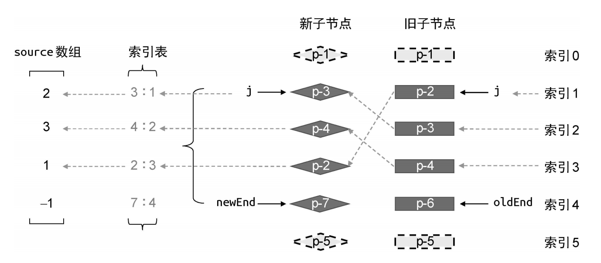
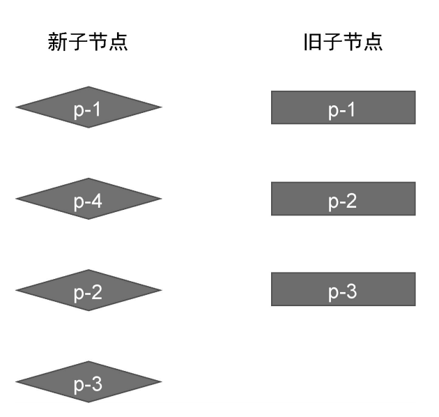
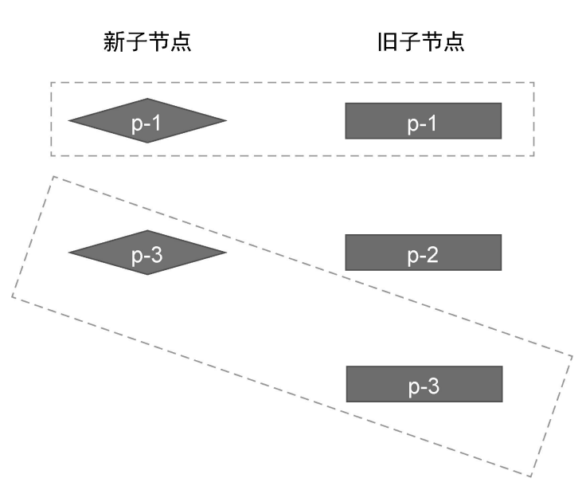

> vue3使用的虚拟DOM比对算法
## 概念

vue2中的比对算法需要很多轮的比对来判断每一个新节点和旧节点是否相同，是否可以复用。再来决定要不要移动删除等操作

vue3正好是相反的操作，只会去找需要进行操作的部分，不需要操作的部分原封不动

## 前置准备

* 两个尾部指针：新后和旧后（newEnd、oldEnd）
* 索引j：新子节点列表头部位置索引

## 移动

这里的移动涉及元素移动、删除、插入，是一个复合操作

### 移动还需要准备一点东西
* source数组：新节点在旧节点列表中的索引位置
* map索引表：`key`为新节点的id，`value`为新节列表中节点索引

### 步骤
#### 1. **头部遍历**
刚开始`j`在0的位置，判断新旧节点是否一致，一致要继续向下遍历。在索引1的位置停止

#### 2. **尾部遍历**
新后和旧后遍历，找到第一个不一样的节点，记录此时位置

#### 3. **记录source数组**
遍历`j`到`新后newEnd`新子节点列表中的节点，找到在旧节点列表中的位置。如果没有找到旧节点，则记录为`-1`

#### 4. **记录map索引表**

#### 5. 遍历新子节点列表需要处理的部分

* 判断在旧节点列表中的索引和map索引表中的大小（旧节点索引 < map索引表索引 就要移动）；  
图中`p-3`、`p-4`不需要动他们的位置，老列表中`p-6`没找到，要卸载这个老节点。`p-2`节点得知新位置在老位置之前，需要移动，还要记录一个`move`标识，表明老子节点列表有元素要移动，要进行下面的操作

* 如果上一步的`move`标识为真，则遍历`j`到`newEnd`；  
  通过source数组得到新子节点列表的最长递增子序列。因为这个子序列是不需要移动的，老的什么样，新的什么样。子序列记录了`p-3`、`p-4`位置`[0, 1]`

* 遍历新节点的索引列表`[0, 1, 2, 3]`，和最长子序列索引列表对比  
从后往前对比  
  * 准备：两个指针，`s`指向最长子序列最后一项，`i`指向新节点索引列表最后一项  
  * 如果`s`和`i`的值不一样，则还要判断source数组中对应位置元素的值（source数组、新节点索引都对应新子节点列表中的元素，所以直接从后往前循环俩数组绝对对应的同一个元素）
  * 如果source中值为-1，则表明新子节点列表中的元素在老的子节点列表中没有对应，没找到位置，是一个新的节点，所以要挂载这个节点。还要拿到当前节点的下一个节点的真实位置（在新节点数组中的位置，PS. 不是子节点数组哦！，计算也很简单，就是新子节点列表开头的位置`newStart` + 当前元素的位置`i`）。如果不是-1，则说明要移动位置，同理拿到下一个节点的真实位置，插入进去
  * 如果当前判断一样，就跳过
  * 循环上面过程，直到`s`或者`i`为0  
* 至此，所有元素完成了移动，删除，插入操作
  
  
  PS. 插入和挂载都是在下一个节点前做的，所以要拿到对应下一个节点位置，如果插入或移动的位置是最后一个位置，那就插入到最后

### 注意
移动过程中，其实是操作了两个列表。老列表要关注卸载节点，是否有节点移动，新列表要注重是否有新节点插入，节点的移动操作  
因为要减少操作，新旧列表中不变节点不操作，所以把上面的过程分开了，而不是像双端比对一样集中在老列表中

## 新增、删除

为纯新增和纯删除，只存在新增操作或只有删除操作。都是判断`j`和`newEnd`、`oldEnd`之间的节点的，不像上面的例子复杂

### 新增

* `j`从头移动到新节点、旧节点不一样的位置。`newEnd`和`oldEnd`同理从尾部也移动到各自指向的节点不同的位置
* 此时，`j`到`newEnd`之间绝对有节点（也就是 `j < newEnd`）
* 挂载这之间的节点

### 删除

* `j`从头移动到新节点、旧节点不一样的位置。`newEnd`和`oldEnd`同理从尾部也移动到各自指向的节点不同的位置
* 此时，`j`到`oldEnd`之间绝对有节点（也就是 `j < oldEnd`）
* 删除这之间的节点

## 最后
根据《vue.js的设计与实现》，快速比对比双端比对快多了，也就是性能更好。写下此文的同时，vue.js已到不需要虚拟DOM的时候——vue vapor

## 拓展：最长递增子序列算法

