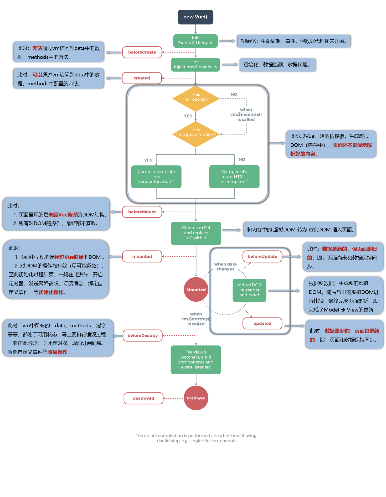
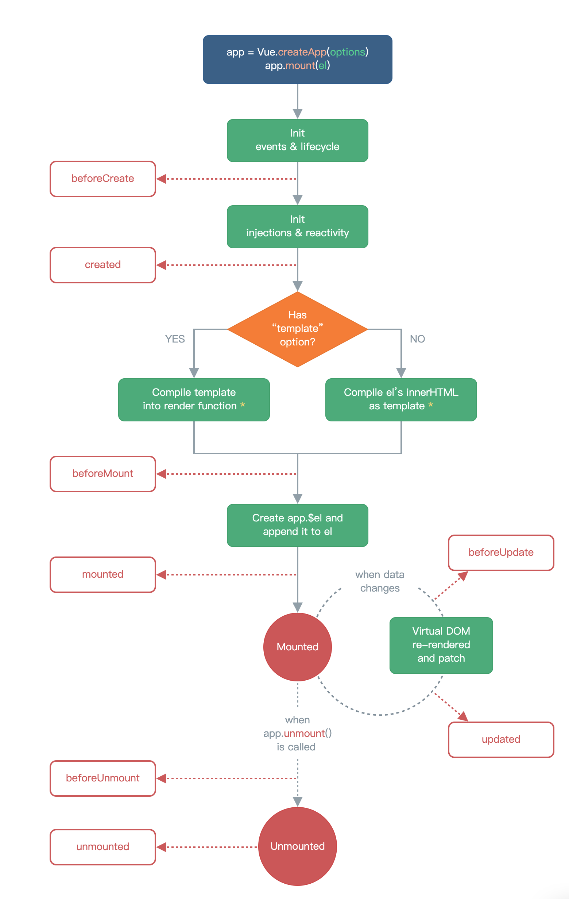

# 生命周期

## 概念：

vue在特定时间会自动执行的一些Hook

### this指向：

生命周期中的this指向的是vm或者vue实例

## vue2中的生命周期：



### mounted

vue完成模版解析以后，把真实DOM放到页面后调用mounted 发送ajax请求、启动定时器、绑定自定义事件、订阅消息等【初始化操作】

```JavaScript
new Vue({
	el:'#root',
	data:{
		a:false
	},
	//Vue完成模板的解析并把初始的真实DOM元素放入页面后（挂载完毕）调用mounted
	mounted(){
		console.log('mounted',this)
	}
})
```

### beforeDestory

vue执行销毁过程之前（马上要执行销毁操作） 清除定时器、解绑自定义事件、取消订阅消息等【收尾工作】

### 注意在Destory流程中：

- 销毁后借助Vue开发者工具看不到任何信息。

- 销毁后自定义事件会失效，但原生DOM事件依然有效。

- 一般不会在beforeDestroy操作数据，因为即便操作数据，也不会再触发更新流程了。

### 还有三个特殊的生命周期钩子

- **`nextTick()`** 参见nextTick节

- **`activated()`** 路由中使用

- **`deavtivated()`** 同上

## vue3的生命周期



**变化的部分为：**

vue2中需要先创建一个vue的实例对象（下面称之为vm）之后执行

`beforeCreate`和 `created`这两个生命周期钩子，之后会检查有没有 `el`配置项。vue3中则是在 `createApp`这个工厂函数中先行提供好vue要用的配置，比如 `el`等组件的卸载生命周期钩子变为：

`beforeUnmount`和 `unmounted`

|vue2生命周期|vue3生命周期|
|-|-|
|beforeCreate|setup()|
|created|setup()|
|beforeMount|onBeforeMount()|
|mounted|onMounted()|
|beforeUpdate|onBeforeUpdate()|
|updated|onUpdate()|
|beforeUnmount|onBeforeUnmount()|
|unmounted|onUnmounted()|

```JavaScript
setup(){
	console.log('---setup---')
	//数据
	let sum = ref(0)
	//通过组合式API的形式去使用生命周期钩子
			onBeforeMount(()=>{
				console.log('---onBeforeMount---')
			})
			onMounted(()=>{
				console.log('---onMounted---')
			})
			onBeforeUpdate(()=>{
				console.log('---onBeforeUpdate---')
			})
			onUpdated(()=>{
				console.log('---onUpdated---')
			})
			onBeforeUnmount(()=>{
				console.log('---onBeforeUnmount---')
			})
			onUnmounted(()=>{
				console.log('---onUnmounted---')
			})
			//返回一个对象（常用）
			return {sum}
		}
```

```JavaScript
beforeCreate() {
			console.log('---beforeCreate---')
		},
		created() {
			console.log('---created---')
		},
		beforeMount() {
			console.log('---beforeMount---')
		},
		mounted() {
			console.log('---mounted---')
		},
		beforeUpdate(){
			console.log('---beforeUpdate---')
		},
		updated() {
			console.log('---updated---')
		},
		beforeUnmount() {
			console.log('---beforeUnmount---')
		},
		unmounted() {
			console.log('---unmounted---')
		},
```

