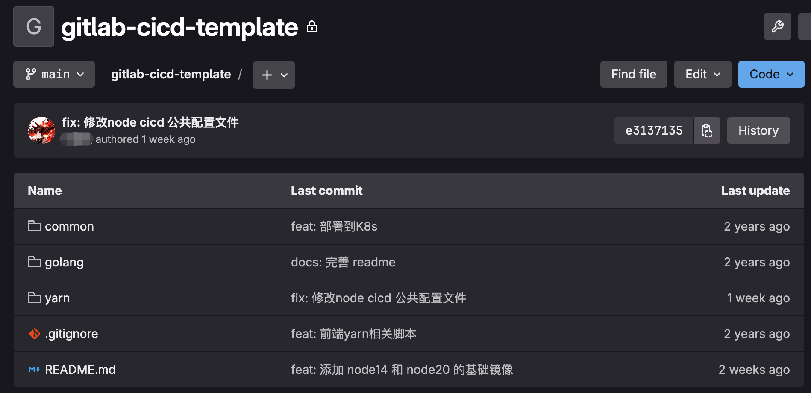

持续集成 (Continuous Integration) 和持续交付/部署 (Continuous Delivery/Deployment) ，可自动触发的构建流水线，且构建成功后可自动部署

## 背景
公司规模无论大小，前后端项目无论复杂程度如何，都需要构建及部署，以前有jetkins，现在有集成度更高的 gitlab cicd
可以和代码仓库集成，且随 gitlab 安装，不需要搭建额外的工具，准备成本低了不少，且支持多语言环境的构建，cicd 底层可以接入 docker，docker 支持什么，cicd 就能干什么，拓展性很强
我司使用的是 gitlab 私仓，所以用 gitlab cicd 就是首选

### 项目是如何让 cicd 介入的
项目从推送代码到部署，一般都是下面几个阶段
- 推送代码
- 构建工具拉取代码开始构建工作，比如前端打包
- 构建产物给部署工具，部署工具根据配置部署不同环境

# 环境
## job环境
`job`为项目cicd 流水线中的每一个完整的独立任务，`job` 是运行在 `runner`中的，gitlab 可以以全局环境建立 `runner`，也可以以项目`project`建立项目`runner`。这两种`runner`的区别就是是否为项目独占


## 执行代码构建，部署的环境
代码构建一般都得在对应的语言环境中，比如前端要在`node`环境下，后端要在`python`环境下等，为了支持多环境，推荐使用`docker`

所以，完整环境是 `runner`中会运行各种各样的不同语言的 `docker`容器，来完成各种 `job`

# 配置
在项目的**根目录** 创建 `.gitlab-ci.yml`文件，这个文件中的关键字见官方[文档](https://docs.gitlab.com/ci/yaml/)，必要的两个关键字 `stage`和 `job`（这里`job`是自己自定义的，具体可以看下面的例子）

```yml
default:
  interruptible: true
  before_script:
    - |
      echo "很多脚本"
variables:
	SOME_VAR: "很多变量"

.build_app:
  stage: build-app
  image: node:14.20-alpine
  tags:
    - x86
  cache:
    key:
      files:
        - yarn.lock
    paths:
      - .yarn-cache/
  artifacts:
    paths:
      - dist
  script:
    - echo "VERSION:$VERSION"
    - node -v
    - yarn config set registry https://registry.npm.taobao.org
    - yarn config set cache-folder .yarn-cache
    - yarn config set strict-ssl false
    - yarn
    - yarn build
      

```
上面配置玲琅满目的，主要看 `job`，`job`就是自定义的名字 `.deploy_app_base`和 `.build_image_base`
这里要注意，前面有个 "."代表的意思是隐藏的 `job`，只能被其他 `yml`文件继承
`stage`标签，就是标明这个 `job`调用时（在 `stages`标签中）的名字

```yml
stages:
  - build-app
    
build-app:
  stage: build-app
  tags:
    - frontend
  extends:
    - .build_app
```

## 触发条件
触发条件一般都是些仓库动作，比如当往仓库推代码的时候，比如在仓库提交一个 MR（合并请求）的时候，比如指往指定的分支推送代码的时候
这里要根据项目的实际触发需要，来写配置文件

```yml
workflow:
  rules:
    - if: '$CI_PIPELINE_SOURCE == "push"'
      when: always

```
[workflow 的配置](https://gitlab.cn/docs/jh/ci/yaml/_index/#workflow)，这里的 `if`就是触发的时机，`when`就是是不是每次都触发

## 缓存
可以提高下一次 cicd 的构建速度
`cache`部分，在 `cache`下，可以指定 `key`和 `paths`，`key`中可以指定文件内容hash 为缓存键， 当文件内容变化才更新缓存，缓存命中则使用指定的 `key`
`path`为缓存的路径

```yml
...
	cache:
    key:
      files:
        - yarn.lock
    paths:
      - .yarn-cache/

```

## 继承
为了复用、共用 cicd 配置文件，且能更好的组织管理文件。在 gitlab 中，可以新建一个公共的仓库来存放共用的配置文件


下面展示继承如何写配置文件
```yml
# 继承的文件
variables:
	SOME_VAR: "很多变量"

.build_app:
  stage: build-app
  image: node:14.20-alpine
  script:
    - node -v


# 主文件
include:
  - project: 'resources/gitlab-cicd-template'
    ref: main
    file: '/yarn/node16/.gitlab-ci.yml'
    
stages:
  - build-app

build-app:
  stage: build-app
  tags:
    - frontend
  extends:
    - .build_app

```
主要在主文件中，首先要引入，引入的路径为 组/项目名 ，之后在写明要引入仓库中的文件的具体路径
之后在主文件的 `job`中，使用 `extends`关键字中写要引入文件中的 `job`

# 构建 ci
构建，在前端中基本为执行各种脚手架的 `build`，打包编译前端工程，打包产物给 部署cd。在后端中，Java 则要打包工程为 `jar`包，golang 则要打包为一个二进制可执行文件等
这里只是说明 cicd 中 ci 的含义是什么，具体怎么去写项目的构建流程，要针对项目而定

# 部署cd
部署，一般是将 构建 ci 阶段完成后的产物进行部署，前端的页面等资源要放到 nginx 指定目录，后端的文件要放到指定位置并暂停上一个服务且重新启动
这里，前端使用 `docker`部署，但是这里的 `job`是不需要指定镜像的，就会在宿主机上直接执行命令了，比如 docker 启动等等
```yml
.deploy_app_base:
  stage: deploy
  tags:
    - x86
  script:
    - |
      docker rm -f $IMAGE_NAME || true
      docker run -d \
        --restart always \
        --name $IMAGE_NAME \
        -p $FRONT_PORT:80 \
        --network $NETWORK \
        $IMAGE_NAME:latest
```
