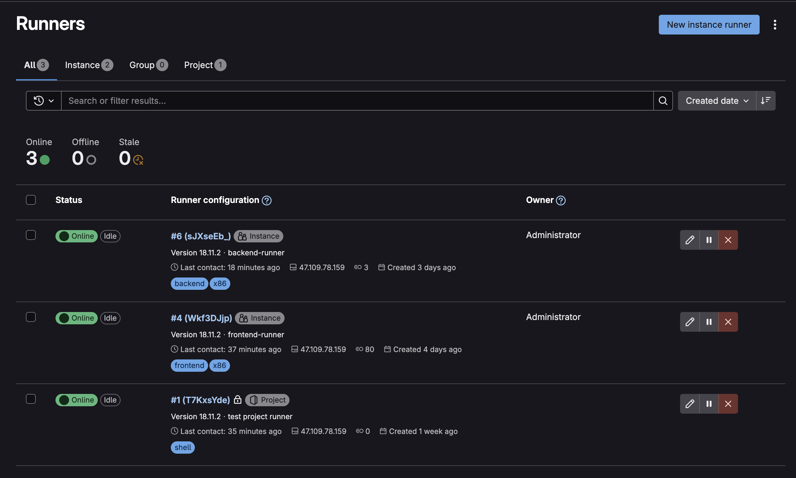
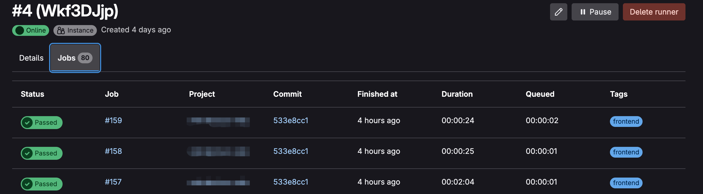

持续集成 (Continuous Integration) 和持续交付/部署 (Continuous Delivery/Deployment) ，可自动触发的构建流水线，且构建成功后可自动部署

## 背景
公司规模无论大小，前后端项目无论复杂程度如何，都需要构建及部署，以前有jetkins，现在有集成度更高的 gitlab cicd
可以和代码仓库集成，且随 gitlab 安装，不需要搭建额外的工具，准备成本低了不少，且支持多语言环境的构建，cicd 底层可以接入 docker，docker 支持什么，cicd 就能干什么，拓展性很强
我司使用的是 gitlab 私仓，所以用 gitlab cicd 就是首选

### 项目是如何让 cicd 介入的
项目从推送代码到部署，一般都是下面几个阶段
- 推送代码
- 构建工具拉取代码开始构建工作，比如前端打包
- 构建产物给部署工具，部署工具根据配置部署不同环境

# 环境
## job环境
`job`为项目cicd 流水线中的每一个完整的独立任务，`job` 是运行在 `runner`中的，gitlab 可以以全局环境建立 `runner`，也可以以项目`project`建立项目`runner`。这两种`runner`的区别就是是否为项目独占



## 执行代码构建，部署的环境
代码构建一般都得在对应的语言环境中，比如前端要在`node`环境下，后端要在`python`环境下等，为了支持多环境，推荐使用`docker`

所以，完整环境是 `runner`中会运行各种各样的不同语言的 `docker`容器，来完成各种 `job`

# 配置
在项目的**根目录** 创建 `.gitlab-ci.yml`文件，这个文件中的关键字见官方[文档](https://docs.gitlab.com/ci/yaml/)，必要的两个关键字 `stage`和 `job`（这里`job`是自己自定义的，具体可以看下面的例子）

```yml


```

# 构建 ci

