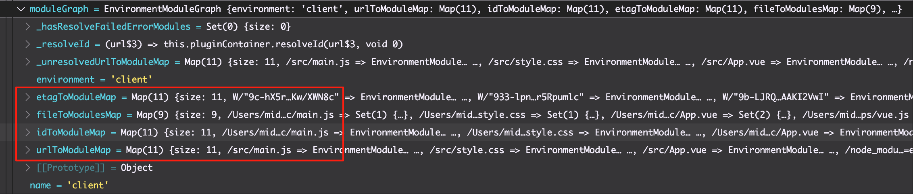
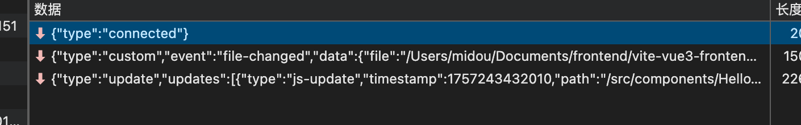
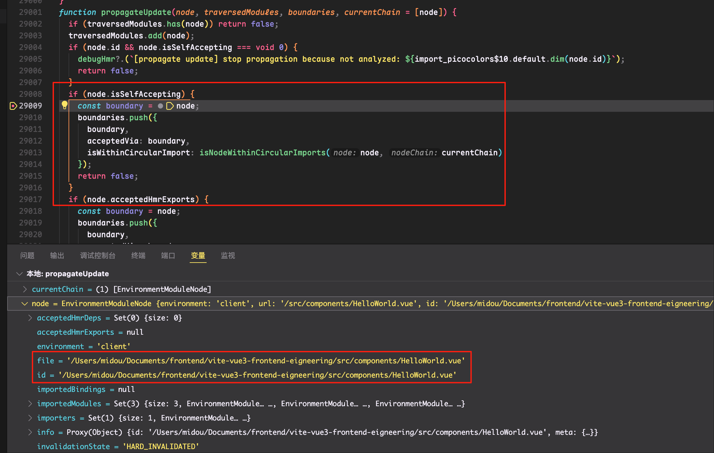

# vite

> vite的出现，使用浏览器ES6模块原生支持，无需打包js文件，js文件以模块加载

# 原理

## 前置概念

### 模块图 ModuleGraph 模块节点 ModuleNode

- **模块节点 ModuleNode**：用于描述在开发服务器和生产打包阶段中，项目中的js文件和css文件，包含这些文件的路径信息，类型，热更新中，引入当前文件的模块，接收热更新的其他模块等信息

```js
export class ModuleNode {
  url: string // 原始请求 url
  id: string | null = null // 文件绝对路径 + query
  file: string | null = null // 文件绝对路径
  type: 'js' | 'css'
  info?: ModuleInfo
  meta?: Record<string, any> // resolveId 钩子返回结构的元数据
  importers = new Set<ModuleNode>() // 该模块的引用方
  importedModules = new Set<ModuleNode>() // 该模块所依赖的模块
  acceptedHmrDeps = new Set<ModuleNode>() // 接收热更新的模块
  acceptedHmrExports: Set<string> | null = null
  importedBindings: Map<string, Set<string>> | null = null
  isSelfAccepting?: boolean // 是否为 接受自身模块更新  
  transformResult: TransformResult | null = null // 经过 transform 钩子编译后的结果
  lastHMRTimestamp = 0 // 上一次热更新时间戳
  lastInvalidationTimestamp = 0
}
```

- **模块图 ModuleGraph**：用于记录多个模块节点，记录模块和url、id（是文件的磁盘绝对路径）等信息和模块节点的映射关系

```js
export class ModuleGraph {
  // url 和模块的映射
  urlToModuleMap = new Map<string, ModuleNode>()
  // id 和模块的映射
  idToModuleMap = new Map<string, ModuleNode>()
  // 文件和模块的映射
  fileToModulesMap = new Map<string, Set<ModuleNode>>()
  // /@fs 的模块
  safeModulesPath = new Set<string>()

  invalidateModule(mod: ModuleNode, seen: Set<ModuleNode> = new Set()): void {
    // ...
  }

  /**
   * 文件修改事件
   */
  onFileChange(file: string): void {
    // ...
  }
  
  // 更新模块信息
  async updateModuleInfo()(
    mod: ModuleNode,
    importedModules: Set<string | ModuleNode>,
    acceptedModules: Set<string | ModuleNode>,
    isSelfAccepting: boolean,
    ssr?: boolean
  ): Promise<Set<ModuleNode> | undefined> {
    // ...
  }
}
```
模块图会在`_createServer`中创建，启动vite服务器时创建一个空的模块图。当浏览器发起入口文件资源请求时，transform中间件会调用插件`vite:import-analysis`分析模块关系，调用`updateModuleInfo`方法更新模块图

## 开发

对应 `vite 或 vite dev` 命令，vite要开启一个后端的http服务器，来处理浏览器的资源请求，返回给浏览器对应的资源。且使用ES6的js模块系统，不同于webpack自己实现模块

### 流程

1. 使用配置创建httpserver 调用`_createServer`（服务端）
   - 解析配置
   - 根据配置创建文件监听器（`server.watch`）
   - 创建插件容器、注册插件
   - 文件监听器注册文件修改事件，`change`、`add`、`unlink`
   - 注册中间件（比如transform中间件）
2. 开启服务器监听 `server.listen()`  
   - 当浏览器输入`http://localhost:5173`发起资源请求，请求index.html
   - 请求依次通过注册的中间件，中间件的执行顺序参考🧅洋葱模型
   - `indexHtmlMiddleware`中间件会处理这个请求，因为这个中间件是处理主页的，要读取磁盘上的这个文件，再经过transform转换，把转换后的内容发送给浏览器
      ```js
      // indexHtmlMiddleware中间件断点截图
      async function viteIndexHtmlMiddleware(req$4, res, next) {
         if (res.writableEnded) return next();
         const url$3 = req$4.url && cleanUrl(req$4.url);
         if (url$3?.endsWith(".html") && req$4.headers["sec-fetch-dest"] !== "script") {
            let filePath = path.join(root, decodeURIComponent(url$3));
            if (fs.existsSync(filePath)) {
               const headers = isDev ? server.config.server.headers : server.config.preview.headers;
               try {
                  let html = await fsp.readFile(filePath, "utf-8");
                  // 这里会执行vite独有的 transformIndexHtml 的 Hook
                  if (isDev) html = await server.transformIndexHtml(url$3, html, req$4.originalUrl);
                  return send(req$4, res, html, "html", { headers });
               } catch (e$1) {
                  return next(e$1);
               }
            }
         }
         next();
      };
      ```
   - 浏览器解析index.html，解析到`<head>`中的`<script>`，这个是用于HMR的js文件，浏览器发送异步加载请求，vite服务器拿到并处理返回对应文件（index.html的内容按照使用vite创建的vue3 helloWorld项目为准）
   - 之后就到了`<body>`中的`<script>`，这个是项目入口main.js文件。浏览器发送请求main.js的请求，请求会在transformMiddleware中间件中的处理  
     中间件的处理：
     - 判断请求资源的类型是不是js、css、模块化的html（html文件转换成了vite使用的模块）以及import导入的资源请求（比如导入的图片就是import请求）。如果不是，就跳过transformMiddleware中间件
     ```js
         function transformMiddleware(req$4, res, next) {
            const environment = server.environments.client;
            if (req$4.method !== "GET" && req$4.method !== "HEAD" || knownIgnoreList.has(req$4.url)) return next();
            let url$3 = decodeURI(removeTimestampQuery(req$4.url));
            const withoutQuery = cleanUrl(url$3);
            try {
               const isSourceMap = withoutQuery.endsWith(".map");
               if (isSourceMap) {
                  // sourceMap 处理
               }
               if (publicDirInRoot && url$3.startsWith(publicPath)) warnAboutExplicitPublicPathInUrl(url$3);
               if (req$4.headers["sec-fetch-dest"] === "script" || isJSRequest(url$3) || isImportRequest(url$3) || isCSSRequest(url$3) || isHTMLProxy(url$3)) {
                  if (isCSSRequest(url$3)) {
                     if (req$4.headers.accept?.includes("text/css") && !isDirectRequest(url$3)) url$3 = injectQuery(url$3, "direct");
                     const ifNoneMatch = req$4.headers["if-none-match"];
                     if (ifNoneMatch && (await environment.moduleGraph.getModuleByUrl(url$3))?.transformResult?.etag === ifNoneMatch) {
                        res.statusCode = 304;
                        return res.end();
                     }
                  }
                  // 执行插件的 transform Hook
                  const result = await environment.transformRequest(url$3);
                  if (result) {
                     const depsOptimizer = environment.depsOptimizer;
                     const type = isDirectCSSRequest(url$3) ? "css" : "js";
                     const isDep = DEP_VERSION_RE.test(url$3) || depsOptimizer?.isOptimizedDepUrl(url$3);
                     return send(req$4, res, result.code, type, {
                        etag: result.etag,
                        cacheControl: isDep ? "max-age=31536000,immutable" : "no-cache",
                        headers: server.config.server.headers,
                        map: result.map
                     });
                  }
               }
            } catch (e$1) {
               // handleError
               return next(e$1);
            }
            next();
         };

     ```
     - vite服务器查看文件是否有缓存，如果没有要使用[协商缓存](../ECMAScript/缓存.md#协商缓存)
     - 浏览器请求的是/src/main.js这个url，vite中定义了模块图这个对象，里面有url和磁盘文件的映射表，通过请求的url拿到main.js真实文件内容返回浏览器
     
     - 之后main.js头部要请求style.css，请求继续通过此中间件处理，要把`import './style.css'`转换成`import '绝对路径的style.css'`（`vite:import-analysis`这个插件提供的功能，同时，这个插件还会分析除css文件外模块依赖关系，生成模块图，并更新。css文件模块关系由插件`vite:css-analysis`）
     - transformMiddleware中间件完成的工作，其实是中间件代码运行的过程中调用了注册的插件的transform Hook，同样，如果引入了别的.vue文件或者.js等文件，也是同样的处理方式
     - 还有插件的transform Hook是转换模板文件的，转换成js，比如.vue转换等（`vite:vue`插件）
3. 这样一来，所有文件都由vite服务器处理并返回给浏览器了，浏览器渲染显示了

## HMR
热模块替换

### 流程

#### 准备
在上文的创建vite服务器阶段，会返回给浏览器HMR client（下文称浏览器client）相关的js文件，用于接收服务端发送的ws消息，下文会提到

#### 开始
1. vite服务器监听到项目中有文件修改
2. vite中使用的chokidar发送`change`事件，触发订阅此事件的回调
3. 执行注册插件的`watchChange`Hook
4. 老模块标记失活（invalid）
5. 执行`handleHMRUpdate`方法
   - 修改的文件如果是vite.config文件，环境变量记录文件或者vite.config引入的依赖，就要重启vite服务器（毕竟配置变了）
   - 修改了浏览器client，要通知客户端刷新浏览器
   - 执行插件的`handleHotUpdate`Hook，和`hotUpdate`Hook（这个Hook是为了兼容，vite会提示警告）
   - 如果修改了.html文件，就通知浏览器刷新
   - 如果修改了js、css文件，服务器发送`update`消息：下面可能会进行递归操作
   *简要流程*：寻找更新边界（找到能处理模块更新的模块就是此次更新的边界）-> 模块要么自己处理自己更新，要么要找下游模块有没有能处理更新的（接收更新模块）-> 如果没找到边界，就要做浏览器刷新
     - 比如更新HelloWorld.vue文件，.vue在HMR中被转换为“自接受更新模块”（可以自己处理自己的更新），边界为自身，所以不用再找下游模块接收更新，之后向client发送`update`消息，内容大致为“请更新HelloWorld.vue”
   
   
   (上面两张图分别展示了：client接收到ws消息、更新helloworld.vue文件时，作为自更新模块拿到边界)
     - foo.js是HelloWorld.vue引入，不是自接收模块，找到下游导入他的.vue文件，去执行foo.js的更新，发送给client的消息也是“请更新HelloWorld.vue”，因为模块边界为HelloWorld
     - main.js（项目入口文件）修改就要执行浏览器刷新
6. 客户端接收
   - 全刷新的消息，就刷新浏览器
   - `update`消息，里面会有要执行更新的模块，client会动态插入（`import()`）

## 打包

### 流程

1. 解析配置：解析vite.config.js配置，最终返回一个对象，属性为配置中的配置项。主要解析`build`配置项下的配置
2. 找到注册在打包阶段(`buildApp`)的插件plugins，执行插件Hooks
3. 解析出rollup相关配置，调用rollup打包，输出相关信息到控制台


