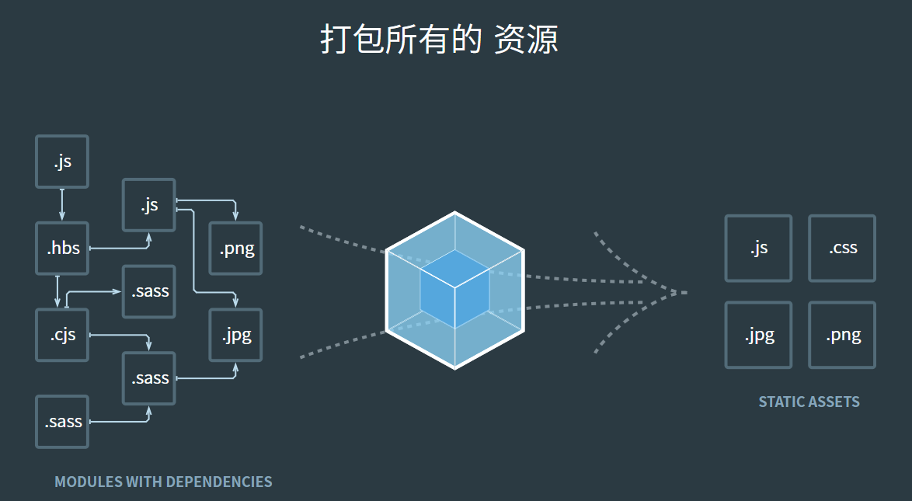
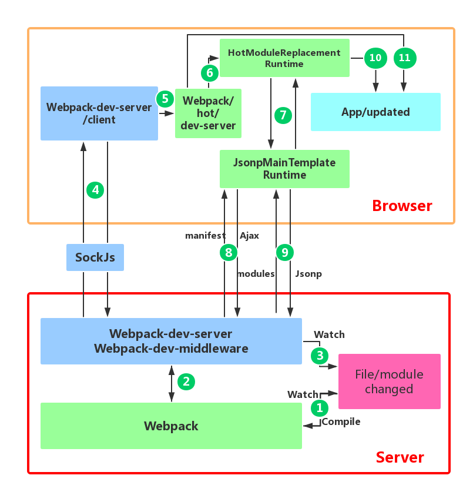

# webpack

## 概念

按照官方的定义：

webpack是一种静态资源的打包器。比如说有两个模块都通过CJS或者是ESM引入了一些js库，通过webpack就可以将引入的这些js库打包到bundle中去。再比如，要通过require的方式引入一个非js的文件，也可以通过webpack来转换为可以让其直接引用的模块

其实说白了，就是处理前端资源、管理、打包的工具，但是`webpack`只能处理`js`和`json`格式的文件，处理不了其他格式的文件，如果要处理其他格式的文件，就需要`loader`



## 术语

- `Entry`（入口）：webpack编译模块依赖图的起点，webpack会从这里开始打包模块需要的静态资源文件

- `Output`（出口）：webpack打包后的bundle的输出位置和名字

- `Loaders`：能让webpack处理各种各样的文件的工具或者说是模块，比如React的JSX，就需要一个react-loader来进行处理

- `Plugins`：可以完成各种打包工作中的事情，比如注入环境变量，压缩bundle等
- `module`（模块）：是webpack内部的类型，包括esm、cjs等定义的模块，同时，引入的css、图片等资源文件都会成为webpack模块
- `chunk`：webpack编译过程中的中间产物，最后要交由转换生成最终的bundle
- `vendor`：webpack打包后的第三方库的代码，动态导入的

- `bundle`：webpack打包后的最终生成产物

## 流程

1. 读取配置、合并配置
2. 使用配置创建编译器
3. 插件注册
4. 编译器从入口文件开始编译（可能会有一些插件执行Hook）
5. 使用loader处理入口文件
6. 生成ast语法树
7. 通过AST收集依赖
8. 解析依赖执行
9. 再次使用loader处理文件，生成语法树，收集依赖这个过程
10. 编译完毕（可能还有插件Hook执行）
11. 编译产物转换成最终产物，可以在环境运行的

其中loader和plugin的执行时机是不一样的

## 模块解析
* 绝对路径解析
* 相对路径解析
* 模块文件夹解析

模块文件夹找包还是要看package.json文件是否存在，并且检查webpack配置中的`resolve.exportsFields`（和package.json的exports字段对应）和`resolve.mainFields`（和package.json的main、browser字段对应）

## Tree-Shaking
在package.json中要引入一个配置`sideEffects`
```json
{
  "name": "awesome-ui",
  "version": "1.0.0",
  "main": "dist/index.js",
  "sideEffects": ["**/*.css"]
}
```

### 概念
sideEffects（副作用）配置：里面匹配到的文件不参与Tree-shaking，必须要打包进去  
同样可以直接配置`true or false`，决定整个项目是否Tree-shaking


## 代码分割 Code Splitting
### 多入口
配置多个入口文件，可以分割bundle

### optimization.splitChunks 配置
[文档](https://webpack.js.org/plugins/split-chunks-plugin/#optimizationsplitchunks)
也可以配置此配置，来提取公共库，分割chunk

### 动态导入
直接使用`import()`，webpack会自动拆分chunk


## 热更新 Hot Module Repalcement

热更新需要搭配`webpack-dev-server`，且在webpack的config中添加配置

```js
module.exports = {
  entry: __dirname + "/src/index.js",
  // 配置hmr
  devServer: {
    hot: true,
  },
  output: {
    path: __dirname + "/dist",      //输出文件的存放位置
    filename: "[name].[contenthash].js"
  },
  optimization: {
    runtimeChunk: 'single', // 分离出webpack浏览器加载的热更新client的代码
    moduleIds: 'deterministic', // 使用算法压缩 vendors的
    splitChunks: {
      // 分离node_modules中引入的第三方lib
      cacheGroups: {
        vendor: {
          test: /[\\/]node_modules[\\/]/,
          name: 'vendors',
          chunks: 'all',
        },
      },
    },
  },
}
```
**PS. 注意**  

- 必须分包，不分包打包输出一个bundle就不用热更新了，因为修改文件每次bundle都会变
- 要分离runtime运行时代码，因为HMR的原理，运行时代码每次都会变动，如果打到和主模块一个bundle中，主模块内容每次都要变化

### 过程图


### 过程
#### 浏览器环境

- 浏览器会问HMR Runtime运行时（webpack-dev-server给浏览器插入的，在浏览器中运行），是否有更新
- 浏览器HMR运行时会异步下载更新
- HMR运行时通知浏览器更新
- 浏览器询问是否要安装更新
- HMR运行时同步安装更新

#### 细节 

HMR运行时给有两个方法来管理模块更新，`check`和`apply`，`check`用来请求资源清单，请求下来的清单会和已经在运行时的模块对比，要更新的模块会提前下载，运行时状态变为`ready`  
`apply`方法会标记所有更新了的模块为`无效的`，冒泡便利每一个模块，检查是否有处理更新方法`update handler`，直到入口文件（entey point），之后所有的`module.hot.accept()`也就是处理更新的方法都会执行，也就是执行模块更新，更新后，运行时状态变为`idle`。如果直到入口文件，都没有任何的`update handler`就会触发全局的更新了  
一般来说，不需要手动在自己的模块里实现HMR的更新逻辑

#### webpack服务器

- 服务器得监听文件改动，compiler生成新的manifest，新的模块代码文件
- 通过websocket，和HMR客户端联系，发送消息给客户端通知更新的模块
- 之后HMR客户端会请求manifest，新模块文件，要发送给HMR客户端


webpack服务器向客户端发送的消息

## 模块联邦 Module Federation

微前端解决方案
