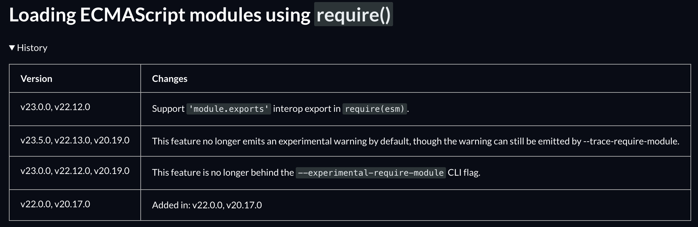

# 模块
### node常见的模块
* ECMAScript Modules（ESM）
* CommonJS Modules （CJS）

浏览器和Node都支持ESM，Node从v12版本开始正式支持ESM，但需要`package.json`配置`type`或要添加命令行参数`--input-type`  
CJS为Node从始至终都支持的模块格式，写到.cjs（自动当CJS模块处理）或.js结尾的文件中

### 浏览器
ESM支持

# 加载

## Node

### CJS
使用`require()`方法来加载模块，且加载的模块必须是同步的

```js
function require(/* ... */) {
  const module = { exports: {} };
  // 自执行函数，拿到导入模块的导出
  ((module, exports) => {
    function someFunc() {}
    exports = someFunc;
    module.exports = someFunc;
  })(module, module.exports);
  // 自执行函数外的module
  return module.exports;
}
```
复制了node官方文档关于`require`方法的代码，基本就是这个导入方法的原理

题外话，`require()`要支持ESM模块加载了  (目前还没正式上线25.8.18)



#### 缓存
`require`加载模块会node会创建加载这个模块的缓存，是根据模块的名字来控制缓存的，并且大小写敏感。但是，当一个文件和另一个名字同名，内容不同，导入可能会出问题，不会建立新文件的缓存

#### 循环导入
a.js导入b.js，b.js在导入a.js，之后在main.js中导入他们俩  

比如main.js中，导入a语句在最顶部
1. 就先进入a.js执行，解析到导入b.js就会又去执行b.js
2. 之后解析b.js又配到导入a了，就先创建一个**未完成**的`exports`对象，是a.js的`exports`的拷贝对象，返回给b，让b先正常解析 
3. 等a解析完了，再回过头来替换b中的a导入

#### 找包策略
如果导入的包路径不已相对路径开头`'/', '../', or './'`
那么就会按下面方式找
* 找当前路径下的`node_modules`
* 找上一级目录的`node_modules`
* 再找上一级的`node_modules`，直到系统根目录（比如mac上的/目录）
CJS支持文件夹查找，文件夹根目录得包含package.json，node会把这个文件夹当成一个模块

#### CJS模块Node处理
node会包装每一个cjs，如下
```js
(function(exports, require, module, __filename, __dirname) {
    // 这里就是我们写的代码
});

```
可以看到常用的变量，`exports`、`__dirname`等，这也就是可以直接在cjs模块中访问的原因  
但同时，也要看作用域，被限制到了一个函数内，cjs全局的一些this指向就要注意了，并不是globalThis

### 前端浏览器

浏览器环境需要`<script type="module" src="path_to_js"></script>`，`src`中引入的文件格式可以是`.js`或者是`.mjs`（准确说，设置了MIME类型`text/javascript`）


## 找包策略(node)、找模块策略(前端浏览器)

### node下查找包的策略

node下找包，不是找文件，文件的导入必须精确到拓展名，而包就是有`package.json`文件的目录

node查找包的策略简单描述会按照下面的步骤来

这里是按照`commonjs`规则，也就是`require`导入为前提条件的

1. 直接去`require`引入的文件的路径去找这个文件 eg. `var x = require("./moduleB");`会去`/path/to/moduleB.js`找这个文件在不在，通过引入的路径（看看是不是下面的几种`'/''../''./'`）
或者也会去`node_modules`找，在当前文件夹下的`node_modules`，在上一级目录的`node_modules`，再上一级。直到根目录`'/'`（`package.json`所在目录）

2. 如果没有`moduleB.js`就要在文件夹`moduleB`下找`package.json`文件里面的`"main"`配置项，这个配置项指定了这个`moduleB`包下的主文件

3. 如果没有指定这个配置型呢，就会去找名字为`index.js`的文件，作为这个`moduleB`文件夹的主文件

4. 如果再找不到就会报错了`can't find package`


#### node下`ES module`找包策略

和上面的`cjs`有些许的不同，`package.json`中使用`module`配置项代替`main`配置项，还有就是`type`配置项要设置为`module`


#### 浏览器找文件策略

只要是文件夹，里面无论是否有`package.json`都可以按照`node`的找包策略来（应该是脚手架支持）


## export导出

[Export和Exposts](https://flowus.cn/469ff45c-397f-4ba2-af33-750b77087f23)

在模块中的顶层变量会处在每一个模块的词法作用域里，不会污染到全局的环境


