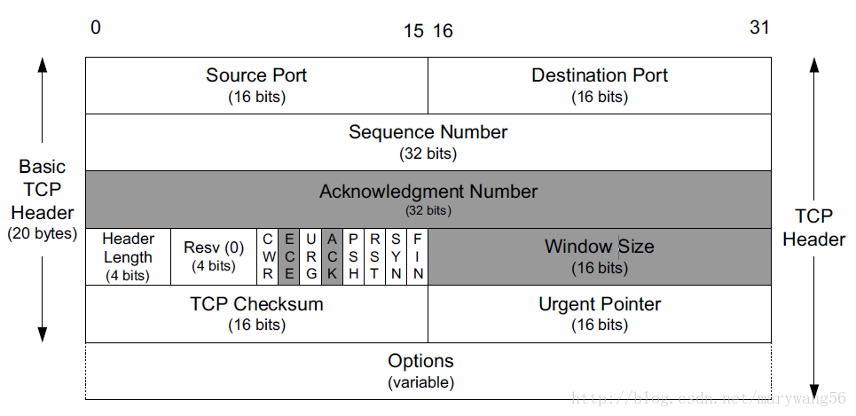
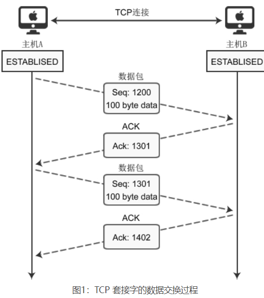

# TCP

## 概念
传输控制协议(Transmission Control Protocol)，简称: TCP。看名字是一个协议，所以在IP层至上，应用层之下（这里指ISO的七层或者TCP/IP网络协议栈）

可靠的传输协议，传输的数据会按照顺序发送给接收方，且发错的数据会重新传送

## TCP层（仅针对TCP协议就先叫这个名字）

介于应用层和IP层（网络层）之间  
+ 发送数据时  
  
  从上层应用层开始，由用户数据和`Appl`首部组成，交给传输层（TCP层）  
  TCP层组装自己的`TCP`首部，之后再次向下传输给网络层（IP层）现在称之为分段（Segament）  
  IP层再次组装，形成IP报文，再给链路层形成以太网帧就可以发送给目标了

+ 数据接受时  

  是上面发送过程的反向，反过来就可以

## 传输层怎么封装的

### Segament结构

TCP头部 + 数据

### TCP首部结构

20字节长度（不包含`Options`部分），其中包含5个部分（每一个部分是4字节），每一个部分的组成都不相同，但大小范围都在4字节（16位）- 8字节（32位）

+ 源端口、目的端口  

  因为TCP段解析完成后，应用层的数据就直接给应用层了，所以也是对应的本机的进程（进程通过端口号来区分）

+ TCP序列号`SEQ`（Sequence Number）  
  
  序列号决定了TCP报文的顺序，具体点就是发送第一个TCP报文到最后一个TCP报文的序号，有了序号可以去重TCP报文、丢失的包可以重发、可以给应用层一个顺序正确的流（stream）

+ TCP确认号`ACK`（Acknowledgment Number）  

  确认号记录下一个TCP报文的序号，32位，8字节，且要求`ACK`位设置为`1`

+ 头部长度字段（头部偏移）

  记录TCP数据位置到TCP报文起始位置的相对距离，也就是TCP头部的长度

+ 保留字段

  必须置为0，待以后使用

+ 控制位
  + `CWR`、`ECE`：
    
    拥塞窗口缩减，保留位第一位，配合`ECE`实现拥塞通知。当发送方收到一个TCP包的`ECE`设置为`1`，代表发送方要调整拥塞窗口，调整后会使用`CWR = 1`，通知接收方收到了拥塞通知并调整了拥塞窗口
    
  + `URG`：

    设置为1，表面该TCP报文为需要紧急处理的，要尽快传送。需要配置`Urgent Pointer`紧急指针
    
  + `ACK`：
  
    和上面的确认号配合，设置为1，表面确认号有效（开启确认号）
    
  + `PSH`：
  
    要求发送方尽快发送给接收方，接收方尽快接收。发送方发送到缓冲区，接收方接收到缓冲区
    
  + `RST`：

    置为1表示强制断开当前连接，之后重新建立新的连接
    
  + `SYN`:

    为1时，表示发起了一个连接请求，要建立一个新连接了

  + `FIN`：

    终止字段，发送端的全部数据都发送完成了，就置为1

+ 窗口大小

  接收方可用缓冲区大小，用来调整接收的数据的大小，能做TCP的流量控制
  
+ 校验和字段

  伪首部、首部、数据的完整性校验

+ 紧急指针

  要和上面的标志位`URG`对应，表示紧急数据末尾的偏移位置。为什么是末尾，因为按照旧标准（紧急指针是指紧急数据后的下一个位置）且方便处理边界情况，直接确定紧急数据的位置，不用解析后面的数据

+ 可选项

  用于拓展TCP功能

### TCP数据大小
这里得要由`MTU`（最大传输单元）决定，`MTU`最大传输单元为数据链路层最大负载（payload），以太网帧的数据部分 (802.3标准定义)  
`最大传输数据字节 = 1500字节（MTU规定的）- TCP Header(20字节) - IP位（20字节）= 1460字节`  
不足`MTU`最小64字节，要补位，超了1500字节，要分片

# TCP连接的建立、后续数据传输、断开连接

## 三次握手

### 过程

1. 客户端向服务器端发送一个`SYN`包，请求一个主动打开。该包携带客户端为这个连接请求而设定的随机数`A`（这个随机数随机生成，`seq=A`）作为消息序列号
   
2. 服务器端收到一个合法的`SYN`包后，把该包放入`SYN`队列中；回送一个`SYN/ACK`包。`ACK`的确认码应为`seq=A+1`，`SYN/ACK`包本身携带一个随机产生的序号`B`。
   
3. 客户端收到`SYN/ACK`包后，发送一个`ACK`包，该包的序号被设定为`A+1`，而`ACK`的确认码则为`seq=B+1`。当服务器端收到这个`ACK`包的时候，客户端和服务端都准备好后续的发送数据了  
  

## 数据传输
传输双方都已经是`Establish`状态。在第三次握手后，准确点在发送方收到了服务端的`ACK`后就可以立刻发送数据，且有可能在第三次发送握手包的时候就携带数据

### 过程

1. 发送端发送数据包，`seq=1200`的一个100字节`Byte`大小的包
2. 接收端收到后发送`ACK=1301`的包（接收端要发送`ACK`号的计算公式：`ACK = seq + 发送方数据部长度 + 1`）
3. 发送方收到`ACK=1301`，下一个发送方发的包`SEQ=1301`，且有100字节大小的包
4. 接收方发送`ACK=1402`，后面以此类推

数据传输并非理想化，实际情况复杂

## 四次挥手

### 过程

1. 客户端发送一个`FIN`包，主动发起终止连接包，确认号`seq=A`

2. 服务端收到包，发起一个`ACK=A+1`的包，告诉客户端我这边收到了，这时对于客户端往服务器这个方向的连接就终止了

3. 服务器发送一个`FIN`包，确认号`seq=B`

4. 客户端收到包，发送一个`ACK=B+1`的包，也是告诉服务器包收到了，服务器相对于客户端方向的连接就终止了，至此，TCP的连接才算是中断

# TCP特性
+ 可靠传输
+ 拥塞控制
+ 流量控制