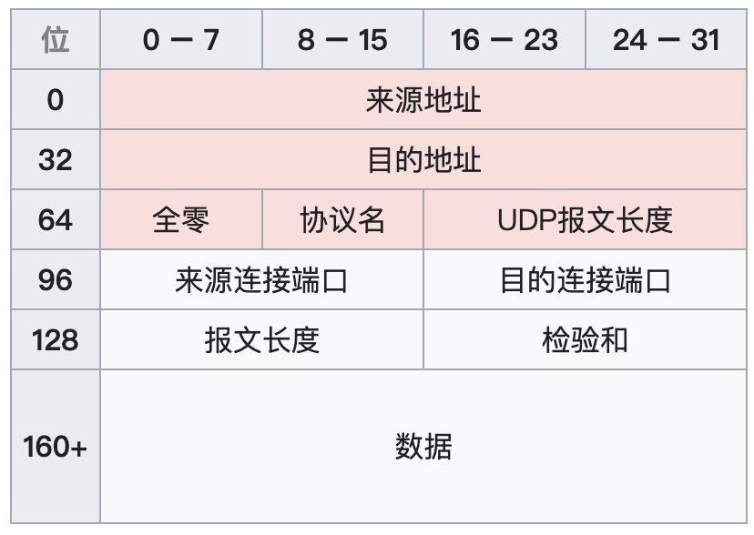
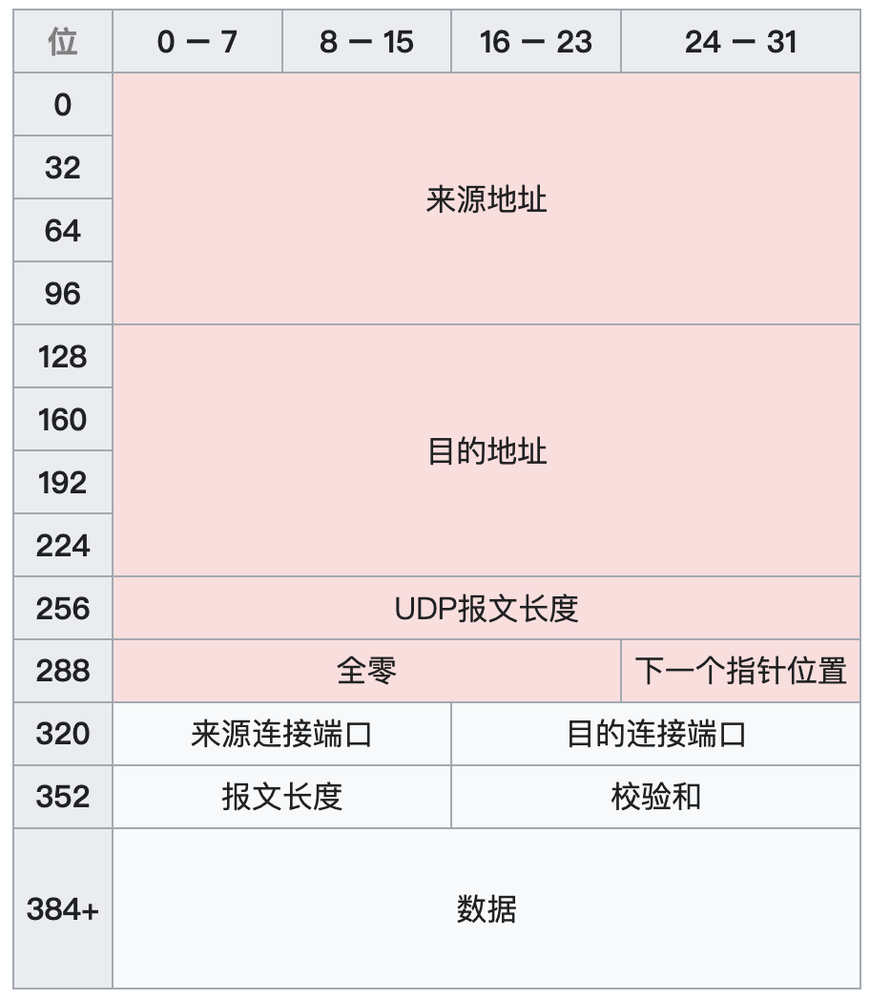
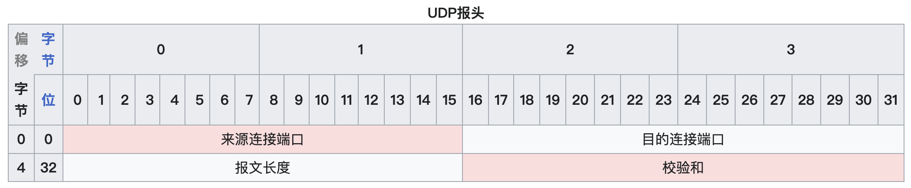

# UDP

## 概念
UDP（User Datagram Protocol）用户数据报协议，同在传输层。不用在传输数据前多次握手（无连接），包小，但不可靠传输，没有顺序，不能重传

## UDP报文

#### 伪首部+UDP头部+数据
+ **伪首部（16字节）**
  
  源IP、目的IP、协议（`UDP`为`17`）、UDP长度、填充（对齐伪首部16位用的，不足要凑齐16位）

+ **UDP头部（8字节）**
 
  源端口、目的端口、UDP长度（和伪首部的UDP长度一致，就是这个UDP报文的长度）、校验和

### 伪首部

伪首部用于校验和计算，不会像上层应用层传递，也不会向下往网络层传递  

#### 校验规则

+ 重新构造伪首部

+ 计算 伪首部 + UDP 头部 + 数据 的 16 位反码和。

+ 如果结果 不是 `0xFFFF`，说明数据可能损坏，UDP 报文应丢弃

IPv4伪首部

IPv6伪首部

### UDP头部

源端口、目的端口还是表面了要接受的应用层的程序的进程。UDP长度和伪首部中的一致，发送方封装时计算。校验和则是通过上面的伪首部来计算

## 特性
+ 多播
+ 广播

