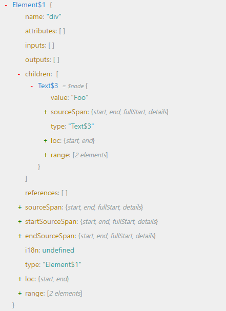

# 从url到页面

## DNS解析

### DNS(Domain Name System)域名系统
只讨论浏览器范围内的，DNS就是域名解析为IP的服务，有了IP才能向对应Html的服务器发请求  

### 名词解释
* 根服务器：`.`，最顶级的域名服务器，记录了顶级域名的服务器地址
* 顶级域名服务器：保存着顶级域名的服务器，`.top .org`
* 二级域名服务器：一般申请的域名都为二级域名，二级域名服务器保存着三次域名缓存，通过分发系统分发
* 权威服务器：DNS服务器有多个的情况下，比如在一个范围内有多个顶级域名服务器，其中一台记录其他顶级域名服务器的记录，这一台就是这个区域的权威服务器
  

### 解析过程
先在本地的Host文件查询有无DNS记录。如果没有，使用递归查询的方式，去找上游的服务器，上游服务器会进行多次的迭代查询，把查询到的信息返回给客户端


* **递归查询**  
  客户端发起一个DNS解析请求，若本地DNS服务器若不能为客户端直接解析域名，则域名服务器会代替客户端（下级服务器）向域名系统中的各分支的上下级服务器进行递归查询，直到有服务器响应回答了该请求后，将该请求结果返回客户端

* **迭代查询**   
  客户端（下级服务器）发起一个DNS解析请求后，若上级DNS服务器并不能直接提供该DNS的解析结果，则该上级DNS服务器会告知客户端（下级服务器）另一个可能查询到该DNS解析结果的DNS服务器IP，客户端（下级服务器）再次向这个DNS服务器发起解析请求，如此类推，直到查询到对应的结果为止

# TCP三次握手，建立连接

拿到服务器IP了，就准备建立TCP连接，及建立连接后通信

[参见TCP部分](./TCP.md#三次握手)

# 解析HTML

字节序列解析出`DOM`、`CSSOM`的过程

## 转换到字符

从服务器拿回的数据包解包，都是`UTF-8`字节序列，需要转换成字符。
字节序列使用`UTF-8`编解码规则。请求头部的`Content-Type`属性可以确定请求的文件类型及编码规则，html文件中的`<meta>`标签也可以指定

## 构建DOM

### 字符分词，转换为Tokens
`Tokens`：一种标记，标记开始标签、结束标签、自闭合标签、元素内容等html中的元素  
`状态机`：可以处于不同的状态，并根据输入条件执行相应的动作来改变状态  
```
  <div>Foo</div>

  <!-- 转换后如下 -->
  [
  {
    "type": "StartTag",
    "tagName": "div",
    "attributes": [],
  },
  {
    "type": "Text",
    "content": "Foo",
  },
  {
    "type": "EndTag",
    "tagName": "div",
  }
]
```


作为解码后的字符串，输入状态机，状态机会依次按照字符来分词，转换成不同类型的`Token`

### 语法分析 AST树
上一步转换后的`Tokens`为扁平化的，现在要把它们组合成树状结构的数据。这种数据里包含了DOM树的结构，标明了父子关系，不同标签的关系
举例、差不多就这样

[AST转换工具](https://astexplorer.net/)

### 创建Node节点，构建DOM树

## 预加载js、css

### js请求、加载


### css请求、加载

### css解析

### css计算

# 布局、绘制

### Layout节点布局计算

### Paint绘制盒子

### 合成Render树


